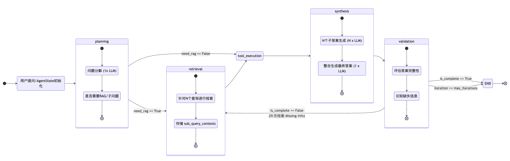

# FinSagent

金融领域 Agentic RAG 系统，支持多轮推理、工具调用和实时流式展示。

## 🚀 快速开始

### 在服务器上测试 / 部署运行
```bash
conda activate lotusenv
cd /path/to/FinSagent

# 运行测试脚本
python simple_qa_test.py

# 部署
cd deploy
bash start.sh
```

目前有已经部署好的服务，访问 `https://uu310022-afb0-a79a43a1.westd.seetacloud.com:8443/`

### API 接口
- **流式对话**: `POST /chat/stream` - 实时返回 Agent 执行过程
- **同步对话**: `POST /chat` - 返回最终答案
- **会话历史**: `GET /sessions/{session_id}/history` (暂时没有使用)
- **健康检查**: `GET /health` (暂时没有使用)

### 运行模式
- **quick**: 快速模式，简单拆解问题，快速检索
- **planning**: 规划模式，深度思考，多角度分析

## 🏗️ 系统架构

### 核心组件
```
src/core/
├── ChatService.py       # 对话服务入口，多会话管理
├── SessionManager.py    # 单会话管理，维护对话历史和 LLM Client
├── AgenticRAG.py        # Agent 工作流定义 (LangGraph)
├── RAG.py               # RAG 组件，提供检索能力
└── RAGManager.py        # 向量库管理，支持多 Collection
```

### 部署组件
```
deploy/
├── app.py               # FastAPI 应用，提供 HTTP API
├── frontend/            # 简单 Web 前端界面，实时流式展示
└── start.sh             # 启动脚本
```

## 🛠️ 技术栈
- **LangGraph**: 构建状态机和多步迭代的 Agent 工作流
- **FastAPI**: 提供 RESTful API 和 SSE 流式接口
- **LangChain**: 向量检索和 LLM 调用
- **FlagEmbedding**: 向量模型和 Reranker

## 💡 工作流节点

| 节点 | 函数 | 职责 | 并行优化 |
| :--- | :--- | :--- | :--- |
| `planning` | `planning_node` | 问题分解与模式选择，拆解为子问题 | - |
| `retrieval` | `retrieval_node` | 并行检索所有子问题的相关文档 | ✓ 子问题并行检索 |
| `tool_execution` | `tool_execution_node` | 调用外部工具（如股价查询、IPO 信息） | - |
| `synthesis` | `synthesis_node` | 并行生成子答案，再合成最终答案 | ✓ 子答案并行生成 |
| `validation` | `validation_node` | 验证答案完整性，识别缺失信息 | - |

### 性能优化
- **检索并行化**: 多个子问题的向量检索并发执行
- **生成并行化**: 多个子答案的 LLM 生成并发执行
- **流式输出**: Agent 执行过程实时推送至前端

## 🧠 Agent 状态

`AgentState` 定义了工作流中的所有状态变量：

| 字段 | 说明 |
| :--- | :--- |
| `original_query` | 用户原始问题 |
| `mode` | 运行模式（quick/planning） |
| `sub_queries` | Planning 阶段分解的子问题列表 |
| `sub_query_contexts` | 每个子问题对应的检索上下文 |
| `tool_results` | 工具调用结果字典 |
| `sub_answers` | 每个子问题的答案 |
| `final_answer` | 最终合成的答案 |
| `is_complete` | 答案是否完整 |
| `missing_info` | 缺失信息列表（用于下轮检索） |
| `iteration` | 当前迭代次数 |

## 🔞 Agent State Diagram (Planning 模式)

