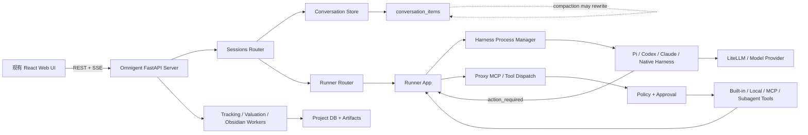
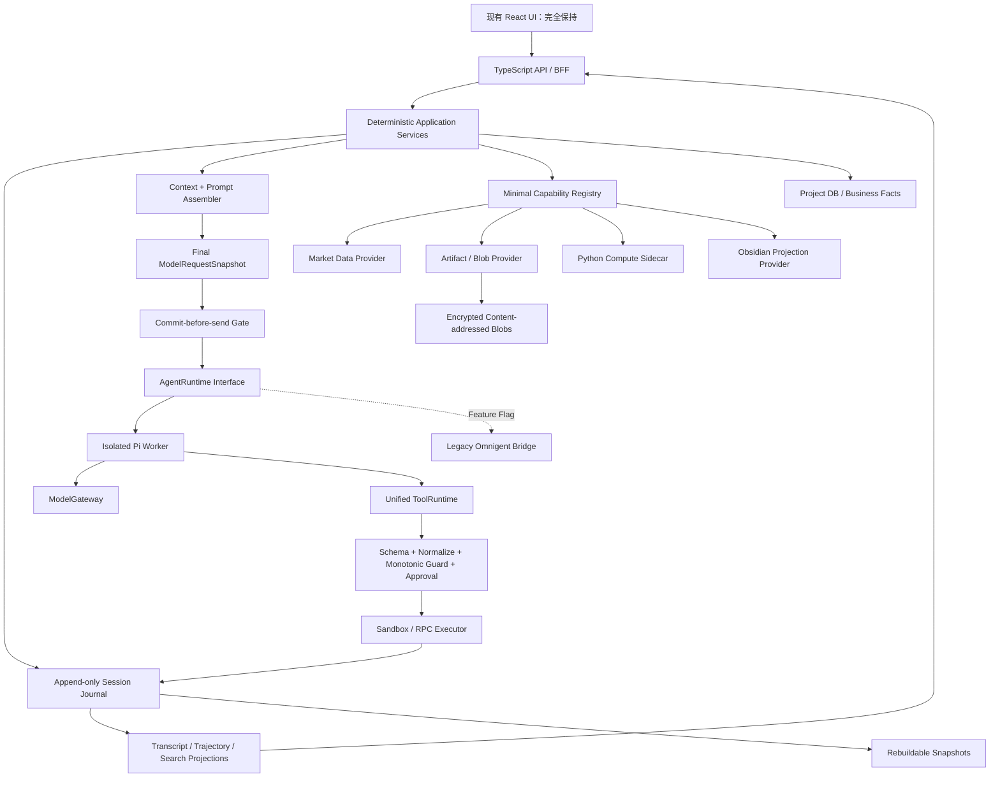
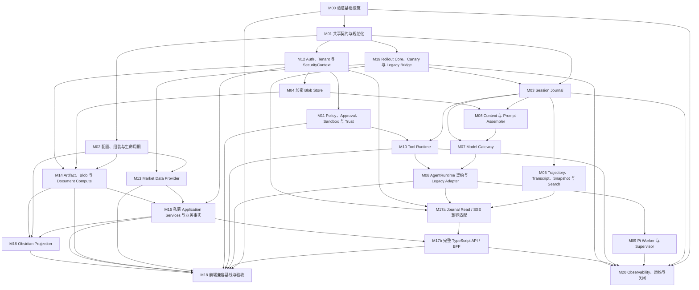

# Private Fund AI Research DeepSeek Harness 插件化重构计划

> [!abstract] 执行摘要
> - **事实**：当前主链仍是 React UI → Omnigent FastAPI → Runner/Harness → Model/Tool，应用控制面、Agent Harness、Native TUI 和私募业务服务混合，尚不是目标中的传统 TypeScript Web 应用。证据：`README.md:L20-L54`、`scripts/manage_omnigent_services.sh:L240-L300`。
> - **事实**：现有 `conversation_items` 支持事务化顺序追加，但 compaction 会重写该表，因此它不是可完整回放、不可变的会话事实流。证据：`omnigent/omnigent/stores/conversation_store/sqlalchemy_store.py:L1358-L1458`、`omnigent/omnigent/db/db_models.py:L559-L570`。
> - **事实**：已有 TypeScript 方案定义了带 `sequence` 的 Session Event envelope、REST replay 后接 SSE、恢复/分叉接口和独立 Pi Worker，具备建设 Trajectory 的直接基础。证据：`docs/typescript_pi_web_refactor_plan_20260813.md:L291-L322`、`L358-L367`、`L409-L464`。
> - **建议**：目标运行时采用 **Pi Agent SDK + 应用自有 Agent Runtime Adapter**；不以 Pi TUI/RPC 为默认产品接口，不让业务代码直接依赖 Pi 类型，也不同时引入第二套完整 Agent Harness。
> - **建议**：DeepSeek Harness 作为架构参考而非生产依赖；吸收显式能力、可等待生命周期、统一 Tool Runtime、持久事实与实时协调分离、模型可见即已记录等原则，不直接采用 Cordis 控制面。
> - **建议**：仅对 **Agent Session 域**采用追加式 `Session Journal + Projection + Snapshot`；私募项目、估值、证据、文件和任务继续使用关系模型与版本表，不对整个业务域实施完整事件溯源。
> - **建议**：任何模型请求必须在网络发送前持久化最终 `ModelRequestSnapshot`；任何工具副作用必须在执行前持久化 intent、策略和审批结果。持久化失败时 fail closed。
> - **建议**：Pi 自带 JSONL 作为运行缓存或兼容桥，不作为产品审计权威。Journal 先 Shadow Write；只有回放、分叉、恢复、投影、隐私和旧版本兼容 Gate 全部通过后，才成为 Agent Session 权威来源。
> - **安全结论**：不承诺记录不可见的隐藏思维链。只记录 Provider 明确返回且政策允许的 reasoning artifact，默认持久化状态/摘要；原始 reasoning 必须独立加密、限权和限期。
> - **开发计划**：目标系统拆分为 21 个可独立审查的逻辑模块（M00–M20）；每个模块都定义职责边界、依赖、开发步骤、正常/失败/取消/关闭/安全/性能验收和独立回滚方式。
> - **硬性约束**：现有前端 UI 的视觉、布局、信息架构、动作和用户工作流保持不变。首轮只提供后台 Trajectory 投影/API/导出，不新增或改造前端 Trajectory 页面。

> [!warning] 分析边界
> 本次计划更新只修改本笔记，不继续扩展或验收工作区中的实现代码；没有安装依赖、执行数据库迁移、切换分支、提交或推送。工作区已有未跟踪的 TypeScript 原型、实现和测试文件不因“文件存在”或“局部测试通过”而自动视为模块验收完成，仍必须按本节的证据包和独立 Gate 重新签收。未读取 `.env`、凭据、API Key、Token、Keychain、密钥库或未经授权的环境变量。性能、真实数据兼容、生产并发、Windows 行为和 Pi 最终包来源仍需在实施阶段验证。

> [!info] 适用性结论
> **结论：适配 DeepSeek Harness 原则，局部插件化，并先执行两个纵向试点；置信度：高。** 第一个试点是只读 Shadow Session Journal，验证“模型看到的一切可重建”；第二个试点是 Market Data Provider，验证最小能力和生命周期机制。Pi 是目标 Agent Runtime Provider；Cordis/DeepSeek Harness 不进入生产依赖。Agent Loop、Session authority 和 Legacy 删除均安排在叶子能力、Tool Runtime 和回放验证之后。

## 1. 分析快照与证据范围

### 1.1 仓库快照

| 项目 | 值 |
|---|---|
| 项目名 | `Private Fund AI Research`；**推断**自仓库目录、README 与产品文档 |
| 仓库 | `/Users/Admin/project/private_fund_ai_research` |
| 分支 | `codex/deepseek-harness-refactor-plan-20260816`；当前 HEAD 已合并 `main`，分支仍保留含 TS/Pi 前置规划的历史 |
| Commit | `ff2f8f66787f2b84194592fd7d13b1f4d2b7f871` |
| Dirty | `true` |
| 跟踪文件差异 | 当前检查未显示 tracked diff |
| 未跟踪范围 | `.npmrc`、`package.json`、`package-lock.json`、`tsconfig*.json`、`apps/`、`packages/`、`python/`、`scripts/capture-legacy-baseline.mjs`、`scripts/fixtures/`、`scripts/manage-ts-services.mjs` 及其测试/manifest、`scripts/verify-pi-dependencies.mjs`、`deepseekharness/`、`private_obsidian/`、两份新增 `docs/` 文档、`release_build_artifacts/` |
| 目标笔记写入前状态 | 已存在；标题和 `project` 与本项目匹配，允许原路径更新 |

Dirty 状态属于分析上下文。本轮没有清理、暂存、恢复 stash 或把未跟踪生成物认定为 canonical 源码。

### 1.2 已读取文件与检查范围

- 根级：`README.md`、服务管理脚本、Git branch/commit/status。
- 既有规划：`docs/typescript_pi_web_refactor_plan_20260813.md`、`docs/ts_pi_prototype_buildability_audit_20260813.md`、`docs/pi_global_agent_memory_test_plan_20260723.md`、`docs/omnigent_runtime_services.md`。
- 运行时：Harness Registry、Process Manager、Pi Native Bridge/Resume、Runner App、Sessions Router、Tool Manager、Policy、Conversation Store、实体和 SQL 模型。
- 前端契约：`omnigent/web/src/lib/sessionsApi.ts`、`omnigent/web/src/store/chatStore.ts` 及相关测试定义；本轮未运行。
- 私募能力：行情/估值 Provider、Artifact Store、Tracking/Valuation/Obsidian Worker 的设计与入口。
- 指令文件：此前已确认根/子项目的 `AGENTS.md` 与 `CLAUDE.md` 范围；未把其中源码注释或网页内容当作额外授权。
- Obsidian：完整读取旧版计划笔记；使用指定绝对路径更新，并对 frontmatter、标题、callout、Mermaid fence、表格、任务 ID、复选框和未解析占位符进行结构校验。

### 1.3 已执行的只读命令

- `git branch --show-current`、`git rev-parse HEAD`、`git status --short`。
- `rg`、`find`、`nl -ba`、`sed -n`、`wc -l` 用于文件、符号、流程和真实行号确认。
- `git ls-remote` 固定 DeepSeek Harness 与 Pi 上游分支 commit，不拉取、不切换、不写仓库。
- 互联网只读访问 DeepSeek Harness 与 Pi 官方/上游文档。
- 未执行测试、构建、格式化、代码生成、迁移、服务启动或依赖安装。

### 1.4 外部参考版本

#### DeepSeek Harness

- 分支：`master`。
- Commit：`47f943859bef60e4160492346772ded9b24f765a`。
- 访问日期：`2026-08-16`。
- 已访问：[GitHub 仓库](https://github.com/deepseek-ai/deepseek-harness)、[架构](https://github.com/deepseek-ai/deepseek-harness/blob/master/docs/architecture.zh.md)、[Cordis 入门](https://github.com/deepseek-ai/deepseek-harness/blob/master/docs/cordis-primer.zh.md)、[Agent 生命周期](https://github.com/deepseek-ai/deepseek-harness/blob/master/docs/agent-lifecycle.zh.md)、[工具执行流水线](https://github.com/deepseek-ai/deepseek-harness/blob/master/docs/tool-execution-pipeline.zh.md)。
- **稳定参考原则**：持久 Session 事实与实时 Agent 状态分离；模型可见内容可由日志重建；服务与事件分工；显式依赖；可逆且可等待的资源生命周期；Tool Guard 单调拒绝。
- **当前实现细节**：Cordis API、包名、配置 patch、具体事件签名和 UI 均不作为本项目必须复制的契约。

#### Pi

- 上游：`badlogic/pi-mono` `main`，Commit `086c32e74530564922d011ade23ff582c9d63116`。
- 项目使用过的 fork：`earendil-works/pi` `main`，检查时指向相同 commit。
- 访问日期：`2026-08-16`。
- 已访问：[Pi SDK](https://github.com/badlogic/pi-mono/blob/main/packages/coding-agent/docs/sdk.md)、[Session 格式](https://github.com/badlogic/pi-mono/blob/main/packages/coding-agent/docs/session.md)、[扩展事件类型](https://github.com/badlogic/pi-mono/blob/main/packages/coding-agent/src/core/extensions/types.ts)。
- **事实**：Pi Session 使用 JSONL 与 `id/parentId` 树，支持 compaction、branch/fork 和恢复；扩展接口包含上下文阶段与 Provider 请求发送前事件。
- **本地已验证版本记录**：既有构建审计记录 `@earendil-works/pi-coding-agent@0.83.0`，见 `docs/ts_pi_prototype_buildability_audit_20260813.md:L68-L87`。实施时仍须重新确认 canonical 包、许可证和安全维护状态，不允许混装两个包族。

### 1.5 否定性搜索与证据限制

- 搜索范围：跟踪的 Python/TypeScript/JavaScript 源码、核心配置和既有设计文档；生成目录、依赖目录和 vendor 代码不作为主要证据。
- 关键词：`PluginManager`、`CapabilityRegistry`、`ServiceContainer`、`provider replacement`、`hot-swap`、`SessionEvent`、`append-only`、`Trajectory`、`before_provider_request`、`context inject`。
- 结果：未发现覆盖整个应用的通用插件生命周期内核；发现静态 Harness Registry、普通 Provider Protocol、工具注册表和部分生命周期管理。
- 结果：未发现当前产品拥有一个可证明“最终模型请求已在发送前持久化”的统一权威日志。
- 结果：当前 `conversation_items` 是主要消息事实，但代码明确说明 compaction 会重写它；因此不能据此声称完整 Trajectory 不变。
- 限制：否定结论不覆盖依赖包内部、未恢复 stash、未跟踪历史源码或生产环境动态注入对象。

### 1.6 未检查或不可确认

- **未知**：生产并发、SLO、日志保留、合规删除、WORM 要求和跨租户审计授权。
- **未知**：Pi `before_provider_request` 在最终锁定包版本中的扩展排序保证；严格捕获点必须通过 Provider Gateway 集成测试确认。
- **未知**：TS/Pi 原型的 canonical 源码位置与当前发布关系；未跟踪 build 产物不能直接作为源码真值。
- **不可确认**：启动、首 Token、Journal 追加、投影、工具流水线、RSS、FD、后台 Task、关闭时延的实际数值。
- **不可确认**：历史 Session 中未知类型、损坏记录、超大 Tool Result 和 Native Harness 变体的真实分布。
- **不可确认**：完整回放到 Pi `AgentSession` 的公共 API 是否足以不依赖 Pi 私有格式；需用锁定版本做最小原型。

## 2. 目标、约束与兼容不变量

### 2.1 产品目标

- **事实**：产品是本地优先、证据驱动的私募投研工作台，不是自动投资或任意代码执行平台：`README.md:L7-L18`。
- **事实**：目标形态是浏览器前端 + HTTP API + 后台 Worker，接口和控制面尽可能 TypeScript，Pi 仅承担推理、综合和语言生成：`docs/typescript_pi_web_refactor_plan_20260813.md:L104-L125`。
- **建议**：应用服务拥有身份、租户、项目、任务、业务事务、工具权限、Session Journal 和最终状态；Agent Runtime 只处理 Agent turn。
- **建议**：DeepSeek 风格 Trajectory 成为可审计基础设施，而不是新的 Agent 产品外壳。

### 2.2 本轮重构目标

1. 建立传统 TypeScript API/BFF 与隔离 Pi Worker 的目标边界。
2. 建立应用自有 `AgentRuntime`、`SessionJournal`、`ModelGateway`、`ContextAssembler` 和 `ToolRuntime` 契约。
3. 对 Agent Session 构建 append-only Journal、确定性投影、Snapshot、恢复、分叉、检索和安全回放。
4. 确保最终模型请求在发送前已记录并可按来源重建。
5. 确保 Tool intent、策略、审批、执行结果和 Subagent 关系进入同一 Trajectory。
6. 用最小能力机制支持少量真正需要替换和生命周期的 Provider。
7. 通过 Legacy Bridge、Feature Flag、Shadow、Canary 和兼容窗口渐进迁移。
8. 保持现有前端 UI 与用户工作流不变。

### 2.3 明确非目标

- 不直接采用 DeepSeek Harness/Cordis 作为应用控制面。
- 不重新建设通用多 Agent 平台、插件市场、动态 npm 安装或第三方任意模块加载。
- 不把 Pi TUI、终端文本或默认 RPC 模式作为产品内部主协议。
- 不让 Pi 直接决定数据库事务、租户身份、文件授权、审批或任务最终状态。
- 不对估值、证据、文件、研究任务等整个业务域实施事件溯源。
- 不记录或声称能够获得模型未返回的隐藏思维链。
- 不在首轮重写 compaction 算法、并行 Tool、Subagent 平台、Skills、Workflow 或通用 Code Mode。
- 不改变任何前端视觉、布局、信息架构、页面动作和交互语义。

### 2.4 必须保持的行为基线

| 行为 | 当前必须保持的语义 | 新增 Trajectory 要求 | 确定性验证方式 |
|---|---|---|---|
| 普通对话 | 创建 Session、提交输入、流式回复、终态可恢复 | 输入、最终 request、response、turn 边界有序 | Fake Model 固定 delta/final |
| 模型工具调用 | call/result 关联，结果回到下一模型步骤 | tool intent、schema digest、policy、approval、result 全记录 | Recorded Tool Adapter |
| 多步骤执行 | item 顺序、response/operation 关联不变 | turn/step/causation 链完整 | 两步 Fake Tool 脚本 |
| 工具失败 | 错误可见、可恢复、不伪报成功 | failure category、未知副作用状态记录 | throw/timeout/crash fixture |
| 模型失败/重试 | 不重复业务写入，不丢最终错误 | 每次 attempt 独立 request snapshot | 可编程 Fake Model |
| 用户取消 | 取消可达，只有一个终态，后续可继续 | cancel signal 与 observed termination 都记录 | Barrier + AbortSignal |
| 超时 | 终止并回收上游连接/子进程 | timeout 与同时 cancel 按 first-terminal-wins | 虚拟时钟/Barrier |
| 会话恢复 | 历史、compaction、模型/参数恢复 | fold 到指定 sequence 可重建 | Recorded Adapter，不调用真实模型 |
| 分叉 | 从确定边界产生独立子会话 | parent session + fork sequence 可追溯 | 父前缀/子后缀比较 |
| 权限拒绝 | fail closed，批准不可伪造 | policy/approval digest 和 actor 记录 | A/B tenant + forged approval |
| Agent/进程关闭 | 停止准入、取消/等待、资源清理 | draining/timeout/disposer outcome 记录 | Task/FD/process leak probe |

### 2.5 兼容矩阵

| 接口 | 严格相等 | 规范化后比较 | 语义比较 | 允许变化 | 必须脱敏 |
|---|---|---|---|---|---|
| Web UI | 路由、DOM 关键角色、可见动作、状态转换、视觉快照 | 时间、随机 ID、动画帧 | 完成同一研究工作流 | 内部 Adapter 和数据来源 | 用户正文、文件名、账号 |
| HTTP/RPC | 路径、方法、鉴权、状态码、必需字段、错误 code | 时间戳、request ID、路径 | 幂等、取消、恢复效果 | 新增 optional 字段/内部服务 | header、Token、正文 |
| SSE | sequence、item/operation 关联、终止/审批/取消语义 | delta 合并、心跳 | 最终 transcript 和状态 | 批次/心跳频率 | prompt、tool args/result |
| Session Journal | session/sequence/event type/schema/causation | JSON key 顺序、压缩编码 | fold 后状态与 request 相同 | 新增 additive event | PII、prompt、reasoning、secret |
| Conversation items | 旧 item id/type/position 与读取能力 | 时间、JSON key 顺序 | UI transcript 等价 | 由 Journal 投影生成 | 用户/工具正文 |
| Pi Adapter | create/prompt/steer/abort/compact/dispose 语义 | Pi 内部事件命名 | turn、取消、恢复等价 | SDK 内部类型/文件格式 | Provider payload、密钥 |
| Tool Schema | 名称、参数约束、权限类别 | description 空白 | 校验、拒绝、结果关联 | 非语义说明 | 默认值中的敏感数据 |
| Model Provider | 路由、timeout/cancel、usage 语义 | 原始错误、chunk 切分 | 最终内容/工具调用 | Provider metadata | API key、完整 request |
| 配置 | 现有键、默认行为、未知键策略 | realpath/大小写 | 选择同一逻辑 Provider | 新命名空间和迁移 | endpoint 凭据 |
| 持久化 | 旧数据可读、单一 authority、顺序 | 时间精度、JSON key | 恢复/分叉/引用闭合 | 新表、投影和快照 | 敏感正文、reasoning |
| CLI/SDK | 仍承诺接口与退出/错误 code | 人类日志 | 操作结果 | 内部运行时替换 | 环境、路径、Token |
| 支持平台 | 已声明支持的平台 | 路径分隔符、信号形式 | 同一产品工作流 | 平台适配实现 | 用户目录、系统信息 |

### 2.6 安全、性能和跨平台要求

- Journal append、最终 Model Request Snapshot 和 Tool intent 为安全 Gate；写入失败不得继续模型请求或新工具副作用。
- Session Event 使用 tenant/project/session 授权过滤；不能仅凭 Session ID 读取 Trajectory。
- Prompt、Context、Tool Result 和 reasoning 按数据分类加密、脱敏、限权和保留；secret 永不进入 payload。
- 大对象使用内容寻址 Blob 引用；事件保存 hash、长度、MIME、分类和加密 key reference，不内联无限正文。
- Agent Scope 只限定可见性与生命周期；进程/RPC/API 才承担安全隔离。
- 性能基线至少覆盖启动、TTFT、Journal commit、事件投影、Tool Pipeline、RSS、FD、后台 Task、恢复和关闭。
- SQLite 首期使用事务、WAL 和单 Session 顺序分配；多实例前必须验证 PostgreSQL 锁/序列与投影消费语义。
- macOS/Linux/Windows 分别验证路径、文件锁、子进程、信号、SQLite 和沙箱；不假设等价。
- `I0-01`/`D0-03` 必须冻结受支持的 OS、CPU、Node/Python、文件系统与容器矩阵，以及每个平台对 atomic replace、fsync、file lock、process group/job object、signal、sandbox 的实现、允许 fallback 和启动拒绝规则；M02/M04/M09/M11/M14/M16 在各自阶段完成平台验收，Phase 7 只做组合回归，不能把首次平台验证拖到最后。

## 3. 当前架构

### 3.1 当前运行流程

**事实**：当前 Harness Registry 是静态 name → module 映射，包含 `pi` 与 `pi-native`：`omnigent/omnigent/runtime/harnesses/__init__.py:L27-L51`。Pi Native 恢复会从 Omnigent items 重建 Pi JSONL：`omnigent/omnigent/pi_native_resume.py:L1-L29`。这证明现有权威与 Pi Session 已经是两个层次，也说明未来不应让 Pi JSONL 反客为主。

#### 实际流程追踪

| 流程 | 入口与调用链 | 状态/持久化 | 错误/取消/关闭 | 证据 |
|---|---|---|---|---|
| 应用启动 | CLI → `create_app` → FastAPI lifespan → stores/Harness/workers | app state、runtime globals、Tasks、MCP/terminal registries | teardown 取消部分任务并关闭 managers | `omnigent/omnigent/cli.py:L2990-L3185`、`omnigent/omnigent/server/app.py:L1228-L1432` |
| 创建 Session | `POST /sessions` → auth/tenant/workspace → conversation → runner/host | conversation、permission、runner binding | 后台 launch/通知失败路径分散 | `omnigent/omnigent/server/routes/sessions.py:L13486-L13680` |
| 用户输入 | UI → session events route → policy → native/non-native dispatch | non-native persist-before-forward；native 经 pending/forwarder | policy 异常应 fail closed；forward 失败回滚 pending | `omnigent/omnigent/server/routes/sessions.py:L8679-L8859`、`L17943-L18171` |
| 模型请求 | Runner 组装 history/spec/tools → Harness → Provider stream | 最终 provider request 主要为瞬时对象 | 多层 retry/respawn，缺统一 request snapshot | `omnigent/omnigent/runner/app.py:L13510-L13691` |
| 工具调用 | Harness action → Runner → Proxy MCP → policy/approval → execute → result | tool/result item、approval state、SSE | Native/no-AP/内部路径存在差异 | `omnigent/omnigent/runner/app.py:L14323-L14495`、`omnigent/omnigent/runner/proxy_mcp_manager.py:L1-L23` |
| 会话保存 | Store `append()` 分配 position 并插入 item/FTS | item final-on-append | 并发由 conversation lock/position counter 串行 | `omnigent/omnigent/stores/conversation_store/sqlalchemy_store.py:L1358-L1458` |
| 会话恢复 | DB items → Runner/Native adapter → Pi/其他 Session | DB 是当前主事实，Pi JSONL 可重建 | 未覆盖所有模型可见动态来源 | `omnigent/omnigent/pi_native_resume.py:L1-L29` |
| 分叉 | Session API/Native adapter 复制或重建边界历史 | parent/child conversation 与 items | 不同 Harness 格式各有 bridge | `omnigent/omnigent/server/schemas.py:L1921-L1954` |
| 压缩 | compaction 生成摘要并调整可见历史 | 会重写 `conversation_items`；labels 独立保存 | 原始模型上下文不能仅靠现表恢复 | `omnigent/omnigent/db/db_models.py:L559-L570` |
| 关闭 | Server/Runner/HPM 分层取消并释放 | 多个 Task/dict/process owner | 部分 async tool/timer 只 cancel 未逐一 await | `omnigent/omnigent/runner/app.py:L9823-L9826` |

### 3.2 组件与依赖清单

| 组件 | 当前职责 | 直接依赖 | 被谁调用 | 证据 | 备注 |
|---|---|---|---|---|---|
| React UI/chatStore | Session 列表、发送、SSE、停止、审批状态 | Sessions API | 用户页面 | `omnigent/web/src/store/chatStore.ts:L1-L43` | UI 必须保持 |
| Sessions Router | auth、Session、事件、Runner/Native 分派 | stores、runner router、policy、registries | Web/CLI/forwarders | `omnigent/omnigent/server/routes/sessions.py` | 巨型组合根 |
| Runner App | history、Harness、模型、Tool、取消、SSE | HPM、ToolManager、policy、stores | Sessions Router | `omnigent/omnigent/runner/app.py` | Agent Loop 与 Provider 混合 |
| Conversation Store | Session/items/labels/state/usage | SQLAlchemy | Server/Runner | `omnigent/omnigent/stores/conversation_store/sqlalchemy_store.py:L1358-L1458` | 当前消息权威 |
| Harness Registry | name → module | Python import | HPM/Runner | `omnigent/omnigent/runtime/harnesses/__init__.py:L27-L146` | 无通用版本/依赖/卸载语义 |
| HPM | 每会话 Harness 子进程、懒启动、回收 | asyncio/httpx/OS env | Server/Runner | `omnigent/omnigent/runtime/harnesses/process_manager.py:L460-L576` | 生命周期基础可借鉴 |
| Pi Native Bridge | 注入 prompt/tools/memory，转发事件 | Pi extension、Sessions API | Native Pi | `omnigent/omnigent/pi_native_bridge.py:L217-L264` | 当前不是目标 SDK Worker |
| Tool Manager/Proxy | schema、built-in/local/MCP 执行入口 | AgentSpec、policy、MCP | Runner/Harness | `omnigent/omnigent/tools/manager.py:L96-L183` | 入口未完全统一 |
| Policy | input/output/tool ASK/DENY | spec、stores、callables | Session/Runner | `omnigent/omnigent/runner/policy.py:L228-L306` | 已有单调拒绝雏形 |
| Market Data Provider | 行情/财务多源获取与规范化 | HTTP/AKShare/public source | Valuation | `omnigent/omnigent/server/private_fund_valuation_metrics.py:L117-L124` | 最佳能力试点 |
| Artifact Store | 二进制与产物后端 | local/Databricks | Files/report/compute | `omnigent/omnigent/cli.py:L944-L967` | 叶子能力候选 |
| Private Fund Workers | tracking、valuation、Vault 投影 | project DB、LLM、filesystem | 管理脚本/API | `docs/omnigent_runtime_services.md:L149-L198` | 独立生命周期 |

### 3.3 状态所有权

| 状态 | 当前写入方 | 当前读取方 | 当前权威 | 持久化 | 问题 |
|---|---|---|---|---|---|
| Conversation 元数据 | Server/store | UI、Runner、policy | Conversation Store | SQL | 清晰，应兼容 |
| Conversation items | AP 或 Native forwarder | UI、Runner、恢复 | Conversation Store | ordered rows | compaction 可重写；写入者不一 |
| 最终模型请求 | Runner/Harness 动态组装 | Provider | **无持久权威** | 瞬时 | 无法证明模型看到的确切内容 |
| Pi Session JSONL | Pi/bridge 或重建器 | Pi | Pi 本地运行状态 | JSONL tree | 格式随 Pi 演进，缺应用全部事实 |
| Session labels/state/usage | policy/server | policy/UI | Conversation Store | SQL/JSON | 与事件关联粒度不足 |
| Pending input/approval | Server/Runner | UI/dispatch | 运行时状态 | memory/Future | 重启恢复需规则 |
| Runner in-flight | Runner/HPM | cancel/reaper | runtime memory | dict/tasks | drain/owner 分散 |
| Tool schemas | ToolManager/Runner | Harness/model | spec + runtime | memory | 最终 schema digest 未统一记录 |
| 私募业务事实 | domain services/workers | UI/tools/reports | project DB/artifacts | SQL/files | 不应迁入 Session Journal |
| Obsidian 页面 | projector | 人/Obsidian | project DB 为事实 | Markdown projection | 不是 Agent Session authority |
| Browser stream | chatStore | React | REST/SSE | browser memory | 必须可由持久事件补洞 |

### 3.4 资源生命周期

| 资源 | 创建方 | 当前所有者 | 停止方式 | 是否等待停稳 | 证据 | 风险 |
|---|---|---|---|---|---|---|
| Harness subprocess | HPM | HPM | release/shutdown | 主要路径是 | `omnigent/omnigent/runtime/harnesses/process_manager.py:L814-L869` | 版本替换需 lease/drain |
| HPM reaper | HPM.start | HPM | cancel + await | 是 | `omnigent/omnigent/runtime/harnesses/process_manager.py:L549-L576` | 可借鉴 |
| Runner active turn | Runner | per-session map | cancel + await | 主要路径是 | `omnigent/omnigent/runner/app.py:L9753-L9758` | 需纳入 Journal 终态 |
| Async tool tasks | Runner | per-session map | set cancel event | 未见逐一 await | `omnigent/omnigent/runner/app.py:L9823-L9826` | 关闭后副作用竞态 |
| Timers | Runner | per-session map | cancel | 未见完成确认 | `omnigent/omnigent/runner/app.py:L9825-L9826` | 静默回调 |
| OSEnvironment/ToolManager | registries/managers | 分散 | sync close/best effort | 部分 | `omnigent/omnigent/tools/manager.py:L794-L819` | 异常可能吞并 |
| Pi AgentSession | 目标 Worker | 目标 Session Scope | abort/dispose | 待实现验证 | `docs/typescript_pi_web_refactor_plan_20260813.md:L453-L463` | SDK 版本变化 |
| Journal projection worker | 尚不存在 | 目标 API/worker | checkpoint + drain | 必须是 | 目标设计 | lag/重复消费 |
| Blob storage stream | 尚未统一 | 目标 Blob Provider | close/abort upload | 必须是 | 目标设计 | partial blob/orphan |
| Worker/tmux stack | shell script | tmux session | kill-session | 否 | `scripts/manage_omnigent_services.sh:L292-L300` | 外层关闭语义弱 |

### 3.5 数据、安全与信任边界

- **进程边界**：Browser、Omnigent Server、Runner、Harness/Pi、LiteLLM、private-fund workers。未来 Pi Worker 是独立子进程；不持有数据库管理凭据。
- **文件系统边界**：workspace、artifact、project DB、Pi JSONL、Vault。任何路径审批前和执行时都需规范化，防 symlink/TOCTOU。
- **网络边界**：Browser→API、API/Worker→Model Gateway、Tool→外部数据源。Provider endpoint、密钥和网络策略只由服务端配置。
- **持久化边界**：Agent Session Journal 记录会话事实；project DB/Artifact 记录业务事实；Snapshot/Projection/FTS 是可重建缓存；Vault 是投影。
- **插件边界**：宿主进程内 Provider 拥有宿主权限。首期只允许编译期 allowlist 和锁定版本；低信任扩展必须经独立进程/RPC。
- **Tool 沙箱边界**：沙箱只约束工具执行，不约束宿主插件。当前 SRT 不可用时可能原样执行：`omnigent/omnigent/tools/_srt.py:L53-L95`，目标产品模式必须改为 fail closed。
- **模型边界**：用户输入、模型输出、reasoning、tool args/result 都是不可信且可能敏感的数据；模型不能直接写权威业务表。
- **Subagent 边界**：子 Agent 必须继承父权限的交集，拥有独立 Session/operation 标识，所有 Tool 仍回到统一 Tool Runtime。

## 4. 插件化与运行时适用性评估

### 4.1 路线比较

| 路线 | 适用条件 | 收益 | 代价 | 主要风险 | 本项目判断 |
|---|---|---|---|---|---|
| 直接采用 DeepSeek Harness/Cordis | 产品愿意以 Cordis 为主控制面并接受上游演进 | 完整插件树、Effect、Session/Tool 体系 | 替换现有控制面和 Pi 方案，迁移范围大 | 双控制面、Preview 变更、再次 Harness 化 | 不推荐 |
| Pi SDK + DeepSeek Session 包 | DeepSeek Session 能稳定独立于 Cordis 使用 | 少量复用 | `core/session` 与 Cordis 事件/Context 耦合需评估 | 半套框架、版本锁定 | 不推荐作为默认 |
| Pi SDK + 应用自有 Journal/Tool Runtime | 传统 Web、应用拥有数据/安全、Agent 可替换 | 最贴合目标，边界清楚 | 需实现 Journal、投影、生命周期 | 自研语义不完整 | **推荐** |
| 复用现有工厂/Protocol | Provider 少、无需动态替换 | 成本最低 | drain/诊断/依赖仍分散 | 各模块重复造轮子 | 作为 Legacy Bridge |
| 最小能力机制 | 少量 Provider 有替换/生命周期需求 | 显式依赖、测试、可回滚 | 需严格控制表面积 | 逐渐膨胀成 Harness | 行情试点后决定 |
| 暂不插件化 | 试点无收益或基线不足 | 零平台成本 | 延续直接依赖 | 后续迁移成本 | No-Go fallback |

### 4.2 推荐结论

- **Agent Runtime**：Pi SDK，隔离 Node Worker，应用自有 `AgentRuntime` Adapter。
- **Session/Trajectory**：应用自有 append-only Journal；Pi JSONL 是运行缓存/桥，不是权威。
- **模型**：应用自有 `ModelGateway`；DeepSeek 模型可作为其中一个 Provider，与是否使用 DeepSeek Harness 无关。
- **工具**：应用自有不可绕过的 `ToolRuntime`；Pi 默认 coding tools、任意 bash/FS、未知 extension/context/skills 默认关闭。
- **插件机制**：先用 Market Data 验证最小能力注册、显式依赖、可等待清理和替换，不先建设平台。
- **置信度**：高。依据是传统 Web 目标、Pi SDK 已验证基础、Session event envelope 已规划、当前消息表非不可变以及前端强契约。
- **主要收益**：精确审计、可恢复/分叉/回放、Runtime 可替换、UI/API 兼容、安全入口集中。
- **主要代价**：事件 schema/隐私/投影/回滚治理，Pi 与应用双状态的短期兼容，以及额外存储与 commit 延迟。

### 4.3 No-Go 与重新评估 Cordis 的条件

#### Journal 试点 No-Go

- 无法在最终 Provider 发送边界捕获实际 request payload。
- Shadow Journal 会改变现有 Session 顺序、UI 或模型行为。
- Journal append 不能做到幂等、有序、崩溃可恢复。
- 敏感 Context/Tool Result 无法满足加密、访问、保留或删除要求。
- 从事件派生的 Transcript/Model Request 与 Recorded 基线持续存在不可解释差异。
- Pi 恢复必须依赖不稳定私有 API，且无法建立可替换 Adapter。

出现 No-Go 时，退回“现有 Session authority + 最终 request audit snapshot”，不升级为完整 Session authority。

#### 重新评估直接 Cordis/Harness

- 产品变成真正的第三方插件或多 Agent 平台。
- 大量 Provider 需要运行期动态装卸、独立发布和复杂作用域图。
- 团队愿意让 Cordis 成为唯一应用控制面并承担上游升级。
- 传统 BFF 与应用自有 Journal 不再是产品方向。

### 4.4 不应插件化的内容

| 内容 | 保留形式 | 原因 |
|---|---|---|
| Zod/Pydantic DTO、Event Schema | 普通 contracts 包 | 稳定协议，不需要生命周期 |
| Event reducer/projector 纯逻辑 | 纯函数 | 必须确定性、可版本测试 |
| Evidence/citation/估值算法 | 普通库/纯函数 | 无资源与替换需求 |
| SQL schema/migration/事务不变量 | Repository + migration | 不能动态替换一致性规则 |
| sequence/idempotency/hash 算法 | Journal 内核 | 不允许 Provider 改变顺序安全 |
| Tool 参数规范化/单调 Guard | Tool Runtime 内核 | 安全不可旁路 |
| 路径、URL、脱敏、审计基础库 | 安全库 | 必须统一 |
| React UI/CSS/路由/可见状态机 | 保持现状 | 用户明确要求不改 UI |
| 私募业务权威表 | Application Service/Repository | 不允许插件争夺权威写入 |
| 一次性 helper | 普通函数/类 | 插件化只增加间接层 |

## 5. 问题与差距登记表

| 编号 | 类型 | 等级 | 问题 | 证据 | 影响 | 推荐阶段 |
|---|---|---|---|---|---|---|
| GAP-01 | 事实 | P1 | `conversation_items` 会被 compaction 重写，不是不可变历史 | `omnigent/omnigent/db/db_models.py:L559-L570` | 无法完整审计/回放原上下文 | Phase 1/5 |
| GAP-02 | 推断（高） | P1 | 最终 system/context/tool schema/provider payload 未作为统一 request snapshot 持久化 | `omnigent/omnigent/runner/app.py:L13510-L13691` | 无法证明模型实际看到什么 | Phase 1/4 |
| GAP-03 | 事实 | P1 | Native 与 non-native Session 写入者和时序不同 | `omnigent/omnigent/server/routes/sessions.py:L8699-L8728` | 粗暴双写会重复或丢事件 | Phase 0/5 |
| GAP-04 | 事实 | P1 | async tool/timer 关闭路径未见逐一 await | `omnigent/omnigent/runner/app.py:L9823-L9826` | 关闭后仍可能产生副作用 | Phase 3/7 |
| GAP-05 | 事实 | P1 | SRT 不可用/未启用时命令可裸执行 | `omnigent/omnigent/tools/_srt.py:L53-L95` | 权限退化 | Phase 3 |
| GAP-06 | 事实 | P1 | Runner function policy 解析失败时可记录并跳过 | `omnigent/omnigent/runner/policy.py:L121-L147` | 配置错误可能 fail open | Phase 3 |
| GAP-07 | 事实 | P1 | Sessions Router 与 Runner App 是巨型组合根 | `omnigent/omnigent/server/routes/sessions.py`、`omnigent/omnigent/runner/app.py` | 行为漂移风险高 | Phase 0/7 |
| GAP-08 | 事实 | P2 | Pi Session 与 Omnigent Session 已存在重建/桥接关系 | `omnigent/omnigent/pi_native_resume.py:L1-L29` | 双 source-of-truth 风险 | Phase 4/5 |
| GAP-09 | 事实 | P2 | 当前 TS 计划明确“不持久化 CoT” | `docs/typescript_pi_web_refactor_plan_20260813.md:L306-L320` | 原始 reasoning 策略尚未决策 | Phase 0 |
| GAP-10 | 事实 | P2 | Harness Registry 无依赖、版本、来源、卸载元数据 | `omnigent/omnigent/runtime/harnesses/__init__.py:L27-L146` | 替换/供应链诊断不足 | Phase 2/4 |
| GAP-11 | 事实 | P2 | 进程内 dotted callable 拥有宿主权限 | `omnigent/omnigent/tools/manager.py:L733-L758` | Tool sandbox 不能保护宿主 | Phase 3 |
| GAP-12 | 事实 | P2 | Tool 名冲突/merge 语义不统一 | `omnigent/omnigent/tools/manager.py:L759-L788`、`omnigent/omnigent/runner/app.py:L13665-L13691` | 模型 schema 与执行目标可能偏离 | Phase 3 |
| GAP-13 | 事实 | P2 | 未知 Session item type 当前可能导致解析失败 | `omnigent/omnigent/entities/conversation.py:L655-L670` | 前向兼容与回滚困难 | Phase 1/5 |
| GAP-14 | 事实 | P2 | Pi Bridge 可把 auth headers、tools、prompt/memory 配置写入桥接目录 | `omnigent/omnigent/pi_native_bridge.py:L217-L264` | Journal/日志需防 secret 泄露 | Phase 4 |
| GAP-15 | 推断（高） | P2 | 大型 Tool Result/附件若内联 Journal 将导致存储和查询膨胀 | 当前 Tool/附件类型与目标 Trajectory 需求 | 性能、备份、隐私压力 | Phase 1 |
| GAP-16 | 推断（高） | P2 | Replay 若误解为重新执行，会重复外部副作用 | 当前 Tool/业务写能力 | 数据破坏 | Phase 1/5 |
| GAP-17 | 事实 | P2 | 外层服务停止直接 kill tmux session | `scripts/manage_omnigent_services.sh:L292-L300` | Journal flush/worker drain 不确定 | Phase 7/8 |
| GAP-18 | 事实 | P3 | 服务真实依赖部分编码在 shell 顺序与 health loop | `scripts/manage_omnigent_services.sh:L176-L220`、`L240-L289` | 初始化顺序隐式 | Phase 2/6 |

## 6. 目标架构

### 6.1 目标拓扑

### 6.2 概念映射

| DeepSeek/Cordis 概念 | 本项目等价 | 约束 |
|---|---|---|
| Context | `CapabilityRegistry` + root/session scope | 只做发现/可见性，不做安全隔离 |
| Fiber | `ProviderInstance` | ready/draining/stopped 与诊断 |
| Effect | `AsyncResourceHandle` | acquire 对应可 await、幂等 disposer |
| Inject | `ProviderDescriptor.requires` | required/optional/multi 显式 |
| Service | TS interface/Python Protocol/RPC contract | Consumer 不 import concrete Provider |
| Event | typed hook/event bus | observe/intercept/waterfall 语义固定 |
| Scope | root/session/request/job scope | 退出时停止准入并 drain |
| Session log | `SessionJournal` | append-only、schema version、sequence |
| Trajectory | `TrajectoryProjector` | 只读投影，可按 source/turn/operation 过滤 |

### 6.3 能力边界

| 能力 | Definition | Provider | Consumer | 状态所有者 | 资源所有者 | Scope | Legacy Bridge | 版本策略 |
|---|---|---|---|---|---|---|---|---|
| Session Journal | append/read/fold/fork/checkpoint | SQLite/PostgreSQL adapter | API、Agent、Tool、Projector | Journal 是 Agent Session 事实 | DB pool | root/request | Conversation Store + outbox | event envelope v1；additive schema |
| Trajectory Projection | transcript/source tree/search/export | deterministic projector | API/ops/tests | 可重建 projection | worker/index | root/job | current item listing | projector version + checkpoint |
| Agent Runtime | create/resume/prompt/steer/abort/compact/dispose | Pi Worker、Legacy Omnigent | Session Application Service | Journal 为事实，Worker 为实时 | WorkerSupervisor | session | current Runner/Harness | IPC v1 + capability negotiation |
| Model Gateway | stream/cancel/usage | DeepSeek/OpenAI/other/fake adapter | Pi/Agent jobs | request/usage 入 Journal | HTTP pool | root/request | LiteLLM | provider-neutral v1 |
| Context Assembler | assemble sources/tools/history | application implementation | Agent Runtime | source manifest 入 Journal | none/short leases | request | current Runner assembly | compiler/projector version |
| Tool Runtime | validate/authorize/approve/execute/audit | core service + executor adapters | Agent/Jobs/Subagent | Journal + business DB | process/network handles | root/request | AP `/mcp` | envelope/schema digest v1 |
| Blob Store | put/get/hash/delete policy | local/object store | Journal/Artifact/Tool | metadata DB + encrypted blob | streams/client | root/request | current Artifact Store | content-addressed v1 |
| Market Data | fetch metrics/prices | FreeCombo/HTTP/public source | Valuation | domain snapshot | HTTP client | root | current factory | market-data/v1 |
| Document Compute | typed job request/result | Python Sidecar | Job Service | job/project DB | child process | job | current Python modules | RPC schema/version |
| Obsidian Projection | project outbox item | filesystem projector | Outbox Worker | project DB/outbox | file lock | root/job | current worker | managed-block checksum |
| Auth | authenticate/authorize | local/cloud/header | API | account/permission DB | auth client | root/request | current AuthProvider | restart-only switch |

### 6.4 持久事件与实时事件

| 操作/扩展点 | 类型 | 语义 | 生产方 | 消费方 | 持久化 | 短路规则 |
|---|---|---|---|---|---|---|
| Session/turn/step | 持久事件 | per-session sequence 严格递增 | Session Service | Projectors/UI | 是 | append 失败则操作不开始 |
| User/steering input | 持久事件 | 先 commit 后进入 inbox | API | Agent Runtime | 是 | policy deny 记录后终止 |
| Context injection | 持久事件 | source/version/blob hash 明确 | Context sources | Assembler/Trajectory | 是 | 敏感/超预算可拒绝 |
| Final model request | 持久 snapshot | 所有变换后、网络发送前 | Model Gateway boundary | audit/replay | 是 | commit 失败不发送 |
| Model stream delta | 持久或批量事件 | 保真回放；允许 chunk batch | Model Adapter | SSE/projector | 按策略 | 不改变最终语义 |
| Assistant final | 持久事件 | 引用 source chunk sequences | Agent Runtime | transcript/recovery | 是 | 无 |
| Tool intent/policy/result | 持久事件 | intent-before-effect、result-after-effect | Tool Runtime | Agent/audit | 是 | DENY 不可撤销 |
| Provider lifecycle | 实时事件 + 诊断 | ordered observe | Registry | tracing/readiness | 非权威 | 监听器不吞启动失败 |
| Agent inbox/status | 实时协调 | bounded queue/state | Agent Runtime | UI/driver | 否，关键边界另记事实 | cancel/timeout first-terminal-wins |
| Projection update | 实时通知 | commit 后 publish | Projector | SSE/cache | checkpoint 是 | 重复幂等 |

#### 推荐 Session Event 类型

| 域 | 事件示例 | 关键字段 |
|---|---|---|
| Session | `session.created`、`session.forked`、`session.closed` | parent session、fork sequence、actor |
| Turn/Step | `turn.started`、`step.started`、`step.completed`、`turn.completed` | turn/step/operation、causation |
| Input | `user.message.accepted`、`steering.accepted`、`input.rejected` | source、content/blob、policy |
| Context | `context.injected`、`context.compacted`、`context.source.failed` | source id/version/hash、replacement range |
| Prompt | `system_prompt.assembled`、`tool_schema.assembled` | sections、source manifest、digest |
| Model | `model.request.snapshot`、`model.response.chunk`、`model.response.completed`、`model.request.failed` | adapter/model/params/request hash/usage |
| Reasoning | `assistant.reasoning.status`、`assistant.reasoning.summary`、受控 `assistant.reasoning.raw` | visibility/classification/retention |
| Tool | `tool.call.requested`、`policy.decided`、`approval.resolved`、`tool.execution.started`、`tool.result.recorded` | canonical digest、actor、sandbox、outcome |
| Subagent | `subagent.spawned`、`subagent.linked`、`subagent.completed` | child session、delegation、permission intersection |
| Control | `operation.cancel.requested`、`operation.timed_out`、`runtime.interrupted` | signal time、observed time、winner |
| Artifact | `artifact.created`、`citation.added`、`blob.referenced` | business id、hash、MIME、classification |

### 6.5 生命周期与依赖语义

- **加载**：仅从编译期清单或锁定 manifest 加载；先校验 config/schema/version/source，再构建依赖图。
- **必需/可选依赖**：required 缺失阻断 readiness；optional 在类型中显式可空并产生诊断。
- **多 Provider**：默认 exactly-one；只有 Definition 声明 multi 才允许，按显式 qualifier/priority，不按文件顺序。
- **同名 Provider**：单 Provider 重复注册直接失败；不得 last-write-wins。
- **循环依赖**：启动前拓扑检查，输出完整 cycle；不以半初始化实例打破。
- **启动失败**：反向 dispose 已获取资源，聚合错误，不留下半 ready 状态。
- **替换**：start/health/contract-check 新实例 → 原子切 resolver → 旧实例 draining → lease 归零 → dispose。
- **in-flight**：每次调用持 lease；draining 后不接新调用；deadline 到达先传播 cancel，再按契约强制关闭。
- **卸载**：停止准入、取消/等待 Task、关闭 stream/client/process/FD；disposer 可 await、幂等、有 timeout。
- **disposer 失败**：继续剩余清理，聚合失败，readiness=false；不能 log-and-swallow 后声称完全停稳。
- **配置重载**：构建不可变新图；仅标记 reloadable 的 Provider 原子替换，其余返回 restart-required。
- **优雅关闭**：停新请求 → drain Session/Tool → 持久化终态 → flush Journal/outbox/projector checkpoint → reverse-topological stop → DB close。
- **背压**：每 Provider 声明 max in-flight/queue/deadline；满载返回稳定 retryable code，不建无界 Task。
- **Agent Scope**：每产品 Session 一个 scope，控制 Pi Session、工具视图、cancel/dispose；不是租户安全边界。

### 6.6 Session Journal 与 Trajectory 数据策略

#### 方案比较

| 方案 | 优点 | 代价/风险 | 结论 |
|---|---|---|---|
| 现有消息模型 + 审计 | 最小改动 | 无法天然统一恢复/分叉/Trajectory | No-Go fallback |
| 保持现有格式 + request snapshot | 能证明模型输入 | 其他事件仍分散 | Phase 1 最小保底 |
| Snapshot + append-only Journal | 审计、恢复、分叉、回放与性能平衡 | schema/投影/兼容治理 | **推荐 Agent Session 域** |
| 完整事件溯源整个应用 | 全域历史统一 | 业务迁移和副作用回放复杂 | 不推荐 |
| 直接以 Pi JSONL 为权威 | 现成 tree/compaction | 缺应用策略/业务事件，受 Pi schema 约束 | 不推荐 |

#### 推荐数据结构

| 结构 | 关键字段 | 权威性 |
|---|---|---|
| `session_events` | session、sequence、event id/type/schema、turn/operation、source、causation/correlation、occurred/recorded time、payload/blob ref、idempotency key、hash chain | Agent Session 持久事实；Phase 5 后候选 authority |
| `session_forks` | child session、parent session、fork sequence、created by | 分叉关系事实 |
| `session_snapshots` | session、through sequence、projector version、state/blob/hash | 可删除/可重建缓存 |
| `trajectory_projection` | source、turn、operation、event refs、search fields | 可重建读模型 |
| `conversation_items` | 兼容 message/function/reasoning 投影 | 迁移期 authority，切换后兼容投影 |
| `content_blobs` | content hash、cipher/key ref、size、MIME、classification、retention | 大内容权威载体，事件引用 |

#### “模型可见即已记录”不变量

每次调用模型必须按以下顺序：

1. 从 Journal/业务快照领取用户输入和动态上下文。
2. 组装 system/developer/user/assistant/tool messages 与 tool schemas。
3. 完成所有 policy、compaction、Provider adapter 和 payload 变换。
4. 生成 canonical `ModelRequestSnapshot`，记录编译器/投影器/Provider adapter 版本。
5. 在 Journal commit `model.request.snapshot`。
6. commit 成功后才允许 Model Gateway 发送网络请求。
7. 响应 chunks/final/usage/error 追加到同一 operation/attempt。

建议测试不变量：`hash(deriveRequest(events, projectorVersion)) == snapshot.canonicalHash`。严格捕获点位于应用控制的 Model Gateway 最终出站边界；Pi 的 `context`/`before_provider_request` 事件可作为集成 seam，但不能在未验证扩展排序时独自承担合规保证。

Snapshot 至少包含：逻辑/实际模型、Provider/API、参数、最终消息、system prompt sections、context sources、tool schemas、路由/策略版本、Pi/adapter 版本、序列范围、内容 hash、敏感分类与脱敏说明。凭据、Authorization header 和环境变量值永不写入。

#### Append、幂等和崩溃一致性

- 每 Session 使用单调 `sequence`；数据库事务/行锁分配，不能依赖客户端时间排序。
- `event_id` 全局唯一；外部投递使用稳定 `idempotency_key`，重复写返回原事件。
- `occurred_at` 表示事件发生，`recorded_at` 表示落库；顺序只认 sequence。
- Model/Tool intent 必须 commit-before-effect。结果持久化失败时标记 `outcome_unknown`，不得自动重放可能已有副作用的工具。
- commit 后再经 outbox/SSE 发布；消费者按 event id/sequence 幂等并检测缺口。
- 大 payload 先安全写 Blob 并校验 hash，再追加引用事件；失败 blob 不可产生可消费引用。
- 可选 `previous_hash/event_hash` 用于篡改检测；它不能替代 WORM、外部签名检查点或数据库权限控制。

#### 恢复、分叉、检索、回放和压缩

- **恢复**：fold 到最后完整 sequence，识别悬空 request/tool/approval；不得自动重试 outcome unknown 的副作用。
- **分叉**：子 Session 记录 `parent_session_id + fork_at_sequence`；逻辑读取父前缀与子后缀，不复制全部历史。
- **检索**：查询 Projection/FTS，不扫描或修改原始 Journal；索引可重建。
- **UI/Transcript 回放**：按 sequence 重放，不调用模型和工具。
- **执行回放**：只允许 Recorded/Fake Model/Tool 或显式 dry-run；禁止默认重新执行外部副作用。
- **压缩**：追加 summary/replacement 事件，记录被替换 sequence 范围；新模型上下文使用 summary surface，但原事件仍保留。
- **Snapshot**：只优化恢复速度，带 `through_sequence` 和 projector version；校验失败时从 Journal 重建。
- **未知事件**：保留原 envelope；非关键 projector 可跳过并报警，核心恢复遇到不认识的关键 state transition 必须阻断而非猜测。
- **损坏事件**：隔离 Session、报告最后可信 sequence；不静默截断并继续写。

#### Authority 迁移

1. **Shadow 阶段**：`conversation_items` 仍是 authority；同库优先同事务写 item + journal/outbox，跨运行时则 item + outbox 原子提交后幂等投递 Journal。
2. **Projection 阶段**：Journal 生成 read-only Transcript/Trajectory，与旧 items 做 normalized diff；UI 仍读取旧 API。
3. **Read Canary**：少量 Session 的 REST/SSE 从 Journal projection 读取，wire contract 不变；随时切回。
4. **Authority Gate**：回放、恢复、分叉、压缩、旧读者、隐私、性能和回滚全部通过后，Journal 才成为新 Session authority。
5. **兼容窗口**：`conversation_items` 由 projector 维护，旧版本可读；不允许旧程序同时成为写 authority。
6. **停止双写 Gate**：连续观察期零不可解释差异、至少一次升级/回滚演练、所有 reader 清单确认后停止 Legacy write。

写 authority 不是布尔 flag，而是持久化的状态机：`legacy_primary → freeze_pending → journal_primary → rollback_pending → legacy_primary`。状态记录至少包含 `session_id、writer_epoch、primary_writer、barrier_sequence、config_version、changed_by、changed_at`，并通过 CAS/fencing 保证旧 epoch 的 Writer 在数据库层失败。控制面暂时不可用时沿用最后已提交 epoch；无法确认 epoch 时 fail closed。

| 事件类别 | Legacy primary 阶段写序 | Journal primary 阶段写序 | 崩溃/补偿要求 | 回切前必须证明 |
|---|---|---|---|---|
| User/steering input | legacy item + 同事务 outbox → Shadow Journal | Journal commit → inbox；projector 写 legacy item | commit 前不进入 Agent；重复投递幂等 | barrier 前后输入均可投影且 cursor 连续 |
| Model request | legacy 运行路径仍必须先写 audit snapshot | Journal snapshot commit → network send | commit 失败零网络；发送结果未知单独终态 | 所有 attempt 可被旧 transcript 安全忽略或映射 |
| Tool intent/policy/approval | audit intent commit → Legacy executor | Journal intent/policy/approval commit → executor | effect 前失败零执行；effect 后落库失败为 `outcome_unknown` | 旧 reader 不误把 pending/unknown 显示为成功 |
| Tool result/business ref | Legacy result + outbox → Journal | Journal result/ref commit → Agent；业务事实仍由业务事务权威 | 不自动重放副作用；对账 business version/hash | 所有已完成/unknown 结果有兼容投影 |
| Assistant final/turn terminal | Legacy item/state + outbox | Journal terminal commit → projection/SSE | 每 operation 只有一个 terminal；重复写幂等 | terminal、usage、error、cancel 可完整反向投影 |

Rollback 必须记录 freeze barrier，停止新 operation，等待或取消 in-flight，flush Journal/Blob/outbox/projector 到 barrier，生成并校验 Legacy 兼容投影，再以新 writer epoch 切换。任何阶段失败都保持原 primary 或 fail closed；不得同时放开两个 Writer，也不得用“控制面异常自动回 Legacy”替代数据对账。

### 6.7 Reasoning、隐私与删除策略

- 模型未返回的隐藏思维链不可获取，也不应伪造或推断后保存。
- 默认只持久化 `assistant.reasoning.status` 和经允许的 `assistant.reasoning.summary`。
- Provider 返回的 thinking/reasoning block 只有在条款、安全与业务必要性评审通过后，才可写 `assistant.reasoning.raw`。
- raw reasoning 使用独立字段级/Blob 加密、最小角色权限、短 retention、默认不进入全文索引和普通 Transcript。
- System Prompt、Context 和 Tool Result 也可能包含商业机密；按来源设置 classification、retention 和导出权限。
- Append-only 不等于永久保留。合规删除采用密钥销毁、Blob 删除和 `content.redacted/tombstoned` 事件；是否保留不可逆 hash 由合规 ADR 决定。
- 测试 fixture、日志、Tracing、差异报告和 Snapshot 必须脱敏。

### 6.8 工具、安全与插件信任模型

```mermaid
flowchart LR
    IN["Agent / Internal / Subagent Tool Request"] --> PARSE["Parse + Schema Validate"]
    PARSE --> NORM["Normalize args / path / URL / cwd / env / target"]
    NORM --> INTENT["Persist tool.call.requested"]
    INTENT --> GUARD["Monotonic Guards"]
    GUARD -->|"DENY"| DENY["Persist denial"]
    GUARD -->|"ASK"| APPR["Approval bound to canonical digest"]
    GUARD -->|"ALLOW"| START["Persist execution.started"]
    APPR -->|"approved and unchanged"| START
    APPR -->|"declined / changed / expired"| DENY
    START --> SBX["Fail-closed Sandbox / RPC"]
    SBX --> EXEC["Timeout + Cancellation + Execute"]
    EXEC --> POST["Normalize + Post-policy"]
    POST --> RESULT["Persist result / outcome unknown"]
    RESULT --> OUT["Return to Agent"]
```

- 所有模型工具、内部工具、组合工具、job-trigger 工具和 Subagent 调用统一进入 Tool Runtime。
- Guard 单调：DENY 不可撤销；ASK 后仍可 DENY；后续 ALLOW 不覆盖既有拒绝。
- 审批绑定 `tool + normalized args + cwd + env allowlist + target + network policy + schema/provider digest + expiry`。
- 路径在审批前和执行时重新安全解析；阻止 symlink/`..`/设备文件/越界和 TOCTOU。
- Shell 使用 argv；确需 shell 时采用严格 allowlist。环境默认清空，只注入显式键。
- 网络工具锁定 scheme/host/IP/port，阻止 loopback、link-local、metadata、私网、DNS rebinding；重定向重新检查。
- 沙箱不可用时产品模式 fail closed；开发例外必须显式、不可用于生产、写入审计。
- 插件在宿主进程内拥有宿主权限。首期仅内置/allowlist/lockfile 固定；低信任代码在独立最小权限进程。
- Subagent 继承父权限交集，不得扩大 tenant/workspace/tools/network；其 child session 通过事件链接父 Trajectory。

### 6.9 模块级开发计划与验收标准

> [!success] 模块统一 Definition of Done
> 一个模块只有同时满足以下条件才能标记完成：公开契约已版本化且通过运行时校验；正常、失败、取消、超时和关闭路径均有确定性测试；数据 authority、幂等和兼容规则已验证；安全负向测试通过且日志/fixture 脱敏；资源可完全 drain；性能不超过 `D0-03` 批准预算；指标、日志和错误可以定位到 request/session/operation/event；Feature Flag 或 Legacy Adapter 回滚已实际演练。任何一项不适用时，必须在该模块 ADR 中说明原因，不能默认省略。建议验证命令由 `I0-01` 确认，本计划不编造仓库中尚不存在的命令。

#### 6.9.1 模块目录与交付依赖

模块 ID 是逻辑边界，不预设最终目录或 npm package；源码落点由 `I0-01` 确认。模块依赖决定开发顺序，不能用配置文件排列顺序代替。

| 模块                                        | 主要产出                                                                          | 开始条件                          | 主要阶段       | 对应主任务                                           |
| ----------------------------------------- | ----------------------------------------------------------------------------- | ----------------------------- | ---------- | ----------------------------------------------- |
| M00 验证基础设施                                | Fake/Recorded adapters、golden transcript、故障/泄漏/脱敏探针                           | canonical 测试入口确认              | 0-8        | `R0-01`、`R1-05`、`R7-02`                         |
| M01 共享契约与规范化                              | Event/IPC/Tool/Error contracts、canonical serializer                           | M00                           | 0-1        | `R0-05`、`R1-01`、`R3-01`                        |
| M02 配置、组装与生命周期                            | composition root、registry、scope、lease/drain                                   | M01                           | 2          | `D2-01`、`R2-02`、`R2-03`                         |
| M03 Session Journal                       | append store、sequence、idempotency、outbox、authority switch                     | M01                           | 1、5        | `R1-02`、`R5-04`、`R5-05`                         |
| M04 加密 Blob Store                         | content-addressed encrypted payload storage                                   | M01、M12-min、数据政策              | 1、6        | `R1-01`、`R1-06`                                 |
| M05 Trajectory/Transcript/Snapshot/Search | deterministic projections、checkpoint、rebuild                                  | M03、M04                       | 1、5        | `R1-04`、`R5-01`、`R5-03`                         |
| M06 Context 与 Prompt Assembler            | source manifest、budget、compaction surface、request input                       | M03、M04                       | 1、4、5      | `R1-07`、`R4-03`、`R5-02`                         |
| M07 Model Gateway                         | outbound commit Gate、provider-neutral stream、usage/cancel                     | M03、M06                       | 1、4、6      | `R1-03`、`R4-06`、`R4-03`                         |
| M08 AgentRuntime 与 Legacy Adapter         | stable session/turn API、runtime state machine                                 | M03、M07、M10                   | 4、7        | `R4-01`、`R7-01`                                 |
| M09 Pi Worker 与 Supervisor                | isolated process、Pi session map、IPC、restart/drain                             | M08、Pi ADR                    | 4          | `D4-01`、`R4-02` 至 `R4-05`                       |
| M10 Tool Runtime                          | canonical tool pipeline、intent/result events、admission                        | M03、M11                       | 3          | `R3-01` 至 `R3-04`                               |
| M11 Policy/Approval/Sandbox/Trust         | monotonic policy、approval digest、secure executor                              | M12、安全 ADR                    | 3-4        | `D3-01`、`R3-02`、`R3-04`、`R4-04`                 |
| M12 Auth/Tenant/SecurityContext           | server-bound identity、authorization、context propagation                       | M01                           | 0、3、6      | `R0-02`、`R6-03`                                 |
| M13 Market Data Provider                  | provider contract、fallback、shadow、diagnostics                                 | 试点：M01/M19a；若采用 registry：M02  | 2          | `R2-01` 至 `R2-03`                               |
| M14 Artifact/Blob/Document Compute        | atomic artifact publish、Python RPC、job cancellation                           | M02、M04、M12                   | 6          | `R6-01`                                         |
| M15 私募 Application Services               | business transactions、idempotency、Journal references                          | M12-M14                       | 6          | `R6-04`                                         |
| M16 Obsidian Projection                   | outbox consumer、managed block、checksum、dead-letter                            | M02、M14、M15                   | 6          | `R6-02`                                         |
| M17 TypeScript API/SSE/Operations         | M17a read/SSE adapter；M17b full BFF                                           | M17a：M05、M08、M12；M17b：再加 M15  | 5-7        | `R5-01`、`R6-03`                                 |
| M18 前端兼容验收                                | frozen baseline + existing UI black-box contract/visual/workflow verification | 基线：M00；最终：M08、M10、M11、M13-M17 | 全阶段、重点 4-7 | `R0-01`、`R4-05`、`R6-05`、`R7-02`                 |
| M19 迁移控制与 Legacy Bridge                   | M19a rollout core；M19b canary/EOL                                             | M01；相关模块 contract             | 0-8        | `R0-03`、`R1-02`、`R4-05`、`R5-04`、`R7-03`、`R8-01` |
| M20 Observability/运维/关闭                   | M20a correlation/readiness/shutdown core；M20b ops/runbooks                    | M00；各资源模块                     | 全阶段        | `R0-04`、`R2-03`、`R7-02`、`R8-02`                 |

#### 6.9.2 模块验收的当前代码基线

| 基线事实 | 真实证据 | 对验收的直接约束 |
|---|---|---|
| 当前 Session event 输入是 `type + free-form data`，缺版本/来源/因果字段 | `omnigent/omnigent/server/schemas.py:L1050-L1085` | M01/M03 必须先冻结 schema/version，不能直接复用自由 JSON |
| 当前 SSE `sequence_number` 是流序列化字段，不是持久 Session sequence | `omnigent/omnigent/server/schemas.py:L2194-L2224` | M03/M05/M17 必须以 DB sequence 作为 replay cursor |
| 当前 Session SSE 是无持久 buffer/replay 的 live tail | `omnigent/omnigent/server/routes/sessions.py:L11168-L11194` | M05/M17 必须解决 backlog 与 live subscription 之间的原子边界 |
| 当前 Prompt 从基础指令、请求指令、Skills、历史和文件多路径组装 | `omnigent/omnigent/runtime/prompt.py:L17-L59`、`L90-L160`；`omnigent/omnigent/runtime/workflow.py:L2042-L2088` | M06 必须逐来源记录，不允许只保存最终文本而丢 provenance |
| Tool 非法 JSON 可降级为 `{}`，Tool 分类执行集中在大型 dispatch 分支 | `omnigent/omnigent/runner/tool_dispatch.py:L4062-L4300` | M01/M10 必须在 policy/execute 前严格拒绝 malformed arguments |
| Tool 已发生副作用后，结果回传失败可能只 warning | `omnigent/omnigent/runner/tool_dispatch.py:L4431-L4460` | M03/M10 必须支持 `outcome_unknown`，禁止盲目自动重试 |
| Local Tool 在容器/SRT 不可用时存在 plain Python fallback | `omnigent/omnigent/tools/local.py:L16-L28`、`L271-L331` | M11 产品模式必须 fail closed |
| 现有 Egress Proxy 已做公网校验、cloud-trap 拒绝和 DNS pinning | `omnigent/omnigent/inner/egress/proxy.py:L150-L167`、`L660-L676`、`L912-L1025` | M11 应复用而非弱化现有 SSRF 防御 |
| 多用户授权已隐藏未授权 Session，但 `permission_store=None` 可跳过权限 | `omnigent/omnigent/server/routes/_auth_helpers.py:L97-L144`、`omnigent/omnigent/server/permissions.py:L17-L60` | M12 必须区分显式单机模式与安全依赖错误缺失 |
| 当前 Pi Executor 是 CLI/RPC，目标才是 SDK Worker | `omnigent/omnigent/inner/pi_executor.py:L1-L15`；`docs/typescript_pi_web_refactor_plan_20260813.md:L409-L463` | M09 必须做真实 SDK contract/canary，不能把旧 CLI 行为当完成 |
| Pi 已有环境/工具收敛基础，但 native policy 异常存在 fail-open 路径 | `omnigent/omnigent/inner/pi_executor.py:L309-L322`、`L1604-L1618` | M09 上线前必须消除 policy fail open |
| Market Data timeout 可能只放弃等待 daemon thread | `omnigent/omnigent/server/private_fund_valuation_metrics.py:L1321-L1343` | M13 取消验收必须证明底层线程/socket 真正停止 |
| 当前 Artifact 接口同步、允许覆盖，本地实现直接写目标 | `omnigent/omnigent/stores/artifact_store/__init__.py:L6-L79`、`omnigent/omnigent/stores/artifact_store/local.py:L72-L121` | M04/M14 必须用流式临时写、hash 与原子 publish |
| Tracking Job 有 claim/stale recovery，但缺 lease token/fencing | `omnigent/omnigent/server/private_fund_tracking.py:L499-L552`、`L2474-L2530` | M15 必须阻止过期 Worker 提交 stale completion |
| Obsidian 已有 DB authority、Outbox、AUTO/USER、原子写和冲突处理 | `omnigent/omnigent/server/private_fund_obsidian.py:L1-L7`、`L276-L367`、`L3045-L3187` | M16 优先适配成熟语义，不先重写算法 |
| 现有 UI 已固定主工作台结构，现有测试覆盖主标签/侧栏/对话区 | `omnigent/web/src/components/private-fund/PrivateFundResearchWorkbench.tsx:L79-L135`、`omnigent/web/src/components/private-fund/PrivateFundResearchWorkbench.test.tsx:L887-L901` | M18 把现有结构作为冻结验收基线 |
| 已有 request ID、HTTP duration、OTel 与 `/health`，但缺独立 readiness/域指标 | `omnigent/omnigent/server/performance_metrics.py:L21-L43`、`omnigent/omnigent/server/app.py:L1476-L1581`、`L1765-L1831` | M20 应扩展现有观测，不另建互不关联系统 |

#### M00：验证基础设施

- **职责**：提供确定性 Fake/Recorded Model、Tool、Provider、时钟和故障注入；生成 canonical Transcript/Request diff、资源泄漏和脱敏报告。
- **不负责**：不作为生产 Provider，不把真实模型逐字输出当稳定基线。
- **输入/输出**：输入为 versioned fixtures 和测试场景；输出为结构化结果、normalized diff、资源/性能样本和可审计报告。
- **开发步骤**：确认安全测试入口 → 固定 fixture schema → 建 Fake/Recorded adapters → 建 Barrier/virtual clock/fault controls → 建 transcript/request comparator → 建 redaction/leak probe。
- **验收标准**：
  1. 相同 fixture 连续运行产生相同 canonical request hash、event sequence 和 normalized transcript。
  2. timeout、cancel、provider crash、network drop、disk full、fsync/rename/commit 逐点 crash、partial write、key resolver unavailable/wrong key/rotation、disposer error/timeout、子进程拒绝终止和回滚中途失败均可按测试控制点稳定触发。
  3. Fake/Recorded 测试不访问真实模型、真实外部写 API 或生产凭据。
  4. 资源报告能比较前后 Task、FD、child process、连接、file lock、lease 和关闭耗时；未回批准基线或仍有未解释 owner 时测试失败。
  5. fixture、日志和报告的 secret/PII 扫描为零命中，已批准的不可逆 hash 除外。
  6. 测试产物位置、清理方式、支持平台和 flaky 重试策略写入 runbook。
- **回滚标准**：测试模块不得影响 production composition；关闭测试/diagnostic flag 后产品路径无变化。

#### M01：共享契约与 Canonical Serialization

- **职责**：定义 SessionEvent、ToolEnvelope、Agent IPC、错误、Provider 描述、Blob 引用和版本协商的唯一协议来源。
- **不负责**：不实现数据库、业务逻辑或 Provider。
- **输入/输出**：输入为 API/运行时语义；输出为 TypeScript contracts、JSON Schema 和 Python/RPC 可消费 schema。
- **开发步骤**：清点 wire types → 划分 required/additive/opaque 字段 → 定义 schema version → 实现 canonical JSON/hash → 生成或校验跨语言 schema → 建 compatibility corpus。
- **验收标准**：
  1. 所有 API/IPC/持久 JSON 在入口和出口都进行运行时校验，非法输入在副作用前被拒绝。
  2. malformed Tool JSON 不得降级为 `{}`；Fake policy/executor 的调用次数必须为零。
  3. TypeScript 与 Python 对同一 fixture 的字段、枚举、数字/时间精度和 canonical hash 一致。
  4. additive 未知字段被保留；未知关键状态事件阻断恢复并给出机器可读错误，不能静默猜测。
  5. 相同语义对象不受 JSON key 顺序影响并产生相同 hash；不同审批关键字段必须产生不同 hash。
  6. 旧版本 fixture 的读取、升级和重新序列化符合兼容矩阵；新 writer 不生成旧 reader 无法安全忽略的未协商字段。
  7. schema 中不允许 Authorization、API Key、原始环境变量或凭据类型字段进入可持久 payload。
- **回滚标准**：协议升级必须保留旧 decoder/adapter 至兼容窗口结束；不允许依赖数据库 downgrade。

#### M02：配置、组装与 Provider 生命周期

- **职责**：显式组装能力、验证依赖、管理 root/session scope、资源 acquisition/disposal、replace/drain 和 readiness。
- **不负责**：不承担 Agent Loop、业务 Service Locator 或远程任意模块安装。
- **输入/输出**：输入为锁定 manifest/config 和 Provider descriptors；输出为只读 resolver、scope、lease、diagnostics 和 shutdown result。
- **开发步骤**：定义 descriptor → config schema → dependency graph → topological start/rollback → scope/lease → atomic replace → reverse-order shutdown → diagnostics。
- **验收标准**：
  1. 缺 required、重复 single Provider、非法 multi 和依赖 cycle 在获取资源前失败，并输出完整依赖链。
  2. 启动第 N 个 Provider 失败时，前 N-1 个按反向顺序全部 dispose；错误被聚合而非吞掉。
  3. replace 先完成新 Provider start/health/contract check，再原子切换；失败时旧 Provider 继续服务。
  4. draining 后不接受新 lease；in-flight 调用完成或在 deadline 后得到稳定取消结果。
  5. disposer 幂等、可 await、有 timeout；一个 disposer 失败不阻止其他资源清理。
  6. queue/max-in-flight 生效，无界 Task 不可创建；过载返回约定的 retryable error。
  7. 配置不能导入 allowlist 外模块；配置顺序改变不改变真实依赖顺序。
  8. factory/start/health/contract-check 都接收 AbortSignal/deadline；超时后底层工作也必须停止，不能只停止等待 Promise。
  9. drain deadline 到达时按 Provider contract 取消 in-flight 并等待终止；仍持 lease 时不得直接 dispose 共享资源。无法停稳时 readiness=false、返回结构化残留 owner 并交由 supervisor 隔离/强停。
- **回滚标准**：可把 Provider 标为 restart-only 并恢复 explicit constructor/factory；registry 失败不能阻断 Legacy composition。

#### M03：Append-only Session Journal

- **职责**：保存 Agent Session 持久事实、分配 sequence、保证幂等/事务/outbox/hash，并支持按边界读取。
- **不负责**：不保存全部业务状态，不直接渲染 UI，不自动重放副作用。
- **输入/输出**：输入为校验后的 NewSessionEvent；输出为已提交 event、sequence、checkpoint/outbox 通知。
- **开发步骤**：schema/migration → sequence allocator → idempotency → append transaction → outbox → read/range → corruption/gap diagnostics → Shadow → authority canary。
- **验收标准**：
  1. 同一 Session 从多个数据库连接/进程并发追加 N 个唯一事件，最终恰有 N 个唯一、严格递增且无重复的 sequence；N、连接数和重复轮次由 `D0-03` 固定。
  2. 相同 idempotency key + 相同 canonical payload 返回原 event；相同 key + 不同 payload 返回 conflict。
  3. append 与同库 outbox 原子提交；跨库 sink 失败不回滚 legacy authority，并可幂等补投。
  4. `model.request.snapshot` commit 失败时 mock Provider 收到零请求；Tool intent commit 失败时 executor 收到零调用。
  5. disk full、断连、partial write、duplicate delivery、checksum mismatch 均产生明确状态，不静默跳号。
  6. tenant/project/session 授权在查询前执行；跨租户读取和 sequence 探测均被拒绝。
  7. append/read/restore/storage 指标在 `D0-03` 预算内；长 Session 不依赖全表扫描分配下一个 sequence。
  8. authority 切换使用持久 writer epoch/CAS/fencing；freeze barrier 后旧 Writer 的 append 在数据库层失败，控制面异常不会自动启用 Legacy Writer。
- **回滚标准**：Shadow 阶段关闭 sink 即停止新写；authority 阶段按已演练的 freeze → flush projection → single-writer switch 回 Legacy。

#### M04：加密 Blob Store

- **职责**：保存大型 Prompt/Context/Tool Result/Artifact payload，提供内容 hash、加密、分类、retention 和受控删除。
- **不负责**：不决定用户授权，不把 Blob URL 暴露为永久公开地址。
- **输入/输出**：输入为 byte stream、MIME、classification、tenant/project/session scope；输出为 opaque、不可注入路径且与授权分离的 blob reference 和 metadata。reference 的不可猜测性和内容 hash 都不能替代 M12 授权。
- **开发步骤**：provider contract → streaming temp write → hash/encrypt → atomic publish → metadata/ref count → read authorization → retention/key destruction → orphan cleanup。
- **验收标准**：
  1. 成功返回前内容已完整写入、hash 校验通过并原子发布；partial upload 不产生可消费 reference。
  2. 同内容去重不能跨越禁止共享的 tenant/密钥边界；hash 不作为访问授权。
  3. 读取时重新校验 tenant/project/session 权限、hash、size 和 MIME；篡改 Blob 被拒绝并报警。
  4. secret、raw reasoning 和高敏数据使用批准的独立加密/retention；普通日志只记录 blob id/hash/size/classification。
  5. missing/corrupt Blob 使相关 request/recovery 明确失败，不能以空字符串继续。
  6. key rotation、错误 key、key resolver 不可用和旧 reader/version fixture 都有明确结果；不能用错误 key 返回乱码或静默回退明文。
  7. key destruction/retention/人工删除演练后原文不可恢复，Journal 留下符合 ADR 的 tombstone；恢复旧备份也不能复活已销毁 key 所保护的内容。
  8. 上传/下载取消关闭 stream 和临时文件；orphan sweeper 必须查询权威引用或安全快照，无法证明未引用时不得删除。
  9. 在批准的文件系统/对象存储与 OS 矩阵上验证 fsync/atomic publish 语义；对 temp write、fsync、rename、metadata commit 前后逐点 crash，均不产生可消费 partial reference。
  10. upload/download、加解密、引用扫描、retention sweep 的吞吐、内存、磁盘放大和取消/关闭耗时满足 `D0-03`。
- **回滚标准**：旧 Artifact Provider 保持 read bridge；新 Blob write 关闭后仍可读取兼容窗口内已写对象。

#### M05：Trajectory、Transcript、Snapshot 与 Search Projection

- **职责**：从 Journal 确定性派生 UI Transcript、按来源 Trajectory、恢复 Snapshot 和搜索索引。
- **不负责**：不修改原始事件，不执行模型/工具，不成为业务 authority。
- **输入/输出**：输入为有序 Session events 和 Blob reader；输出为 versioned projections/checkpoints/checksums。
- **开发步骤**：纯 reducer → projection schemas → checkpoint/gap detection → rebuild → permission filtering → REST/SSE adapter → search index。
- **验收标准**：
  1. 删除 Projection/Snapshot/Index 后，从 sequence 1 重建得到相同 checksum、Transcript 和来源关系。
  2. 重复 event 不重复渲染；发现 sequence gap、未知关键事件或 hash mismatch 时停止 checkpoint 前移。
  3. REST replay 与随后 SSE 的边界无缺口和重复，客户端按 sequence 去重后得到完整 transcript。
  4. 普通视图不返回 raw reasoning、受限 Prompt/Context 或未授权 Tool Result；按 source 筛选不绕过行级权限。
  5. Snapshot 携带 through-sequence 和 projector version；损坏/过期时自动从 Journal 重建而非覆盖 Journal。
  6. Search 结果引用真实 event/blob/business id，可回到原始证据；被删除/限权内容不留可读索引副本。
  7. 长 Session rebuild、增量投影和查询延迟满足 `D0-03` 预算，lag/gap 有指标和告警。
  8. rebuild、Blob read、search indexing 和 backlog catch-up 均传播 AbortSignal/deadline；关闭时停止领取新批次，当前 checkpoint 只能原子前移或保持不动。
  9. backlog 与 live handoff 使用同一持久 cursor；Projector 替换/重启后不会跳过或重复推进 checkpoint。
- **回滚标准**：read flag 切回 legacy items，停止 projector；Journal 保持只读并可稍后重建。

#### M06：Context 与 System Prompt Assembler

- **职责**：按显式 source、优先级、预算、policy 和 compaction surface 组装模型可见上下文并生成 provenance manifest。
- **不负责**：不执行 Provider 网络请求，不在 Prompt 中替代权限/事务校验。
- **输入/输出**：输入为带 `sourceId/sourceType/version/classification/required/priority/deadline` 的 Journal history、业务只读快照、tool schemas 和 prompt fragments；输出为 canonical messages、逐字节覆盖的 source manifest 和 request input hash。
- **开发步骤**：source contract → deterministic ordering → token/budget policy → sensitive filtering → compaction replacement → manifest/hash → legacy shadow diff。
- **验收标准**：
  1. 相同 source versions、Journal boundary、config 和 compiler version 产生相同消息顺序和 hash。
  2. 每个模型可见字节可追溯到 event、blob、business version 或静态 prompt version；瞬时查询结果必须先快照。
  3. source 缺失、超时、越权和超预算遵循显式 required/optional policy；required 失败时 fail closed。
  4. compaction 只改变新请求使用的 surface，不删除原事件；summary 标明 replaced sequence range 和生成版本。
  5. tool schema 顺序、名称、digest 与 Tool Runtime 实际可执行集合一致；冲突在请求前失败。
  6. Prompt/Context 不包含凭据；高敏内容按 `D0-02` 加密并限制 Trajectory 可见性。
  7. Legacy/new assembler shadow 只发送一份模型请求，阻断字段连续窗口零差异后才能切换。
  8. AbortSignal/deadline 传播到每个动态 source 和 compaction reader；取消/超时后不继续读取 Blob、查询业务源或提交 request snapshot。
  9. 同一 Session 的 assembler 并发、队列和 memory/token budget 有上限；超载按 required/optional 规则稳定失败或降级，不创建无界 Promise。
  10. assemble latency、峰值内存、token 估算误差和 compaction 增量满足 `D0-03`，证据按 source 类型拆分。
- **回滚标准**：关闭新 assembler flag，恢复 Legacy 组装；不回滚已记录的 source manifest。

#### M07：Model Gateway

- **职责**：M07a 先提供不可绕过的最终出站 commit Gate；M07b 再提供 provider-neutral 模型流、路由、取消、错误/usage 规范化。Pi hook 只可用于观测和集成，不替代应用拥有的网络发送边界。
- **不负责**：不拥有 Session、Prompt 业务规则或 Tool 执行。
- **输入/输出**：输入为 canonical model request、deadline、AbortSignal 和 SecurityContext；输出为 normalized chunks/final/usage/error。
- **开发步骤**：gateway contract → Provider adapters → final payload interception → Journal commit Gate → streaming/cancel → error/usage mapping → connection lifecycle。
- **验收标准**：
  1. mock Provider 实收 payload 的 canonical hash 与先行 `model.request.snapshot` 完全一致。
  2. Journal append 失败时不建立 Provider 请求；未知发送结果被标为 attempt outcome unknown，不能伪报未发送。
  3. AbortSignal/timeout 关闭上游 stream 和连接 lease，只产生一个稳定终态；usage 的已知/未知边界明确。
  4. Provider 4xx/5xx、限流、断流、malformed chunk、空 response 和 max-token 均映射稳定 error/status。
  5. retry 只针对 ADR 允许的无副作用模型请求，保留独立 attempt 和 causation；不覆盖原失败事件。
  6. API key/header/proxy credential 不进入 Snapshot、错误、日志或 Trace；浏览器不能指定任意 endpoint/key。
  7. Provider 替换遵循 start-new/swap/drain-old；in-flight stream 不被路由到新 Provider 中段。
  8. stream buffer、每 Provider max-in-flight、connection pool 和重试队列有界；慢消费者/背压不会无界积累 chunk 或内存。
  9. Gateway 增量 TTFT、stream throughput、RSS、连接数、cancel latency 和 drain latency 满足 `D0-03`。
  10. 若任一 Pi/Legacy 模型调用可以绕过应用持有的 transport 并直接发网，该路径不得宣称满足完整 Trajectory，应触发 No-Go 或被禁用。
  11. 发现相同 request/attempt 的 snapshot 已提交但缺失可信发送/终态时，不自动重发；返回 recovery-required/outcome-unknown，直到人工或幂等策略证明可重试。
- **回滚标准**：按逻辑 model route 回 LiteLLM/Legacy adapter；已提交 request/response events 保持可读。

#### M08：AgentRuntime 契约与 Legacy Adapter

- **职责**：向应用提供 create/resume/prompt/steer/abort/compact/dispose 和统一事件流，不暴露具体 Pi/Omnigent 类型。
- **不负责**：不直接实现 DB、模型、工具、安全或 UI。
- **输入/输出**：输入为 Session/operation、canonical input、deadline/SecurityContext；输出为 normalized Agent events 和稳定终态。
- **开发步骤**：接口/state machine → common contract suite → Legacy adapter → session scope/admission → error/cancel mapping → Pi provider plug-in point。
- **验收标准**：
  1. Legacy 与 Pi Provider 通过同一 contract suite，覆盖普通回复、Tool、多步、retry、steer、cancel、compact、resume 和 dispose。
  2. 同一 Session 默认串行 turn 或按 ADR 的有界规则排队；不同 Session 不共享 history、cancel signal 或 tool result。
  3. prompt/steer/abort 的非法状态转换返回稳定错误且不产生孤儿 operation。
  4. 每个 runtime event 都关联 session/operation/turn/step/causation，并能写入 Journal。
  5. Consumer 和业务代码无 concrete Pi/Harness import；依赖检查可自动发现越界。
  6. dispose 停止准入、取消/等待 in-flight、释放 scope；返回后无 session-owned Task/process/stream。
  7. Provider crash 收敛为一个持久失败/中断终态，恢复时不重复已完成副作用。
- **回滚标准**：per-session runtime flag 回 Legacy Adapter；同一 Session 任一时刻只有一个 active runtime owner。

#### M09：Pi Worker 与 Supervisor

- **职责**：在隔离 Node 子进程内运行锁定版本 Pi，每产品 Session 一个 AgentSession，管理 IPC、健康、崩溃和停稳。
- **不负责**：不持有业务 authority、DB 管理凭据或任意默认 coding environment。
- **输入/输出**：输入为 versioned AgentRuntime IPC；输出为 normalized events、health/readiness 和 lifecycle diagnostics。
- **开发步骤**：包/版本 ADR → IPC handshake → WorkerSupervisor → session map → Pi SDK create/subscribe/abort/compact/dispose → gateway/tool adapters → crash recovery。
- **验收标准**：
  1. 锁文件/SBOM 中只有一个批准的 Pi 包族和精确版本；版本/IPC 不兼容时 readiness 失败而非降级运行。
  2. Worker 环境变量为 allowlist，检查不到 DB/admin secret；cwd、network 和 filesystem 权限符合 threat model。
  3. 默认 coding tools、bash、任意 read/write/edit、未知 extension/context/skills 和任意 subagent 均不可用。
  4. 并发多 Session 测试中 history、model、reasoning level、cancel 和 Tool calls 不串流。
  5. Worker crash/kill/无心跳使活跃 operation 在 deadline 内落为持久失败，Supervisor 不进入无限重启风暴。
  6. abort/compact/dispose 和进程关闭后 Task、FD、child process、连接回到批准基线。
  7. Pi 实际 Provider payload 与 Journal snapshot hash 相同；Pi JSONL 可删除/重建或被明确限定为兼容缓存。
  8. TTFT、RSS、并发和关闭耗时满足 `D0-03`；队列满返回明确过载错误。
- **回滚标准**：不启动 Pi Worker，新 Session 路由 Legacy；已使用 Pi 的 Session 按兼容策略恢复或显式保持旧 runtime，禁止静默换 owner。

#### M10：统一 Tool Runtime

- **职责**：接收所有模型可达 Tool intent，执行 schema/normalize/admission，调用安全策略与 executor，持久化完整 outcome。
- **不负责**：不允许 Provider 替换核心 Guard，不直接决定业务写事务内容。
- **输入/输出**：输入为 canonical ToolEnvelope；输出为 normalized ToolResult、policy/approval/execution events。
- **开发步骤**：入口清单 → envelope adapters → validate/normalize → persist intent → policy/approval → executor → result normalize/persist → return to Agent。
- **验收标准**：
  1. `I0-04` 清单中的每个模型可达入口都能追踪到唯一 Tool Runtime；直接调用测试使 CI 失败或启动拒绝。
  2. 同一 approval/execute 使用完全相同 canonical digest；args/cwd/env/target/network/schema 任一变化都要求重审。
  3. intent 在执行前 commit；result 在返回 Agent 前 commit。effect 后结果落库失败时记录 outcome unknown 且不自动重试。
  4. 相同 idempotency key + 同 payload 不重复业务副作用；同 key + 不同 payload 返回 conflict。
  5. cancel、timeout、executor crash 和返回过大/畸形结果均只有一个终态，下一模型 step 不接收孤儿结果。
  6. max-in-flight/queue/deadline 生效；过载不创建无界 Task，并返回可观测 retryable error。
  7. Tool 名、schema digest、实际 executor 与模型所见 schema 完全匹配；重复/冲突注册启动失败。
  8. approval wait、executor call、result persistence 和回传均受同一 operation cancellation/shutdown deadline 控制；关闭后没有悬空审批 Future、executor lease 或结果回调。
  9. parse/normalize/policy/Journal/executor 各阶段延迟、队列深度和总流水线开销满足 `D0-03`。
- **回滚标准**：transport 可回 AP `/mcp` Legacy Bridge，但必须先证明该 Bridge 使用已验证的 fail-closed Guard；安全 Guard、intent audit 和未迁移 Tool 禁用策略不能回退。已知 fail-open 的旧策略路径不得作为回滚目标。

#### M11：Policy、Approval、Sandbox 与插件信任

- **职责**：实现单调决策、审批绑定、路径/网络/环境安全、fail-closed sandbox 和 Provider/插件来源信任。
- **不负责**：不把 Agent Scope 或 Tool sandbox 宣称为宿主插件隔离。
- **输入/输出**：输入为 canonical ToolEnvelope、SecurityContext、policy/config version；输出为 DENY/ASK/ALLOW、approval record 和受限 execution capability。
- **开发步骤**：policy contract → monotonic aggregation → approval digest/TTL → path/URL/env normalization → sandbox/RPC adapters → source allowlist/SBOM → negative suite。
- **验收标准**：
  1. 任一 DENY 成为最终下界，后续 ASK/ALLOW 不能撤销；策略异常、缺失或解析失败默认 DENY。
  2. approval 绑定 actor、tenant、session、tool canonical digest、target、expiry、policy version、executable/provider digest 和一次性 nonce；批准通过事务原子消费，复用/伪造/过期均拒绝。
  3. symlink、`..`、绝对路径、设备文件、审批后换链、cwd/env 改变和 shell 注入在 execute 前失败；实际对象通过 dirfd/openat/no-follow、handle broker 或经安全评审的平台等价机制绑定，不能在“最后一次检查”后重新按不可信路径打开。
  4. loopback、link-local、metadata、私网、DNS rebinding 和未批准重定向被网络策略拒绝。
  5. 产品模式 sandbox 不可用时零裸执行；开发例外显式、隔离、审计且不能打包为生产默认。
  6. DNS 校验后的实际连接使用同一 pinned IP，TLS SNI/证书仍绑定原 host；每次 redirect 都重新验证 scheme/host/IP/policy。
  7. 子进程环境从空集加 allowlist 构造；父进程放置的 secret canary 在子进程环境、stdout/stderr、Journal 和 Trace 均不可见。
  8. 进程内 Provider 只来自 allowlist/lockfile/SBOM；低信任代码必须在独立最小权限 RPC host。
  9. Subagent 权限是父权限与目标 policy 的交集，无法扩大 tenant/workspace/tool/network。
  10. approval/policy schema 支持兼容窗口；旧策略版本不能解释新关键字段时 fail closed。等待批准、sandbox/RPC host、broker 和 policy cache 可取消、drain、dispose。
  11. policy、路径/网络 broker 和 sandbox 启动/执行/关闭延迟满足 `D0-03`；滚动部署期间不得因版本不一致降级权限。
- **回滚标准**：发现安全回归时立即禁用受影响 Tool/Provider；不能通过回退到 fail-open 路径恢复功能。

#### M12：Auth、Tenant 与 SecurityContext

- **职责**：服务端解析身份/租户/项目/角色，把不可伪造 SecurityContext 传播到 API、Journal、Agent、Tool、Blob 和业务服务。
- **不负责**：不信任浏览器、模型或 Pi Worker 自报的 tenant/permission。
- **输入/输出**：输入为批准的认证凭据/本地身份；输出为 server-bound SecurityContext 和授权决策。
- **开发步骤**：统一 context type → AuthProvider adapter → route binding → IPC capability token/opaque context → resource authorization → revocation/failure handling → audit。
- **验收标准**：
  1. 客户端修改 tenant/user/project 字段不能改变服务端 context；跨租户 Session/event/blob/tool/business id 全部拒绝。
  2. Journal append/read、Trajectory filter、Blob read、Agent create/resume 和 Tool execute 均强制接收 SecurityContext。
  3. Pi Worker 只收到最小 opaque identifiers/capabilities，不能构造更高权限 context。
  4. Auth Provider 不可用、返回畸形身份或权限存储超时时 fail closed，并给出现有 UI 可理解的稳定错误。
  5. 多用户配置下 auth/permission/tenant store 任一缺失时 readiness 失败；只有显式、受测的 local-single-user profile 可使用单用户语义。
  6. 撤销/登出后新请求立即失效；已运行高风险 Tool 按 ADR 取消或完成，不继续获得新 lease。
  7. A/B 用户、同名资源 ID、guessable sequence 和伪造 approval 的负向测试全部通过。
  8. 日志/Trace 不包含 cookie、Authorization、token 或完整身份声明；审计保留 actor 的稳定非秘密标识。
  9. AuthProvider client、JWKS/session/permission cache 和 IPC capability token 有明确 owner、TTL、revocation、version 和 dispose；滚动部署时不认识关键权限字段的一方 fail closed。
  10. 身份解析、授权查询、撤权传播和 cache miss 延迟满足 `D0-03`；外部 AuthProvider 饱和时使用有界队列且不把超时转换为匿名成功。
- **回滚标准**：可回当前 AuthProvider adapter，但不能绕过服务端授权；若新 runtime 无法携带 SecurityContext，则禁用该 runtime。

#### M13：Market Data Provider

- **职责**：按稳定契约获取并规范化行情/财务数据，提供来源、时点、失败和诊断。
- **不负责**：不直接写 UI，不拥有估值业务事务，不隐藏来源漂移。
- **输入/输出**：输入为标的、时点、deadline 和服务端配置；输出为 normalized metrics/prices、source metadata 和结构化错误。
- **开发步骤**：收窄 Protocol → Legacy adapter → common contract suite → timeout/fallback → diagnostics → feature flag/shadow → canary。
- **验收标准**：
  1. 所有 Provider 对相同 fixture 输出相同 normalized schema、单位、精度、时区和空值语义。
  2. waterfall 优先级来自显式配置；慢/失败源遵循 deadline/fallback，不改变已批准来源顺序。
  3. source、as-of、cache/stale 状态和错误被保存；不能把 stale 数据伪装为实时成功。
  4. shadow 不写业务表、不触发付费/限流副作用，除非 ADR 明确批准；UI 只见 primary。
  5. HTTP client/connection 可 cancel/drain；Provider replace 期间 in-flight 语义符合 M02。
  6. timeout/cancel 后底层 HTTP、AKShare adapter、thread/process 和 socket 均回到基线；仅让调用方停止等待不算通过。
  7. endpoint/credential 只来自服务端 allowlist；错误/诊断不泄露 secret。
  8. 输出差异、延迟和错误率在 `D0-03` 预算；不可解释估值/来源漂移即 No-Go。
- **回滚标准**：feature flag 回现有 factory；不需要数据库 downgrade或清除权威估值记录。

#### M14：Artifact、Blob 与 Document Compute

- **职责**：原子保存/读取产物，运行类型化 Python 计算 job，并使元数据、内容 hash、取消和发布边界一致。
- **不负责**：不让 Agent 直接写任意文件，不把临时输出标为成功产物。
- **输入/输出**：输入为 typed job/artifact request、business version、SecurityContext；输出为 artifact metadata/blob ref、job progress/final/error。
- **开发步骤**：contract/schema → Legacy Artifact adapter → Python RPC handshake → temp output → validate/hash → atomic publish → cancel/timeout/crash recovery。
- **验收标准**：
  1. 同一确定性输入和算法版本产生相同 artifact hash/metadata；非确定字段按兼容矩阵规范化。
  2. Python RPC 的 request/response/version 在两端校验；不兼容版本在执行前失败。
  3. process crash、timeout、cancel、disk full、malformed result 不发布成功 metadata；临时文件可清理。
  4. metadata 与 Blob 发布遵循事务/outbox；任何 partial state 可被检测和修复，不产生悬空成功引用。
  5. Node/API 在“产物生成后、业务 commit 前”崩溃，恢复后至多生成一个业务版本；已 commit 后崩溃不得重复 current pointer。
  6. 路径/URI opaque，不允许模型提供任意绝对路径；读写强制 tenant/project 授权。
  7. child process 及其完整 process group 可完全终止，stdout/stderr 脱敏且有大小上限。
  8. job latency、内存、文件大小和并发在批准预算；队列过载返回稳定状态。
  9. macOS/Linux/Windows 对 process group、signal/job object、file lock、fsync/atomic replace 的差异有显式 adapter 和 oracle；不支持的平台在启动前拒绝相关能力。
  10. 子进程拒绝终止、RPC 半包、publish/metadata commit 各 crash point 与回滚自身中断时，系统保留唯一可诊断状态并报警，不假装完全停稳。
- **回滚标准**：per-provider/job-type flag 回旧 Artifact/Python 调用；已写 Blob 通过兼容 reader 继续可读。

#### M15：私募 Application Services 与业务事实边界

- **职责**：拥有项目、数据集、研究、估值、证据、任务和产物的确定性业务事务；向 Journal 只写引用和版本事实。
- **不负责**：不让 Agent/Journal/Projection 取代 project DB，不从 replay 自动重做业务写。
- **输入/输出**：输入为授权命令、expected version、idempotency key；输出为业务实体/version、outbox event 和稳定错误。
- **开发步骤**：命令/查询分界 → transaction owner → idempotency/version checks → Tool adapters → outbox/Journal references → reconciliation。
- **验收标准**：
  1. 所有业务写只能通过 Application Service；Pi、Tool Provider、Projector 和前端不能直接写权威表。
  2. 同 idempotency key + 同命令返回原结果；同 key + 不同命令 conflict；并发 version mismatch 不静默覆盖。
  3. 业务 commit 与 outbox 原子；Journal 记录 business id/version/hash，不复制另一套可变 authority。
  4. Session replay/Trajectory rebuild 产生零新业务写；显式执行回放只能使用 fake/dry-run。
  5. Job claim 使用 lease owner/token/expiry/heartbeat 和 fencing；租约转移后旧 Worker 的 completion 更新零行并记录 stale completion。
  6. queued/running/cancelled/completed 竞态只产生一个终态；running cancel 由持有效 lease 的 Worker 确认。
  7. 业务失败、取消和部分外部调用有补偿/人工复核状态，不伪报 completed。
  8. tenant/project/role 权限在事务入口验证；模型输出再次校验后才可成为业务命令。
  9. Legacy/new service shadow 只比较查询或无副作用结果；写路径始终单 authority。
  10. worker/application service 停止时停止新 claim/command，drain 或安全归还 lease；关闭后无 stale completion、未提交事务或无 owner 的 outbox item。
  11. DB schema、command/result 和旧 reader 有版本兼容 corpus；事务、claim、heartbeat、query 和 backlog 性能满足 `D0-03`。
- **回滚标准**：route 回 Legacy Application Service；新 Journal references 不要求回滚业务 schema。

#### M16：Obsidian Projection

- **职责**：把 project DB/outbox 的事实幂等投影到指定 Vault managed block，保留人工 USER 内容。
- **不负责**：不以 Vault 为业务 authority，不从模型直接接受目标路径。
- **输入/输出**：输入为 versioned outbox item、批准 Vault root 和 SecurityContext；输出为 checksum、投影状态、retry/dead-letter。
- **开发步骤**：projector contract → canonical render → managed block parser → lock/temp write/atomic replace → checksum/idempotency → retry/dead-letter/conflict handling。
- **验收标准**：
  1. 同一 outbox item 重复投递不会重复内容；相同输入产生相同 managed checksum。
  2. USER 区和 managed block 外内容逐字节不变；标题/frontmatter ownership 规则由 contract 固定。
  3. Vault 路径经 realpath/allowlist，不能越过批准 root；symlink race 和非法文件名测试通过。
  4. lock contention、不可写、磁盘满、人工冲突和进程 crash 不丢 outbox，进入 retry/dead-letter 并可诊断。
  5. Outbox claim 使用 lease token/heartbeat/fencing；过期 Worker 无法覆盖新 Worker 的完成或文件写结果。
  6. 写入采用同目录 temp + flush/atomic replace 或平台等价安全流程；partial 文件不成为成功状态。
  7. worker 收到关闭后停止 claim；当前 item 只能原子完成或安全回队，随后保存 checkpoint 并释放 file lock。
  8. 此模块不修改 Web UI；Vault 投影失败不回滚已提交业务事实。
  9. managed block/frontmatter schema 有版本与旧文件 corpus；未知人工结构不被猜测改写，进入 conflict/dead-letter。
  10. 大 Vault、大 Markdown、outbox backlog 的扫描/渲染/锁等待/写入/恢复满足 `D0-03`；切换 consumer 前后 checkpoint 和 fencing 连续。
- **回滚标准**：停止新 Projector，由旧 consumer 在确认单写后接管；不并发写同一 managed block。

#### M17：TypeScript API、SSE 与 Session Operations

- **职责**：M17a 先提供 Journal read/REST replay + SSE 兼容适配；M17b 在业务服务就绪后提供完整传统 Web BFF、HTTP contracts、Session/Job operations、错误和 readiness/shutdown。
- **不负责**：不实现具体 Pi、Model、Tool、存储或业务 Provider。
- **输入/输出**：输入为认证 HTTP 请求；输出为现有兼容响应/SSE 和 stable machine-readable errors。
- **开发步骤**：route inventory → shared schema → application service handlers → Session operation state → replay/live bridge → error adapter → readiness/shutdown → Legacy routing。
- **验收标准**：
  1. 兼容矩阵中的路径、方法、鉴权、状态码、必需字段和错误 code 通过 contract tests。
  2. REST replay 到 sequence S 后接 SSE，只产生 S+1 及后续事件；断线重连能补洞且不重复终态。
  3. backlog 查询与 live subscription 的竞态测试中，边界间注入的 event 仍恰好收到一次；SSE `id`/`Last-Event-ID` 使用持久 sequence。
  4. 慢消费者超过有界 buffer 时收到可恢复 gap/backlog 指示，不允许无限内存；重连后从 Journal 补齐。
  5. message/steer/interrupt/compact/fork/job cancel 的非法状态、重复请求和并发冲突返回稳定结果。
  6. request body、query、path 和 JSON payload 在进入 Service 前校验；tenant/SecurityContext 由服务端绑定。
  7. readiness 区分可服务、draining、Provider unavailable、projection lag 和 migration blocked，不以 200 掩盖故障。
  8. 停止时拒绝新 operation、drain/cancel 到期请求、flush Journal/outbox/SSE、再关闭 DB/Worker。
  9. API/SSE 延迟、并发、背压和 payload 上限满足 `D0-03`；日志关联但不记录敏感正文。
- **回滚标准**：按 route/session flag 回 Omnigent API；同一 operation 只由一个 BFF owner 处理。

#### M18：现有前端兼容验收（不改 UI）

- **职责**：以黑盒/现有测试证明后端替换不改变视觉、布局、信息架构、动作、状态和工作流。
- **不负责**：不重设计、不新增 Trajectory 页面、不隐藏或删除现有动作。
- **输入/输出**：输入为 legacy/new API/SSE recordings；输出为 DOM、visual、workflow、accessibility 和 transcript diff 报告。
- **开发步骤**：固定关键页面/状态 → 录制 legacy baseline → API adapter parity → DOM/visual/workflow run → 人工高风险路径验收。
- **验收标准**：
  1. 关键路由、可见文案、DOM role/test identity、布局和批准的视觉快照零阻断差异。
  2. 创建 Session、发送、stream、Tool/approval、停止、恢复、分叉、错误重试和切换项目的用户动作保持。
  3. delta 分片/心跳允许规范化，但最终 transcript、Tool 卡片、引用、终态和按钮可用性语义一致。
  4. interrupt 不错误关闭本地可恢复 stream；重连/补洞不会重复消息或丢失 final。
  5. 键盘、焦点、loading/error/empty states 和既有 accessibility assertions 不退化。
  6. SSE 上线后逐项关闭对应 polling；同一资源不能由 polling 与 SSE 竞争覆盖，刷新/乱序 fixture 后状态仍一致。
  7. 普通 UI 不显示 raw reasoning、system prompt、受限 Context 或内部 Trajectory metadata。
  8. 若必须修改前端 Adapter，变更仅限 wire 映射且经独立 UI 变更审查；视觉/CSS/组件结构不借机改造。
  9. Phase 0 冻结浏览器/OS、viewport、DPR、font、locale、时区、动画、数据 fixture、视觉容差和 baseline artifact hash；没有产品/前端/QA 三方签字的 baseline 不能用于判断“UI 不变”。
  10. 首屏、stream render、长 transcript、Tool 卡片和重连交互性能满足 `D0-03`；视觉容差只允许渲染噪声，不得掩盖布局、文案、状态或可访问性变化。
- **回滚标准**：前端保持同一构建，后端 route/feature flag 回 Legacy；任一可见回归立即停止 canary。

#### M19：Feature Flag、Shadow、Canary 与 Legacy Bridge

- **职责**：M19a 在 Phase 0/1 提供服务端 flag schema/evaluator、sticky cohort、writer epoch/fencing、decision audit 和 kill switch；M19b 在后期提供 capability/runtime/read/write authority 的 canary、兼容窗口和 EOL。
- **不负责**：不成为永久业务逻辑分支，不允许 flag 绕过安全内核。
- **输入/输出**：输入为服务端发布配置、Session/tenant allowlist、健康与差异指标；输出为确定性路由决策和迁移审计。
- **开发步骤**：flag catalog/owner → immutable evaluation context → shadow rules → per-session stickiness → canary stages → rollback/freeze/flush → reader/writer inventory → EOL。
- **验收标准**：
  1. 每个 flag 有 owner、默认值、作用域、互斥关系、过期日期、指标和 rollback action。
  2. flag 配置缺失、未知模式、Provider 不可用或配置源故障时，不得进入 new writer；按 ADR 安全回 Legacy 或 fail closed。
  3. 同一 Session/runtime/authority 决策具有 stickiness；配置刷新不会让 active turn 中途换 Provider。
  4. shadow 对业务写和外部副作用为零；无法安全 shadow 的能力只做 Recorded 比较。
  5. writer inventory 能证明任一 Session/业务对象只有一个 primary writer；检测双 writer 时自动阻断。
  6. canary cohort 使用稳定 key，跨进程/重启决策一致；错误/差异/lag/资源超过 Gate 自动停止扩量。
  7. rollback 演练在 `D0-03` 批准时限内完成，包含停止准入、drain、flush projection、切路由和验证旧 reader。
  8. Legacy 删除前连续观察窗口零 traffic/writer/reader；删除为独立变更而非与切流合并。
  9. authority state 使用持久 writer epoch/CAS/fencing token；旧 writer 在 freeze barrier 后的写入被数据库拒绝，不能只依赖进程内 flag。
  10. 已切到 Journal authority 的 Session 在控制面故障时保持最后已提交的 fenced 决策或 fail closed；不得自动回到 Legacy writer。只有完成 freeze、反向投影、数据对账和新 epoch 提交后才可人工回切。
- **回滚标准**：模块本身就是回滚控制面；只读/无副作用能力可按 ADR 回已批准 Legacy，authority 写路径按 fenced state machine 回滚；控制面不可用时 fail closed，不随机选 Provider。

#### M20：Observability、运维与优雅关闭

- **职责**：M20a 在 Phase 0 提供 correlation、结构化信号、resource probe、health/readiness 和 shutdown coordinator；M20b 随模块补充 dashboards、alerts、runbook、备份恢复和完全停稳证明。
- **不负责**：不把敏感 payload 复制到遥测，不用日志代替 Journal authority。
- **输入/输出**：输入为 lifecycle/session/model/tool/projector/worker signals；输出为脱敏 telemetry、alerts、diagnostics 和操作报告。
- **开发步骤**：signal catalog → correlation model → metrics/traces/log schema → redaction → dashboards/alerts → shutdown coordinator → backup/restore/rollback runbooks。
- **验收标准**：
  1. request/session/operation/turn/step/event/provider/tool/job 可通过稳定 ID 关联，不依赖用户正文搜索。
  2. Journal gap/append failure、projection lag、Tool outcome unknown、Provider drain、Worker restart、queue saturation 和 disposer failure 有独立指标/告警。
  3. telemetry 默认不包含 Prompt、Context、raw reasoning、Tool payload、Authorization、token、绝对敏感路径；脱敏测试为零泄露。
  4. health 表示进程存活，readiness 表示依赖可服务；安全/authority/migration 故障使 readiness 失败。
  5. DB/Journal down 使 readiness fail；外部行情或 Vault down 按批准矩阵显示 degraded，不能错误改变 liveness。
  6. 优雅关闭按“停准入 → drain/cancel → 持久终态 → flush Journal/outbox/checkpoint → reverse dispose”执行并报告每阶段耗时/失败。
  7. shutdown 返回后 Task、FD、child process、socket 和 file lock 回到批准基线；强杀只在明确 timeout 后由 supervisor 执行。
  8. backup/restore、projection rebuild、missing snapshot/blob、密钥销毁和灾难回滚 runbook 至少各演练一次并保留脱敏报告。
  9. 观测开销和存储增长在 `D0-03` 预算；采样不能丢失安全拒绝、authority 切换和终态事件。
  10. disposer timeout、回滚中途失败、子进程忽略 graceful/TERM/KILL、file lock 无法释放时产生唯一失败状态、readiness=false 和高优告警；不能在仍有资源时报告 stopped。
- **回滚标准**：关闭非关键 telemetry exporter 不影响 Journal/业务；核心 readiness、审计和 shutdown diagnostics 不允许被 feature flag 整体关闭。

### 6.9.3 验收判定协议

模块验收不是“代码已存在”或“某个测试命令通过”。每个模块使用以下唯一状态机：`未开始 → 开发中 → 待验收 → 通过`；发现硬门槛失败时进入 `阻断`，已经切流后发现失败则进入 `回滚中 → 已回滚`。`有条件通过` 只能用于不影响安全、数据、兼容和回滚的文档性尾项，且必须有 owner、截止时间和不影响下一阶段的书面理由。每个模块必须逐列声明功能、错误、幂等、并发、取消、超时、生命周期、安全、性能、兼容、可观测和回滚为“本模块满足 / 依赖指定 Mxx 或 Rxx / N/A + ADR”；空白或笼统继承全局 DoD 均视为未验收。

#### 零容忍硬门槛

以下任一项非零，相关模块和依赖它的阶段均不得通过：

1. 未经授权的跨租户/跨项目读取、写入或存在性探测成功次数。
2. 没有先行 Journal intent/snapshot 的模型请求或工具副作用次数。
3. 无法解释的 Session sequence gap、重复终态、hash mismatch 或双 primary writer 次数。
4. secret canary、Authorization、Token、API Key 或未授权 raw reasoning 在日志、Trace、fixture、错误或普通投影中的命中数。
5. 安全策略异常后进入 ALLOW、沙箱缺失后裸执行、审批摘要与实际执行参数不一致的次数。
6. 回放、投影重建或 Shadow 路径触发真实业务写/外部副作用的次数。
7. 按模块关闭契约返回后仍由该模块持有、且未列入批准共享基线的 Task、FD、socket、child process、file lock 或 lease 数量。
8. M18 标记为阻断级的可见 UI、工作流、DOM 语义、错误状态或 accessibility 差异数量。

#### 必须量化的预算门槛

`D0-03` 必须按平台和代表性 workload 填入 startup、TTFT、Journal append p50/p95/p99、Tool Pipeline 增量、Projection lag/rebuild、RSS、FD、后台 Task、存储增长、队列饱和行为和 graceful shutdown 的绝对阈值与相对基线阈值。阈值、样本量、预热方式、重复次数、允许方差或观察窗口任一为空时，只能进入 `待验收`，不能进入 `通过`。安全、权限、数据完整性和 UI 阻断项不得用性能预算豁免。

#### 每个模块必须提交的验收证据包

1. **版本证据**：branch、commit、dirty 状态、依赖锁、配置/事件/IPC schema 版本和受测平台。
2. **执行证据**：由 `I0-01` 确认的精确命令、退出码、开始/结束时间、fixture 版本和测试报告；不得事后只给截图或口头结论。
3. **行为证据**：正常、失败、重复、并发、取消、超时、重启和关闭路径的结构化结果，以及严格/规范化/语义差异分类。
4. **安全证据**：负向测试、secret canary 扫描、权限矩阵、信任来源和 fail-closed 结果。
5. **数据证据**：authority、sequence/idempotency、崩溃一致性、旧数据读取、损坏隔离和恢复结果。
6. **资源与性能证据**：基线/新路径对比、样本与分位数、资源最终值、背压和 drain 结果。
7. **回滚证据**：实际执行的 flag/route/freeze/flush/drain/restore 步骤、耗时、数据核对和回滚后健康检查。
8. **审查证据**：模块 owner 与独立验收角色签字；例外必须引用 ADR，不允许以聊天记录替代。

每个模块的回滚报告必须固定记录：`Trigger`（指标和阈值）、`Boundary`（最后安全 sequence/version/epoch）、`Procedure`（停止准入→drain/cancel→flush/对账→切换→验证）、`RTO`（由 `D0-03` 批准的最大时限）、`Oracle`（查询/指标/fixture 的期望值）和 `Failure of rollback`（回滚自身失败时保持哪个 authority、如何 fail closed、由谁介入）。缺一项只能桌面评审，不能算完成回滚演练。

### 6.9.4 每个模块的验收责任与证据索引

下表是模块级签收索引；详细断言以各模块“验收标准”为准。角色表示职责而非具体人员，由 Phase 0 指派。所有模块初始状态均为“未验收”。

| 模块 | Entry Gate | 最小验收证据 | 独立验收角色 | Exit Gate / 一票否决 |
|---|---|---|---|---|
| M00 验证基础设施 | `I0-01`、`D0-03` | 重复运行确定性报告；故障控制点清单；资源探针和脱敏扫描 | QA/测试负责人、平台负责人 | 其他模块可复用同一 fixture；真实外部调用、不可控故障或泄密即否决 |
| M01 共享契约 | M00 | schema corpus；TS/Python 互操作与 canonical hash 报告；旧版本兼容报告 | 架构负责人、API 负责人 | 所有边界运行时校验；malformed 输入进入副作用或 hash 跨语言不一致即否决 |
| M02 生命周期 | M01、`D2-01` | 依赖图诊断；启动回滚、replace、lease/drain、disposer 故障记录 | Runtime 负责人、SRE | 新实例健康后原子切换且旧实例完全停稳；半初始化或 lease 泄漏即否决 |
| M03 Session Journal | M01、数据 ADR | 并发 append、幂等冲突、outbox、磁盘/损坏/恢复、authority rollback 报告 | 数据负责人、Runtime 负责人 | 严格序列、commit-before-effect 和单 writer 可证明；gap、双写或静默损坏即否决 |
| M04 加密 Blob Store | M01、`D0-02` | 加密格式与 key policy；篡改、partial write、取消、删除、引用感知 GC 报告 | 安全负责人、数据负责人 | 未授权/篡改读取为零且删除可验证；跨租户去重泄漏或误删引用 Blob 即否决 |
| M05 Projection | M03、M04 | 全量重建 checksum；gap/unknown/corrupt；权限过滤；search 删除与 lag 报告 | 数据负责人、API 负责人、安全负责人 | 可从 Journal 重建且不前移坏 checkpoint；受限内容泄露或 drift 即否决 |
| M06 Context Assembler | M03、M04、数据 ADR | source manifest 覆盖率；预算/排序；compaction；Legacy Shadow request diff | Agent Runtime 负责人、安全负责人 | 每个模型可见字节都有来源；required source 缺失仍发送或 secret 入 Prompt 即否决 |
| M07 Model Gateway | M03、M06 | Provider 实收 hash；Journal 故障零调用；断流/限流/取消；connection drain 报告 | Model/Runtime 负责人、SRE | 最终 payload 先 commit 且单终态；无 snapshot 出站或凭据泄露即否决 |
| M08 AgentRuntime | M03、M07、M10 | Legacy/Pi common contract；状态机；Session 隔离；resume/dispose 资源报告 | Agent Runtime 负责人、QA | Consumer 无具体 Provider 依赖且每 Session 单 owner；串 Session 或孤儿 operation 即否决 |
| M09 Pi Worker | M08、M11、`D4-01` | 锁文件/SBOM；IPC compatibility；最小权限；crash/restart/close 与资源报告 | 安全负责人、平台负责人、Runtime 负责人 | Worker 不持有高权密钥并可完全停稳；默认 coding 能力旁路或重启风暴即否决 |
| M10 Tool Runtime | M03、M11、`I0-04` | 入口覆盖；canonical digest；intent/result 链；cancel/timeout/outcome unknown 报告 | 安全负责人、Agent Runtime 负责人 | 所有模型可达 Tool 只有一个入口；旁路、未审计副作用或盲重试即否决 |
| M11 Policy/Sandbox/Trust | M12、`D3-01` | 单调策略、审批伪造、TOCTOU、shell/env/SSRF、sandbox missing、供应链报告 | 安全负责人 | fail closed 且执行与批准精确绑定；任一权限扩大或裸执行即否决 |
| M12 Auth/Tenant | M01 | A/B tenant、伪造 identity/context、撤权、存储故障和日志脱敏报告 | 安全负责人、数据负责人 | 服务端身份贯穿所有边界；客户端/Worker 可覆盖 context 或跨租户成功即否决 |
| M13 Market Data | M02 | Provider contract corpus；来源/时点；fallback/cancel；Shadow 差异和资源报告 | 行情/估值领域负责人、SRE | normalized 数据与来源语义满足预算；stale 冒充实时或底层调用未停止即否决 |
| M14 Artifact/Compute | M02、M04 | RPC 版本；atomic publish；disk full/crash/cancel；hash、孤儿与 process-group 报告 | 平台负责人、数据负责人 | partial output 不可见且进程可收敛；任意路径写入或悬空成功引用即否决 |
| M15 Application Services | M12-M14 | 命令幂等；乐观并发；事务/outbox；lease fencing；replay 零写入报告 | 私募业务负责人、数据负责人 | 每类业务事实单 authority；stale Worker 提交或 replay 产生业务写即否决 |
| M16 Obsidian Projection | M15 | 重复投递、USER 区逐字节保护、路径攻击、崩溃恢复、dead-letter 与单写报告 | 私募业务负责人、存储/安全负责人 | Vault 始终是投影且人工内容不变；越界写、双 writer 或丢 outbox 即否决 |
| M17 TypeScript API/SSE | M05、M08、M12、M15 | HTTP contract；backlog/live 原子边界；`Last-Event-ID`；慢消费者；shutdown 报告 | API 负责人、前端负责人、SRE | wire contract 与终态兼容且 replay/live 无洞；未绑定身份或无界 buffer 即否决 |
| M18 前端兼容 | M17 | DOM/visual/workflow/accessibility；Legacy/new transcript；错误与重连报告 | 产品负责人、前端负责人、QA | 现有 UI 源码/视觉/交互不变；任一阻断级可见回归即否决并回切后端 |
| M19 迁移控制 | 首个 Shadow 模块前 | flag catalog；稳定 cohort；stickiness；writer inventory；自动停止与限时回滚记录 | Release 负责人、SRE、数据负责人 | 可证明单 writer、可重复路由和可操作回滚；活动 turn 换 Provider 或双写即否决 |
| M20 Observability/关闭 | M00 与首个资源模块 | correlation/redaction；readiness；告警；完全停稳；备份恢复与 runbook 演练 | SRE、Security、模块 owner | 故障可定位且关闭后资源回基线；遥测泄密、假 readiness 或静默 disposer 失败即否决 |

### 6.9.5 执行波次与并行约束

| 波次 | 主线模块 | 可并行工作 | 严格串行 Gate | 完成标志 |
|---|---|---|---|---|
| W0 基线与契约 | M00、M01 | M12 contract、M19 flag catalog、M20 signal catalog 可同步设计 | `I0-*`、`D0-*` 必须先关闭 | 有确定性测试底座、版本契约、数据/性能预算和 owner |
| W1 Trajectory 纵向试点 | M03、M04 → M05、M06 → M07 | M03 与 M04 可并行；M05/M06 在各自依赖就绪后并行 | M07 必须等待 request provenance 与 Journal Gate | 单 turn + 单 Tool 的 request、response 和来源可完整重建，仍由 Legacy authority 服务 |
| W2 最小能力试点 | M02 → M13 | 可与 W1 后半段并行，但不能替代 Journal Gate | 先通过行情 contract，再决定是否保留 registry | Provider 可替换、drain、回滚，且没有长成第二个 Harness |
| W3 安全与 Tool | M12 → M11 → M10 | 安全负向 fixture 可提前；执行接线必须后置 | Tool 入口清单和沙箱 ADR 是硬 Gate | 所有模型可达副作用只有一个 fail-closed 入口 |
| W4 Agent Runtime | M08 → M09 | Legacy Adapter 与 Worker Supervisor 可分支开发 | Pi canary 必须等待 M07、M10、M11 | Pi/Legacy contract 等价、Session 隔离、Worker 可完全停稳 |
| W5 传统 Web 与业务能力 | M14、M15、M16、M17 → M18 | M14 与部分 API query adapter 可并行；M16 等待 M15 outbox | M18 必须使用冻结 UI 基线；业务写始终单 authority | 现有前端不改即可通过完整产品工作流 |
| W6 Authority、Canary 与 EOL | M19、M20 贯穿；Phase 5/7/8 Gate 收口 | read canary、性能和恢复演练可并行 | write authority、Agent Loop、Legacy 删除分别独立决策 | 至少一次升级和限时回滚成功，观察窗口内无 P0/P1 |

并行开发不能越过数据 authority 和安全顺序：M03/M04 可以同时实现，但 M07 不得在 M03 Gate 前发送真实请求；M08 接口可以提前定义，但 Pi Provider 不得在 M10/M11 前获得工具；M17 可先实现只读 API，但写 Session 的 owner 必须等待 M19 single-writer Gate；M18 从第一波开始持续录制基线，但任何 UI 代码变更都不属于本计划授权范围。Agent Loop 仍是最后迁移项。

## 7. 渐进式迁移路线

### 7.1 路线总表

| 阶段 | 目标 | Entry Gate | Exit Gate | 回滚点 | 主要风险 |
|---|---|---|---|---|---|
| Phase 0 | 固定源码、行为、数据与安全决策；建立 M12-min/M19a/M20a | 当前快照 | 基线、ADR、安全上下文、rollout/观测核心可执行 | 关闭尚未切流的核心接线 | 基线遗漏 |
| Phase 1 | 出站捕获 + Shadow Journal 纵向试点 | Fake/Recorded、M12-min/M19a/M20a | request/trajectory 可重建 | 关闭 journal/capture flag | 写入延迟/泄密 |
| Phase 2 | 行情 constructor-injection 试点与最小能力机制决策 | M00/M01 完成；可与 Phase 1 并行 | Provider 生命周期有可量化收益 | legacy factory | 内核膨胀 |
| Phase 3 | 统一 Tool Runtime | 工具入口清单完成 | 无模型可达旁路 | AP `/mcp` bridge | 权限退化 |
| Phase 4 | Pi Worker/Model Gateway 实接 | Journal/Tool 契约稳定 | Pi 与 Legacy transcript 等价 | AgentRuntime flag | SDK/恢复漂移 |
| Phase 5 | Journal 投影与 authority Gate | 旧数据 corpus/回放通过 | 恢复/分叉/回滚通过 | legacy authority | 数据损坏 |
| Phase 6 | 其他叶子能力与传统 API 组装 | 最小内核稳定 | 能力逐项可切回 | per-capability flag | 组合复杂 |
| Phase 7 | 最后收窄 Agent Loop/Canary | 叶子/Tool/Session 稳定 | Loop 只协调服务 | legacy loop | 行为漂移 |
| Phase 8 | 兼容窗口与 Legacy 退出 | 全矩阵和演练通过 | 按能力完成 EOL | 保留只读 Legacy | 删除过早 |

### Phase 0：基线与关键决策

- 目标：确认 canonical 源码、测试入口、Session 全路径、Pi 捕获点、数据分类和 Go/No-Go 预算，并建立后续所有模块依赖的最小 SecurityContext、Rollout Core 与 Observability/Shutdown Core。
- 为什么现在做：工作区 dirty，TS 原型来源和完整构建入口需要确认；不能对生成物实施重构。
- Entry Gate：本计划评审；禁止改 UI、Session authority 和 Agent Loop。
- 工作内容：Fake/Recorded 基线、冻结 UI 基线、Session/Tool 路径清单、Pi 包/事件能力调查、数据分类和 ADR；实现不改变业务行为的 M12-min、M19a、M20a。
- 明确不做：不切换 Session authority、不接真实 Pi 流量、不迁 Agent Loop、不改前端 UI。
- 验证方式：形成可执行 runbook、字段级兼容矩阵和风险 owner。
- Exit Gate：每个模型可见输入、Tool 路径、Session 写入者和资源 owner 已确认；关键 ADR 签字；后续模块只能使用服务端 SecurityContext、受审计 flag 决策和统一 correlation/readiness/shutdown contract。
- 阻断条件：无法确认发布源码或无法构造无真实模型的测试。
- Abort/Rollback Trigger：调查需要覆盖用户修改或改变 Git 状态；立即停止。
- 兼容窗口：不适用。
- 下一阶段准入条件：可以在不改 UI/authority 的前提下做 Shadow append。

### Phase 1：Append-only Journal 纵向 Shadow 试点

- 目标：贯通一次用户输入 → 最终模型 request → 一次 Tool → 模型 final → turn end 的不可变 Trajectory。
- 为什么现在做：它直接验证 DeepSeek 核心收益，也能在不切 authority 的情况下失败退出。
- Entry Gate：Phase 0 完成；Fake/Recorded Model/Tool、M12-min、M19a、M20a 可用；数据分类与 retention ADR 通过。
- 工作内容：先用 M07a 验证应用是否拥有唯一最终网络发送边界；随后实现 Event envelope、append store、最小加密 Blob、Context Assembler、final request snapshot、Trajectory projector、diff 和 commit-before-send Gate。
- 明确不做：不改变 `conversation_items` authority，不改 UI，不用真实副作用做 replay，不存隐藏 CoT。
- 验证方式：顺序/幂等/partial write/duplicate、request hash、Transcript diff、重启后 fold、脱敏扫描。
- Exit Gate：相同 fixture 可重建完全相同的 request/trajectory；Shadow 关闭即可回滚；性能在批准预算内。
- 阻断条件：捕获点不是最终 payload或存在绕过 transport；写失败后仍会调用模型；敏感数据无法治理。
- Abort/Rollback Trigger：UI/模型行为改变、Journal 缺口、secret 泄露、不可解释 diff；关闭 flag 并保留 legacy authority。
- 兼容窗口：至少覆盖一个开发发布周期；具体由 D0-03 确定。
- 下一阶段准入条件：Journal 被证明是可靠审计 sink，但尚不宣称 authority。

### Phase 2：行情 Provider 试点与最小能力机制

- 目标：验证 Definition/Provider/Consumer、显式依赖、diagnostics、disposer、lease/drain 和回滚。
- 为什么现在做：行情已有 Protocol、多源 Provider、注入点和 timeout/waterfall 测试，且不碰 Agent Loop/Session/UI；它与最终请求捕获是正交试验，不应被 Journal No-Go 阻塞。
- Entry Gate：M00/M01、M19a 和行情基线可重复；可与 Phase 1 并行。
- 工作内容：先以显式 constructor injection + Legacy Adapter 完成 contract/shadow 试点；只有量化证明替换、诊断和生命周期收益后，才通过 `D2-01` 决定是否实现最小 registry。
- 明确不做：不动态安装 Provider，不接 Cordis，不迁 Agent Loop。
- 验证方式：输出/来源顺序、timeout/cancel、替换 in-flight、disposer、资源和性能。
- Exit Gate：新旧 normalized 结果无不可解释差异；Provider 可独立回滚；内核 API 维持最小。
- 阻断条件：契约必须暴露数据库/HTTP/UI 细节，或 registry 成为任意 Service Locator。
- Abort/Rollback Trigger：估值/来源漂移、资源泄漏、性能超预算；flag 回 legacy factory。
- 兼容窗口：按能力独立观察期。
- 下一阶段准入条件：若试点 Go，Tool Runtime 可作为不可替换核心服务进入该生命周期体系；若 No-Go，继续使用显式 constructor/factory，不影响 Journal/传统 Web 主线。

### Phase 3：统一 Tool Runtime 与安全闭环

- 目标：所有 Agent/内部/组合/Subagent Tool 经过一个 fail-closed、可审计入口。
- 为什么现在做：扩大 Pi/Provider 前必须先封闭现有策略和沙箱旁路。
- Entry Gate：工具/信任清单完成；审批 digest 与沙箱 ADR 通过。
- 工作内容：canonical envelope、normalize、server-bound SecurityContext、intent event、monotonic Guard、approval、sandbox/RPC、timeout/cancel、result event。
- 明确不做：不扩大工具白名单、不改变前端审批 UI、不允许插件绕过 stages。
- 验证方式：TOCTOU、symlink、shell、env、SSRF、伪造批准、sandbox absent、Subagent 权限、cancel+timeout、effect 后持久化失败。
- Exit Gate：入口矩阵无模型可达旁路；DENY 不可逆；跨租户访问在执行和持久化前拒绝且无副作用；每个执行有一个可追踪 outcome。
- 阻断条件：任一模型可达 Native/内部 Tool 无法接入。
- Abort/Rollback Trigger：权限扩大、批准 digest 与实际执行不一致、Tool 成功却无审计；禁用受影响工具并回旧 bridge。
- 兼容窗口：旧 AP `/mcp` 可作为 transport bridge，但必须复用核心 Guard。
- 下一阶段准入条件：Pi 只获得 Tool Runtime 提供的最小白名单工具。

### Phase 4：Pi Agent Runtime 与 Model Gateway

- 目标：用独立 Node Worker 运行 Pi，每产品 Session 一个 Pi AgentSession，并把真实 Pi 请求/事件写入应用 Journal。
- 为什么现在做：Journal 与 Tool 安全先稳定，才能接真实 Runtime 而不丢审计。
- Entry Gate：Pi 包来源/version ADR、Worker threat model、Journal/Tool contract 通过。
- 工作内容：先冻结 AgentRuntime contract 并使 Legacy Adapter 通过，再实现 WorkerSupervisor/Pi Provider；完成 M07b provider-neutral ModelGateway、create/resume/prompt/steer/abort/compact/dispose、真实出站捕获和 canary。
- 明确不做：不采用 Pi TUI 作为产品协议；不加载默认 coding tools、未知 context/extensions/skills；不改 UI。
- 验证方式：Fake/Recorded、Worker crash/restart、Session 隔离、取消/关闭、request hash、Pi JSONL/Journal 差异、资源基线。
- Exit Gate：Pi 与 Legacy 在兼容矩阵内等价；Worker crash 收敛到持久终态；Pi Session 可完全 dispose。
- 阻断条件：需把 DB/admin secret 注入 Worker；恢复依赖不稳定私有 API；最终请求无法捕获。
- Abort/Rollback Trigger：串 Session、权限扩大、重复 Tool、Journal 缺失、TTFT/资源超预算；AgentRuntime flag 回 Legacy。
- 兼容窗口：按 Session canary，Pi 与 Legacy 不能同时写同一 authority。
- 下一阶段准入条件：至少一个完整产品 Session 可由 Recorded 日志恢复。

### Phase 5：Session Projection、恢复、分叉与 Authority Gate

- 目标：让 Journal 派生 Transcript/SSE/Search/Snapshot，并经独立决策后成为新 Session authority。
- 为什么现在做：只有真实 Pi/Tool/Context 事件稳定后，才能判断 Journal 是否完整。
- Entry Gate：旧数据 corpus、Shadow diff、corruption tests、backup/restore、old-reader fixture 可用。
- 工作内容：deterministic projectors、fork parent pointer、compaction replacement、snapshot/index、M17a Journal read/SSE compatibility adapter、read canary、fenced authority switch、rollback drill。
- 明确不做：不事件溯源业务域；不在同一发布删除 `conversation_items`；不开发新前端 Trajectory UI。
- 验证方式：replay/resume/fork、unknown/corrupt/partial/duplicate/concurrent、旧版本读取、Blob 缺失、privacy deletion、性能。
- Exit Gate：D5-01 签字；Journal authority 的写序、兼容窗口、回滚和 EOL 明确；至少一次升级/回滚演练成功。
- 阻断条件：新写入使旧读者崩溃；projection drift；outcome unknown 被错误重放；合规删除不可实现。
- Abort/Rollback Trigger：任何数据差异/损坏无法解释或恢复；read/write flag 回 Legacy，停止新 authority 切换。
- 兼容窗口：至少覆盖一个旧版本和一个新版本的双向读取验证。
- 下一阶段准入条件：Session/Trajectory 与业务事实边界稳定。

### Phase 6：其他叶子能力与传统 Web 组装

- 目标：逐项迁移 Model/Artifact/Blob/Document Compute/Obsidian 等叶子能力，收敛到 TypeScript API/BFF。
- 为什么现在做：能力内核、Tool 和 Session 已稳定，可以避免新控制面再次直接耦合具体 Provider。
- Entry Gate：每能力有 Definition、Legacy Adapter、Fake、owner、flag 和数据 authority 说明。
- 工作内容：一项一变更、contract tests、shadow/canary、Python sidecar RPC、outbox projector、M17b 完整 TypeScript BFF 与 M18 独立兼容证据包。
- 明确不做：不改 UI、不迁纯算法、不把 project DB 变成插件状态。
- 验证方式：API/UI/transcript、artifact hash、job restart、outbox idempotency、provider drain。
- Exit Gate：每能力可独立回滚；业务单一 authority 不变；API wire contract 保持。
- 阻断条件：Provider 直接写 UI、绕过业务事务或要求共享宿主高权限。
- Abort/Rollback Trigger：数据/行为/性能超预算；仅回滚该能力 flag。
- 兼容窗口：按能力独立，禁止批量删除 Legacy。
- 下一阶段准入条件：Agent Loop 不再直接实现模型、工具、存储、权限和 Context Provider。

### Phase 7：最后收窄 Agent Loop 与 Canary

- 目标：Agent Loop 只协调 turn/step、调用服务和处理状态转换。
- 为什么现在做：Loop 是最高行为风险，必须晚于叶子、Tool、Session 和 Pi 稳定。
- Entry Gate：Phase 1-6 Exit Gate；核心 transcript 与关闭测试可重复。
- 工作内容：Legacy Loop Bridge、direct import 替换、bounded state machine、shadow transcript、internal canary。
- 明确不做：不增加多 Agent、并行 Tool、Workflow、Skills 或 UI 功能。
- 验证方式：普通回复、Tool、多步、retry、cancel、timeout、resume、fork、permission、shutdown 全矩阵。
- Exit Gate：Loop 无 concrete Provider；行为/性能/资源/安全矩阵通过。
- 阻断条件：必须同时改 UI/Session/Tool 才能切 Loop。
- Abort/Rollback Trigger：任一 P0/P1 回归或关闭不完全；flag 回 Legacy Loop。
- 兼容窗口：内部项目 canary，保留旧 Loop 读取和回滚能力。
- 下一阶段准入条件：回滚演练通过且观察期无关键回退。

### Phase 8：兼容窗口和 Legacy 退出

- 目标：安全切换默认路径，并在证据充分后按能力删除 Legacy。
- 为什么现在做：删除是最后一步，不是新架构成功的前提。
- Entry Gate：全验证矩阵、数据对账、安全评审、性能预算、跨平台和回滚演练通过。
- 工作内容：feature flag → shadow → canary → staged rollout；reader/traffic inventory；EOL ADR；按能力删除。
- 明确不做：不在同一变更切入口、迁数据并删旧代码；不改 UI。
- 验证方式：线上指标、projection lag、Journal gap、资源、错误、回滚耗时、旧版本读取。
- Exit Gate：兼容窗口结束；无 Legacy traffic/reader/rollback 依赖；删除单独评审。
- 阻断条件：仍有未分类流量、旧写入者或工具旁路。
- Abort/Rollback Trigger：安全/数据/取消/资源/UI 回归；入口切回 Legacy，冻结新写入并按 runbook 恢复。
- 兼容窗口：覆盖至少一次真实升级和一次回滚演练。
- 下一阶段准入条件：无，进入常规维护。

## 8. Obsidian 主任务清单

### Phase 0A：调查与决策

- [ ] `I0-01` 确认 canonical 源码、构建和测试入口
  - 类型：调查
  - 目的：区分发布源码、未跟踪生成物和历史 TS/Pi 原型。
  - 证据：`docs/typescript_pi_web_refactor_plan_20260813.md:L839-L856`；当前工作区存在未跟踪 `apps/`、`python/`。
  - 搜索范围：tracked tree、只读 branch/stash 清单、package/CI/build/test definitions；不恢复到当前工作区。
  - 产出：以当前 branch/commit/dirty 状态重新生成的 source-of-truth、owner、build/test entry、证据行号和生成物 disposition 矩阵；明确当前未跟踪 workspace 哪些可进入实现、哪些只是恢复/原型。
  - 依赖：无。
  - 完成条件：每个目标 TS/API/Worker 模块都有 canonical 来源和安全验证入口，所有引用行号在当前 commit 上复核；在该结果签字前任何 R-* 都不得被标记为正式开发完成或验收通过。

- [ ] `I0-02` 追踪所有 Session 写入、读取、压缩、恢复和分叉路径
  - 类型：调查
  - 目的：避免 Native/non-native、Pi JSONL、Conversation items 和 SSE 双写/漏写。
  - 证据：`omnigent/omnigent/server/routes/sessions.py:L8699-L8728`；`omnigent/omnigent/pi_native_resume.py:L1-L29`。
  - 搜索范围：Sessions Router、Runner、all forwarders、Conversation Store、compaction、fork、SSE replay。
  - 产出：每种 Harness 的 authority、write order、idempotency、resource owner 和 error path 图。
  - 依赖：无。
  - 完成条件：每条 Session 事实只有一个当前写入 owner，重复/缺口风险有测试任务。

- [ ] `I0-03` 验证 Pi 最终请求捕获、恢复和包来源
  - 类型：调查
  - 目的：确认 `context`、`before_provider_request`、SessionManager 与 Provider Gateway 的真实锁定版本语义。
  - 证据：Pi 上游扩展/Session 文档；本地 `@earendil-works/pi-coding-agent@0.83.0` 审计记录。
  - 搜索范围：锁定包类型/源码、许可证、安全维护、extension ordering、custom provider/gateway、session restore APIs。
  - 产出：捕获点时序、canonical 包选择建议、私有 API 清单和替代路径。
  - 依赖：`I0-01`。
  - 完成条件：可以证明捕获的是最终出站 request，或明确列出 No-Go。

- [ ] `I0-04` 穷举 Tool、内部 Tool、组合 Tool 与 Subagent 入口
  - 类型：调查
  - 目的：证明所有模型可达副作用能进入统一 Tool Runtime。
  - 证据：`omnigent/omnigent/runner/proxy_mcp_manager.py:L1-L23`、`omnigent/omnigent/runner/app.py:L14323-L14495`。
  - 搜索范围：ToolManager、tool_dispatch、MCP、local callable、native relays、jobs、subagent、client tools。
  - 产出：入口→normalize→policy→approval→sandbox→execute→audit 矩阵。
  - 依赖：无。
  - 完成条件：每个模型可达 Tool 都有唯一入口、权限、owner 和旁路结论。

- [ ] `D0-01` 固定总体运行时路线
  - 类型：决策
  - 背景：Pi 与 DeepSeek Harness 位于不同层；目标是传统 Web 而非通用 Harness。
  - 选项：直接 Cordis；Pi + Cordis Session；Pi + 应用自有 Journal/Tool；维持 Legacy。
  - 推荐：Pi + 应用自有 Journal/Tool/Model Gateway，DeepSeek 仅作原则参考。
  - 影响：依赖、包边界、控制面、迁移和长期替换成本。
  - 依赖：`I0-01`、`I0-03`。
  - 最晚决策阶段：Phase 1 开始前。
  - 完成条件：ADR 记录选择、拒绝项、owner、版本策略、退出和重评条件。

- [ ] `D0-02` 决定 reasoning、Prompt、Context 与 Tool Result 数据政策
  - 类型：决策
  - 背景：Trajectory 可能包含高敏感信息；当前计划默认不持久化 CoT。
  - 选项：只存状态；状态+摘要；加密 raw reasoning；按 Provider/tenant 配置。
  - 推荐：默认状态+摘要；raw reasoning 独立加密、限权、短 retention，并允许彻底禁用。
  - 影响：Journal schema、Blob、索引、导出、删除和合规成本。
  - 依赖：`I0-02`、`I0-04`；安全/合规负责人是外部审批 Gate。
  - 最晚决策阶段：Phase 1 schema 冻结前。
  - 完成条件：每类 payload 有 classification、encryption、reader、retention、redaction 和 deletion 规则。

### Phase 0B：基础 Gate

- [ ] `R0-01` 建立脱敏的 Fake/Recorded 验证与可观测基线
  - 类型：实施
  - 目的：为后续每个模块提供确定性的行为对比、故障注入、资源收敛和敏感信息检查能力，避免用真实模型的随机输出作为回归基线。
  - 证据：Python 测试与质量入口定义在 `omnigent/pyproject.toml:L285-L340`；前端测试脚本定义在 `omnigent/web/package.json:L6-L18`；模块 M00 要求统一验收底座。
  - 变更：Fake/Recorded Model、Tool 与 Provider；canonical request/event/transcript comparator；可控时钟与 Barrier；错误/磁盘/网络/取消故障注入；Task/FD/子进程探针；secret canary 扫描；request/session/operation/event 关联字段；冻结浏览器/OS/viewport/DPR/font/locale/timezone/fixture/视觉容差与 UI baseline hash。
  - 依赖：`I0-01`。
  - 建议验证：建议验证命令：待确认；依赖 `I0-01` 测试入口调查。
  - 可观察结果：同一 fixture 重复运行得到相同 request hash、事件顺序和规范化 transcript；不访问真实模型或外部副作用；资源泄漏、未脱敏字段或不可解释差异会使验收失败。
  - 完成条件：M00 的验收标准全部通过，基线报告记录平台、样本、指标、允许差异和负责人；产品/前端/QA 签署不改 UI 基线；其他模块可直接复用而无需各自发明测试桩。
  - 回滚：该模块仅增加测试/诊断设施；生产装配默认不加载，移除其测试接线即可，不改变业务路径或持久化格式。
  - 风险：fixture 覆盖面不足、跨平台资源探针口径不一致，导致错误的稳定性结论。

- [ ] `D0-03` 批准行为、性能和 Journal Go/No-Go 预算
  - 类型：决策
  - 背景：不能以“基本一致”或虚构阈值验收；预算必须来自 `R0-01` 的可重复基线。
  - 选项：严格/规范化/语义字段；同步/异步写；观察窗口、样本、分位数、资源和回滚预算。
  - 推荐：采用第 2 节矩阵；关键 intent/request 同步 commit，其余 chunk 可批量；用基线分布确定绝对与相对阈值。
  - 影响：Phase 1-8 的 Exit/Abort Gate。
  - 依赖：`I0-01`、`R0-01`。
  - 最晚决策阶段：Phase 1 或 Phase 2 写代码前。
  - 完成条件：每项指标的 workload、平台、样本量、预热、p50/p95/p99、允许方差/窗口、abort trigger、回滚 RTO/RPO 和负责人签字；无空白阈值。

- [ ] `R0-05` 建立 M01 共享契约与 Canonical Serialization 基线
  - 类型：实施
  - 目的：为 Session、Blob、Model、Tool、IPC、错误和 Provider descriptor 提供唯一的版本化协议与跨语言 canonical 规则，避免各模块各自定义 envelope/hash。
  - 证据：当前 Session event 仍允许 free-form data：`omnigent/omnigent/server/schemas.py:L1050-L1085`；M01 是 M02-M04/M12/M19 的共同前置。
  - 变更：基础 envelope、schema/version negotiation、canonical JSON/hash、stable error、opaque extension、secret-key denylist、TS/Python compatibility corpus；领域事件在对应模块继续细化。
  - 依赖：`I0-01`、`D0-01`、`R0-01`。
  - 建议验证：`npm run test --workspace @private-fund/contracts`；`npm run test --workspace @private-fund/core`；Python 互操作命令待 `I0-01` 确认。
  - 可观察结果：同一 corpus 在 TS/Python 得到相同 canonical bytes/hash；非法/未知关键输入在副作用前产生稳定错误；secret 字段无法进入持久 schema。
  - 完成条件：M01 的 7 条验收和版本证据包通过；后续模块不再复制 canonical 实现。
  - 回滚：未持久化前移除新 decoder；一旦写入新 schema，保留旧/新 decoder 到兼容窗口结束，不依赖 DB downgrade。
  - 风险：基础 envelope 过宽；领域字段保持在各自 versioned contract 中。

- [ ] `R0-02` 建立最小 Server-bound SecurityContext Gate
  - 类型：实施
  - 目的：在 Journal、Blob、Tool 和 Worker 开始实现前，先提供不可由浏览器、模型或 Worker 覆盖的身份/租户/项目上下文。
  - 证据：M03-M05 的授权验收依赖 M12；当前权限存储缺失存在兼容路径：`omnigent/omnigent/server/routes/_auth_helpers.py:L97-L144`、`omnigent/omnigent/server/permissions.py:L17-L60`。
  - 变更：最小不可变 SecurityContext、服务端 route binding、resource scope、A/B tenant fixture、显式 local-single-user profile、稳定拒绝码和 correlation 字段；完整 AuthProvider/cache/撤权在后续迭代补齐。
  - 依赖：`R0-05`、`D0-02`。
  - 建议验证：建议验证命令：待确认；依赖 `I0-01` 测试入口调查。
  - 可观察结果：客户端/Worker 篡改 tenant/user/project 不改变服务端 context；跨租户 Session/event/blob 探测在读取或写入前被拒绝且无副作用。
  - 完成条件：M03/M04/M05 可以只接收 server-bound context；多用户部署缺 permission dependency 时 readiness 失败；日志不含凭据。
  - 回滚：禁用依赖新 context 的新路径，继续使用已鉴权 Legacy route；不得回滚为匿名或客户端自报 tenant。
  - 风险：过早抽象完整 IAM；本任务严格限制为后续安全 Gate 所需最小 contract。

- [ ] `R0-03` 实现 M19a Rollout Core
  - 类型：实施
  - 目的：让 Phase 1 起的 Shadow/Feature Flag/Writer 决策具备统一、服务端、可审计和可回滚语义。
  - 证据：Phase 1/2 已依赖 flag/shadow，但旧计划把 M19 置于 M18 之后；§6.9.4 的 M19 验收索引。
  - 变更：versioned flag catalog、owner/default/scope/expiry、稳定 cohort、active-operation stickiness、decision audit、kill switch、shadow no-side-effect policy、writer epoch/CAS/fencing contract。
  - 依赖：`R0-05`、`D0-03`。
  - 建议验证：建议验证命令：待确认；依赖 `I0-01`。
  - 可观察结果：同一 key 跨进程/重启得到同一决策；active turn 不换路由；配置缺失不进入 new writer；双 writer fixture 被阻断。
  - 完成条件：M03/M13/M17 可复用同一 evaluator；每个初始 flag 有 owner、过期日、指标和 rollback action。
  - 回滚：未切 authority 前关闭新 flag 接线；已切 authority 必须执行 fenced state machine，禁止自动回旧 Writer。
  - 风险：flag 逻辑渗入业务代码；通过集中 evaluator 和过期检查限制。

- [ ] `R0-04` 实现 M20a Correlation、Readiness 与 Shutdown Core
  - 类型：实施
  - 目的：让每个后续资源模块从第一天就能提供可关联证据、真实 readiness 和统一完全停稳协议。
  - 证据：已有 request ID/OTel/health，但缺独立 readiness 与域指标：`omnigent/omnigent/server/performance_metrics.py:L21-L43`、`omnigent/omnigent/server/app.py:L1476-L1581`、`L1765-L1831`。
  - 变更：ID propagation contract、结构化 signal catalog、redaction hook、resource baseline probe、health/readiness state、shutdown phase coordinator、disposer timeout/error aggregation。
  - 依赖：`R0-01`、`R0-05`、`D0-03`。
  - 建议验证：建议验证命令：待确认；依赖 `I0-01`。
  - 可观察结果：故障能关联到 request/session/operation/provider；dependency down 使 readiness=false；关闭各阶段有时间与资源差异报告。
  - 完成条件：M02-M20 的 Provider descriptor 能接入同一观测/关闭 contract；secret canary 扫描为零。
  - 回滚：可关闭非关键 exporter；核心 readiness、redaction 和 shutdown coordinator 不允许通过 flag 关闭。
  - 风险：遥测接口先于业务稳定而膨胀；初始只保留 Gate 必需字段。

### Phase 1：Journal 纵向试点

- [ ] `R1-01` 定义版本化 SessionEvent 与 Blob 引用契约
  - 类型：实施
  - 目的：建立 append-only、可前向兼容和可按来源查询的事实 envelope。
  - 证据：现有 TS envelope `docs/typescript_pi_web_refactor_plan_20260813.md:L291-L304`；未知 item 风险 `omnigent/omnigent/entities/conversation.py:L655-L670`。
  - 变更：session/sequence/event/schema/source/causation/idempotency/hash、payload classification、blob ref、unknown event 规则。
  - 依赖：`R0-05`、`D0-01`、`D0-02`、`D0-03`。
  - 建议验证：建议验证命令：待确认；依赖 `I0-01` 测试入口调查。
  - 可观察结果：schema round-trip、重复 event 幂等、未知 additive event 可保留。
  - 完成条件：contract review 通过；不包含凭据；不改变现有 HTTP/UI。
  - 回滚：删除未启用的 schema/关闭 build flag；无数据迁移。
  - 风险：事件粒度过细或把运行状态误当持久事实。

- [ ] `R1-02` 实现 Shadow Append Store 与 transactional outbox
  - 类型：实施
  - 目的：在不切 authority 的情况下验证有序、幂等、崩溃一致性和性能。
  - 证据：当前 Store 已有 per-conversation lock/position counter：`omnigent/omnigent/stores/conversation_store/sqlalchemy_store.py:L1380-L1439`。
  - 变更：新 Journal adapter、sequence allocation、outbox、hash chain、feature flag、lag/gap diagnostics。
  - 依赖：`R1-01`。
  - 建议验证：建议验证命令：待确认；依赖 `I0-01`。
  - 可观察结果：旧 authority 不变；重启/重复投递后 sequence 连续且 event 不重复。
  - 完成条件：disk full/partial write/duplicate/concurrent append 可解释；关闭 flag 即停止写入。
  - 回滚：关闭 Journal sink；保留 legacy item writer；新表只读留存或按批准清理。
  - 风险：双写顺序不当、DB 延迟、outbox backlog。

- [ ] `R1-06` 实现 M04-min 加密 Blob 与引用安全 Gate
  - 类型：实施
  - 目的：在记录真实 Prompt/Context/Tool Result 前提供最小但完整的加密、原子发布、授权和受控删除能力，避免 Phase 1 用明文或不受控大 payload 冒充 Trajectory。
  - 证据：M05/M06 依赖 M04；Phase 1 要求 Blob reference，而旧计划只在 Phase 6 交付 Blob 实现。
  - 变更：opaque ref、tenant/key namespace、streaming temp write、hash + authenticated encryption、fsync/atomic publish、server-bound read authorization、retention/tombstone、reference-aware orphan policy、Legacy read bridge。
  - 依赖：`R0-02`、`R1-01`、`D0-02`。
  - 建议验证：建议验证命令：待确认；依赖 `I0-01`。
  - 可观察结果：partial/cancel/wrong-key/tamper/missing-key 均不返回可消费内容；跨租户相同内容不共享可推断 ID；引用中的 hash/size/MIME/classification 与实际一致。
  - 完成条件：M04 的安全、崩溃点、删除、引用感知 GC、跨平台和性能验收通过；Phase 1 不内联超过批准上限或 restricted payload。
  - 回滚：关闭新 Blob write，保留兼容 reader；未能安全保存的 payload 使 request fail closed，不降级明文。
  - 风险：key 生命周期与备份删除语义不完整；未通过 `D0-02` 不得接真实敏感数据。

- [ ] `R1-07` 实现确定性 Context 与 Prompt Assembler
  - 类型：实施
  - 目的：在最终 request Gate 前形成唯一、可取消、可预算且逐字节有 provenance 的模型输入。
  - 证据：当前 Prompt 存在多条组装路径：`omnigent/omnigent/runtime/prompt.py:L17-L59`、`L90-L160`；M06 没有独立实施任务会使 `R1-03` 捕获到不可解释 payload。
  - 变更：versioned Source contract、deterministic order、required/optional policy、AbortSignal/deadline、token/memory budget、compaction surface、tool schema set、manifest/hash 和 Legacy shadow comparator。
  - 依赖：`R1-02`、`R1-06`。
  - 建议验证：建议验证命令：待确认；依赖 `I0-01`。
  - 可观察结果：相同 source versions 得到相同 request input hash；每个输出 pointer 有 source；required source 失败时 Model Provider 调用数为零；cancel 后无继续读取。
  - 完成条件：M06 的 provenance、取消、背压、安全、性能和 Shadow 验收全部通过。
  - 回滚：关闭新 assembler，恢复 Legacy 组装；已提交 manifest 保持只读，不作为继续发送的授权。
  - 风险：tokenizer/Provider adapter 再次变换 payload；由 `R1-03` 的最终 transport hash 检测。

- [ ] `R1-03` 实现 M07a 最终 ModelRequestSnapshot commit-before-send Gate
  - 类型：实施
  - 目的：证明模型实际看到的 request 已在发送前记录。
  - 证据：当前 request 动态组装 `omnigent/omnigent/runner/app.py:L13510-L13691`；DeepSeek “模型可见即已记录”原则。
  - 变更：包装所有现有 Provider transport 的唯一出站 seam、canonical serializer、source/tool/policy/adapter versions、hash、final outbound interception、persist-before-network；Pi hook 仅作一致性观测。
  - 依赖：`R1-02`、`R1-07`、`I0-03`。
  - 建议验证：建议验证命令：待确认；依赖 `I0-01`。
  - 可观察结果：Journal 故障时 Provider 未收到请求；Recorded payload hash 可由 events 重建。
  - 完成条件：所有模型入口在物理网络发送前都使用应用持有的 Gate；secret/header/env 不入 Snapshot。任何 transport 绕过均为 No-Go，而不是降级为“部分审计”。
  - 回滚：退回 legacy model path并关闭新 Agent canary；保留旧 Session authority。
  - 风险：捕获点过早、敏感内容泄漏、TTFT 增加。

- [ ] `R1-04` 实现只读 Trajectory/Transcript Projector
  - 类型：实施
  - 目的：从同一事件流按 source、turn、operation、tool/subagent 关系生成可审计视图。
  - 证据：DeepSeek Session event/Trajectory 原则；现有 REST replay + SSE 设计 `docs/typescript_pi_web_refactor_plan_20260813.md:L322`。
  - 变更：deterministic reducer、checkpoint、gap detection、read-only API/内部导出；不新增前端页面。
  - 依赖：`R1-02`、`R1-03`。
  - 建议验证：建议验证命令：待确认；依赖 `I0-01`。
  - 可观察结果：相同 events 生成相同 Transcript/Trajectory；重建后 checksum 一致。
  - 完成条件：删除 projection 后可重建；普通用户看不到受限 reasoning/raw payload。
  - 回滚：停止 projector；UI 继续使用 legacy API。
  - 风险：projector drift、错误权限过滤。

- [ ] `R1-05` 执行 Fake/Recorded 纵向试点与 Go/No-Go 评审
  - 类型：实施
  - 目的：用单 turn + 单 Tool 验证完整因果链，而不依赖真实模型输出。
  - 证据：第 2.4 节行为基线。
  - 变更：Recorded Model、Fake Tool、cancel/error/retry fixture、semantic diff、资源/性能报告。
  - 依赖：`R1-01` 至 `R1-04`、`R1-06`、`R1-07`。
  - 建议验证：建议验证命令：待确认；依赖 `I0-01`。
  - 可观察结果：request、tool、response、turn 的 sequence/causation 完整；UI/legacy transcript 不变。
  - 完成条件：Phase 1 Exit Gate 全部通过并形成 Go/No-Go 记录。
  - 回滚：关闭 Journal/Projector flag；不迁 authority。
  - 风险：fixture 过窄掩盖 Native/并发路径。

### Phase 2：能力与生命周期试点

本阶段的实际执行顺序是 `R2-01 → D2-01 → R2-02 → R2-03`：先用显式 constructor injection 获取证据，再决定是否值得引入 registry。任务清单把 ADR 与实施项放在同一阶段，不代表先预设结论。

- [ ] `D2-01` 固定最小能力内核语义
  - 类型：决策
  - 背景：当前只有静态 registry/factory，没有统一替换/drain 语义。
  - 选项：仅 constructor；现有 DI；最小 registry；Cordis。
  - 推荐：行情试点证明收益后实现最小 registry；默认 exactly-one、显式 multi、reloadable opt-in。
  - 影响：Provider API、配置、诊断和关闭。
  - 依赖：`R2-01`、`I0-01`；不依赖 Journal Go。
  - 最晚决策阶段：Phase 2 开始。
  - 完成条件：ADR 覆盖 required/optional/cycle/replace/lease/drain/disposer/config reload。

- [ ] `R2-01` 收窄 Market Data Provider 契约并保留 Legacy Adapter
  - 类型：实施
  - 目的：用低风险叶子能力验证 Provider 边界。
  - 证据：`omnigent/omnigent/server/private_fund_valuation_metrics.py:L117-L124`、`L1598-L1611`。
  - 变更：输入/输出/deadline/cancel/error/diagnostics contract；用显式 constructor injection 接入 Legacy Adapter，legacy factory 默认；暂不引入 registry。
  - 依赖：`R0-01`、`R0-03`、`R0-05`、`D0-03`；不依赖 Phase 1 Journal 结论。
  - 建议验证：建议验证命令：待确认；依赖 `I0-01`。
  - 可观察结果：相同 fixture 的 normalized metrics、source order、failure snapshot 一致。
  - 完成条件：Consumer 不 import concrete Provider；无 API/UI/DB schema 变化。
  - 回滚：feature flag 回 `default_market_data_provider()`。
  - 风险：契约过宽或 shadow 外部调用限流。

- [ ] `R2-02` 实现最小 Capability Registry 与 root/session scope
  - 类型：实施
  - 目的：只提供已证明确有需要的发现、依赖和生命周期。
  - 证据：否定性搜索未发现通用内核；行情试点结果。
  - 变更：stable key、typed resolution、descriptor、topological startup、scope、diagnostics。
  - 依赖：`R2-01`、`D2-01` 的 Go 决策。
  - 建议验证：建议验证命令：待确认；依赖 `I0-01`。
  - 可观察结果：缺依赖/重复/cycle 在 startup 前产生确定性错误。
  - 完成条件：无任意字符串 Service Locator；业务代码不依赖 concrete Provider。
  - 回滚：保留 explicit constructor/factory 组装。
  - 风险：API 膨胀成第二个 Harness。

- [ ] `R2-03` 实现 Lease、Drain、原子替换和关闭诊断
  - 类型：实施
  - 目的：保证 Provider replace/unload 不破坏 in-flight 调用。
  - 证据：当前 HPM 存在进程生命周期基础，但无通用 Provider lease。
  - 变更：admission、lease counter、draining、deadline cancel、swap、disposer timeout/error aggregation。
  - 依赖：`R2-02`。
  - 建议验证：建议验证命令：待确认；依赖 `I0-01`。
  - 可观察结果：新调用只到新 Provider；旧调用完成/稳定取消；失败 swap 保留旧实例。
  - 完成条件：关闭后 Task/FD/process 回到基线或明确列出泄漏。
  - 回滚：禁用 runtime replace，退为 restart-only。
  - 风险：lease 泄漏导致永不 drain。

### Phase 3：Tool Runtime

- [ ] `D3-01` 决定沙箱不可用与插件信任策略
  - 类型：决策
  - 背景：当前 SRT 缺失可裸执行，进程内 callable 具有宿主权限。
  - 选项：fail closed；开发例外；独立 RPC host；禁用第三方代码。
  - 推荐：产品模式 fail closed；首期内置 allowlist；低信任代码独立进程/RPC。
  - 影响：工具可用性、部署和错误展示。
  - 依赖：`I0-04`。
  - 最晚决策阶段：Phase 3 开始。
  - 完成条件：ADR 定义环境、错误 code、审计、例外审批和 UI 兼容。

- [ ] `R3-01` 定义 canonical Tool Envelope 与规范化层
  - 类型：实施
  - 目的：让 intent、审批、安全、执行和审计绑定同一请求。
  - 证据：现有路径的 name/arguments/session 已有，cwd/env/target 分散。
  - 变更：session/operation/toolCall、normalized args、cwd/env/target/network/schema digest/idempotency。
  - 依赖：`D3-01`、`I0-04`、`R0-02`。
  - 建议验证：建议验证命令：待确认；依赖 `I0-01`。
  - 可观察结果：同语义 hash 稳定；路径/URL/env 变化使 approval digest 变化。
  - 完成条件：所有模型可达入口先转换 envelope；invalid input 执行前拒绝。
  - 回滚：adapter 继续输出旧 AP `/mcp` request。
  - 风险：规范化改变合法参数。

- [ ] `R3-02` 合并单调 Guard、审批和结果策略
  - 类型：实施
  - 目的：任何 Provider 都不能撤销拒绝或复用失效批准。
  - 证据：现有 policy 已有单调语义：`omnigent/omnigent/runner/policy.py:L228-L306`。
  - 变更：统一 verdict、approval TTL/digest/actor、post-result policy、policy events。
  - 依赖：`R3-01`、`R0-02`。
  - 建议验证：建议验证命令：待确认；依赖 `I0-01`。
  - 可观察结果：DENY 不被 ALLOW 覆盖；参数/target 变化使旧批准失效。
  - 完成条件：策略异常 fail closed；前端审批行为不变。
  - 回滚：仅可复用已通过 fail-closed contract 的 Legacy AP Guard 并关闭新 executor；若旧策略解析异常仍可能放行，则禁用相关 Tool，不得以该路径恢复功能。
  - 风险：ASK 重启恢复语义变化。

- [ ] `R3-03` 收敛执行、取消、超时和 Journal 审计
  - 类型：实施
  - 目的：关闭 Native/internal/composite/Subagent 旁路并实现 intent-before-effect。
  - 证据：AP 模式已有 Proxy MCP，no-AP/test/native 存在差异。
  - 变更：executor adapters、bounded admission、persist intent/start/result、outcome unknown、first-terminal-wins。
  - 依赖：`R3-02`、`R0-02`、`R1-02`、`R2-03`。
  - 建议验证：建议验证命令：待确认；依赖 `I0-01`。
  - 可观察结果：每次 Tool 只有一个 audit chain；同时 cancel/timeout 只有一个终态。
  - 完成条件：入口矩阵无模型可达旁路；effect 后落库失败不自动重试。
  - 回滚：路由回 AP `/mcp` 并禁用未迁移 Tool。
  - 风险：RPC/commit 增加延迟。

- [ ] `R3-04` 建立 Tool 安全负向与故障注入套件
  - 类型：实施
  - 目的：证明 fail closed 和 Journal 完整性。
  - 证据：当前 sandbox/policy 存在已确认退化路径。
  - 变更：symlink/TOCTOU、shell、env secret、SSRF、DNS rebinding、sandbox missing、forged approval、provider crash、disk full。
  - 依赖：`R3-03`。
  - 建议验证：建议验证命令：待确认；依赖 `I0-01`。
  - 可观察结果：攻击在 execute 前拒绝并产生脱敏事件；未知 outcome 明确标记。
  - 完成条件：安全评审通过；fixture/log/Trajectory 无 secret。
  - 回滚：测试不回滚；失败时关闭相关 Tool/Provider。
  - 风险：跨平台沙箱差异。

- [ ] `R3-05` 完成 AuthProvider、撤权与 SecurityContext 生命周期
  - 类型：实施
  - 目的：在 `R0-02` 最小安全 Gate 上补齐生产认证源、权限缓存、撤权、IPC capability 和滚动部署兼容，供 Tool/Pi/BFF 使用。
  - 证据：权限存储缺失时存在兼容处理：`omnigent/omnigent/server/routes/_auth_helpers.py:L97-L144`、`omnigent/omnigent/server/permissions.py:L17-L60`；M12 的完整验收超出最小 route binding。
  - 变更：AuthProvider adapter、JWKS/session/permission cache owner/TTL、revocation、opaque IPC capability、schema negotiation、provider failure/readiness、dispose 和审计。
  - 依赖：`R0-02`、`D3-01`、`R3-01`。
  - 建议验证：建议验证命令：待确认；依赖 `I0-01`。
  - 可观察结果：撤权在批准预算内阻止新 lease；旧/新 IPC 版本不能理解关键权限字段时 fail closed；AuthProvider down 不转匿名成功。
  - 完成条件：M12 的 provider lifecycle、撤权、并发、重启、滚动兼容和性能验收全部通过；M10/M11/M09 只消费 server-bound context/capability。
  - 回滚：回到 `R0-02` 支持的已鉴权 Legacy route，并禁用无法携带 context 的新 Runtime；不得绕过授权。
  - 风险：缓存过期窗口扩大权限；必须由 `D0-03` 与安全 ADR 给出上限。

### Phase 4：Pi Agent Runtime

- [ ] `D4-01` 固定 Pi 包、版本和升级策略
  - 类型：决策
  - 背景：本地文档使用 `@earendil-works`，公开上游使用 `@mariozechner`；当前 commit 可一致但发布包谱系不同。
  - 选项：canonical upstream；项目 fork；短期 fork 后迁上游。
  - 推荐：选一个维护来源并精确锁定；若 fork 含必要修复，定义回上游 Exit Gate；禁止双装。
  - 影响：安全、SDK API、Session 格式、许可证和可回滚性。
  - 依赖：`I0-03`。
  - 最晚决策阶段：Phase 4 实施前。
  - 完成条件：ADR 包含 provenance、license、SBOM、version pin、upgrade/rollback 和 API compatibility。

- [ ] `R4-06` 完成 M07b Provider-neutral Model Gateway
  - 类型：实施
  - 目的：在 M07a 不可绕过出站 Gate 上补齐 provider-neutral streaming、error/usage、routing、backpressure、retry 与连接生命周期。
  - 证据：`R1-03` 只证明 commit-before-send；M07 完整职责还包含 Provider stream 和资源语义。
  - 变更：Provider contract/adapters、bounded stream buffer、connection pool、timeout/cancel、error/usage normalization、attempt policy、replace/drain 和 diagnostics。
  - 依赖：`R1-03`、`R1-07`、`D2-01`；若 registry No-Go，则 ADR 必须指定等价的显式 owner/drain 实现。
  - 建议验证：建议验证命令：待确认；依赖 `I0-01`。
  - 可观察结果：Provider 4xx/5xx/断流/malformed/限流/slow consumer/cancel 只有一个稳定终态；in-flight replace 不换 Provider。
  - 完成条件：M07 的完整功能、安全、性能、背压、取消和 drain 验收通过；所有 adapter 仍必须经过 M07a Gate。
  - 回滚：route 回通过 M07a Gate 的 Legacy/LiteLLM adapter；不得回到可绕过 snapshot 的 transport。
  - 风险：Gateway 再次成为模型业务规则容器；只保留 transport/provider concerns。

- [ ] `R4-01` 冻结 AgentRuntime Contract 并实现 Legacy Adapter
  - 类型：实施
  - 目的：在引入 Pi 进程之前，让业务只依赖 create/resume/prompt/steer/abort/compact/dispose，并用现有 Omnigent 路径证明 contract 可承载当前行为。
  - 证据：Pi 能力映射 `docs/typescript_pi_web_refactor_plan_20260813.md:L453-L463`；依赖图要求 M08 先于 M09。
  - 变更：interface/state machine、operation admission、normalized event/error/cancel、session scope、Legacy Omnigent Adapter 和 common contract suite。
  - 依赖：`R1-02`、`R3-03`、`R4-06`、`R0-03`。
  - 建议验证：建议验证命令：待确认；依赖 `I0-01`。
  - 可观察结果：Legacy Adapter 通过普通回复、Tool、多步、retry、steer、cancel、compact、resume、dispose；Consumer 无 concrete Harness import。
  - 完成条件：M08 contract、非法状态、单 Session owner、完全停稳和回滚 Gate 通过，Pi 尚未参与生产路径。
  - 回滚：新接口停止接流量，现有 Legacy route 继续服务；无数据格式切换。
  - 风险：接口为 Pi 特性过拟合；以 Legacy 与 Fake contract 双重约束。

- [ ] `R4-02` 实现 Agent Worker Supervisor 与 Pi Provider
  - 类型：实施
  - 目的：在隔离 Node 子进程中实现 M08 contract，隔离 Pi/Provider 故障和环境权限。
  - 证据：目标方案 `docs/typescript_pi_web_refactor_plan_20260813.md:L426-L463`。
  - 变更：fork/health/heartbeat/admission/restart/drain、version handshake、limited env、typed IPC、per-session AgentSession、event subscription 和 stable error/cancel semantics。
  - 依赖：`D4-01`、`R4-01`、`R2-03`、`R3-03` 至 `R3-05`。
  - 建议验证：建议验证命令：待确认；依赖 `I0-01`。
  - 可观察结果：Pi/Legacy 用同一 contract suite；Worker crash 不终止 API；活跃 operation 有持久终态；Session 不串流且无孤儿进程。
  - 完成条件：M09 的启动、关闭、重启、背压、版本不兼容、最小权限和资源验收通过；每 Session 完全 dispose。
  - 回滚：per-session flag 回 `R4-01` Legacy Adapter；不启动 Pi Worker。
  - 风险：Pi SDK/Session schema 演进以及进程信号跨平台差异。

- [ ] `R4-03` 将真实 Pi Context/Provider/Stream 事件写入 Journal
  - 类型：实施
  - 目的：把 Phase 1 Fake 捕获扩展到真实 Pi，保持最终 request 不变量。
  - 证据：Pi extension 提供 context/before-provider-request；本地计划支持 structured subscription。
  - 变更：Model Gateway final capture、Pi event normalization、attempt/chunk/final/usage mapping、source/causation。
  - 依赖：`R4-02`、`R4-06`、`R1-03`。
  - 建议验证：建议验证命令：待确认；依赖 `I0-01`。
  - 可观察结果：Provider mock 实收 payload hash 等于 Journal snapshot；stream replay 保真。
  - 完成条件：任何 Pi 模型调用均有先行 snapshot；未识别 Pi event 不丢原 envelope。
  - 回滚：停止 Pi canary，回 Legacy；Journal 仍保留审计。
  - 风险：事件排序/重复、reasoning 泄露。

- [ ] `R4-04` 关闭 Pi 默认能力并建立最小权限 Worker
  - 类型：实施
  - 目的：防止 Pi 绕过应用 Tool Runtime 和数据边界。
  - 证据：目标关闭清单 `docs/typescript_pi_web_refactor_plan_20260813.md:L465-L473`。
  - 变更：禁默认 coding/bash/FS、未知 extension/context/skills、浏览器 provider config、任意 subagent；env allowlist、network policy。
  - 依赖：`R4-02`、`D3-01`。
  - 建议验证：建议验证命令：待确认；依赖 `I0-01`。
  - 可观察结果：未注册工具不可调用；Worker 无 DB/admin secret；网络/FS 越界失败。
  - 完成条件：threat-model 和负向测试通过。
  - 回滚：禁用 Pi Provider，不放宽权限。
  - 风险：误关必要资源导致功能缺失。

- [ ] `R4-05` 执行 Pi/Legacy Transcript 与资源 Canary
  - 类型：实施
  - 目的：证明替换 Runtime 不改变产品行为和 UI。
  - 证据：第 2.4/2.5 节兼容矩阵。
  - 变更：内部 Session canary、normalized transcript/request diff、TTFT/RSS/FD/close metrics、rollback drill。
  - 依赖：`R4-01` 至 `R4-04`、`R4-06`。
  - 建议验证：建议验证命令：待确认；依赖 `I0-01`。
  - 可观察结果：UI 只见 primary；Pi/Legacy 差异分类；关闭后资源归零。
  - 完成条件：Phase 4 Exit Gate 通过并签署 Go/No-Go。
  - 回滚：新 Session 默认回 Legacy；不修改旧 Session authority。
  - 风险：真实模型非确定性掩盖结构差异。

### Phase 5：Session Authority

本阶段的实际执行顺序是 `R5-01 → R5-02 → R5-03 → R5-05 → D5-01 → R5-04`。先完成只读、恢复、损坏和回滚证据，再决定是否切 Write Authority；任务编号不表示 `D5-01` 可以先于证据签署。

- [ ] `D5-01` 审批 Session Journal Authority 切换
  - 类型：决策
  - 背景：Shadow 审计可行不等于可安全成为恢复/分叉 authority。
  - 选项：维持 legacy+snapshot；Journal 只审计；Journal 成为新 Session authority。
  - 推荐：仅在全部 Gate 通过后让 Journal 成为新 Session authority；业务域仍非事件溯源。
  - 影响：write order、API/SSE、恢复、旧版本、存储和 EOL。
  - 依赖：`R1-05`、`R4-05`、`R5-01` 至 `R5-03`、`R5-05`、`D0-02`、`D0-03`。
  - 最晚决策阶段：Phase 5 read canary 后、write canary 前。
  - 完成条件：ADR 明确逐事件类别 authority/write order、writer epoch/CAS/fencing、freeze barrier、双写、补偿、unknown/corrupt、compat window、stop gate 和 rollback；控制面故障不得自动放开 Legacy writer。

- [ ] `R5-01` 实现 M17a Journal Read、Conversation Items、REST 与 SSE 兼容适配
  - 类型：实施
  - 目的：保持现有 UI wire contract，同时把读模型变为可重建投影。
  - 证据：现有 event envelope/replay 设计和前端 chatStore 契约。
  - 变更：projector、checkpoint、gap repair、wire adapter、read feature flag、semantic diff。
  - 依赖：`R1-04`、`R4-01`、`R0-02`；`D5-01` 之前只做 read-only canary，不依赖尚未完成的 M15/M17b。
  - 建议验证：建议验证命令：待确认；依赖 `I0-01`。
  - 可观察结果：REST replay + SSE 衔接无缺口/重复；DOM/视觉/动作不变。
  - 完成条件：新旧 transcript normalized diff 连续窗口零阻断差异。
  - 回滚：read flag 回 legacy items；Journal 不删。
  - 风险：projection lag 和 UI 顺序漂移。

- [ ] `R5-02` 实现 Journal 恢复、分叉和 compaction replacement
  - 类型：实施
  - 目的：让恢复/分叉/压缩共享同一事件流且不删除原历史。
  - 证据：Pi tree/session 能力与当前 compaction rewrite 差距。
  - 变更：fold state、parent/fork sequence、summary replacement event、dangling operation rules、Pi rehydrate adapter。
  - 依赖：`R5-01`、`R4-02`。
  - 建议验证：建议验证命令：待确认；依赖 `I0-01`。
  - 可观察结果：父前缀/子后缀正确；compaction 后 request 可重建；outcome unknown 不重放。
  - 完成条件：Recorded replay/resume/fork 与 legacy 语义等价。
  - 回滚：恢复/分叉 route 回 Legacy；不切 write authority。
  - 风险：Pi rehydrate 依赖私有格式。

- [ ] `R5-03` 实现 Snapshot、Search 与 Trajectory Projection 重建
  - 类型：实施
  - 目的：控制长 Session 恢复/查询成本，不牺牲 Journal 权威。
  - 证据：目标性能与 Trajectory 需求。
  - 变更：through-sequence snapshot、projector version、FTS/source index、rebuild/checksum、lag metrics。
  - 依赖：`R5-02`。
  - 建议验证：建议验证命令：待确认；依赖 `I0-01`。
  - 可观察结果：删除 Snapshot/Projection 后可重建相同 checksum；长 Session 在预算内恢复。
  - 完成条件：Snapshot 损坏自动回退 rebuild；原 Journal 不被修改。
  - 回滚：禁用 Snapshot/索引，顺序扫描 Journal。
  - 风险：索引泄露敏感内容、checkpoint 错位。

- [ ] `R5-04` 执行 Journal Write Authority Canary
  - 类型：实施
  - 目的：对新 Session 切 Journal primary，并投影 legacy items 供旧 UI/reader。
  - 证据：`D5-01`。
  - 变更：per-session persisted authority state、writer epoch/CAS/fencing token、freeze barrier sequence、single-writer enforcement、projection outbox、rollback marker、traffic diagnostics。
  - 依赖：`R5-01` 至 `R5-03`、`R5-05`、`D5-01`、`R0-03`。
  - 建议验证：建议验证命令：待确认；依赖 `I0-01`。
  - 可观察结果：旧 epoch Writer 在数据库层被拒绝；同一 Session 无双 primary writer；旧 reader 仍可读投影。
  - 完成条件：逐事件类别的 commit/crash fixture、canary window、零 gap/duplicate/corruption和限时 rollback drill 全部通过。
  - 回滚：停止准入并建立 freeze barrier，drain/cancel in-flight，flush Journal/Blob/outbox/projector，核对反向投影，再以新 epoch route 回 Legacy writer；任一步失败保持原 primary 或 fail closed。
  - 风险：双 authority、旧版本写入冲突。

- [ ] `R5-05` 建立损坏、隐私和回滚专项套件
  - 类型：实施
  - 目的：证明 Journal 在磁盘/版本/删除/攻击场景下可恢复。
  - 证据：第 6.6/6.7 节规则。
  - 变更：disk full、partial/corrupt/duplicate、unknown critical event、missing blob、key destruction、old reader、upgrade/downgrade fixtures。
  - 依赖：`R5-01` 至 `R5-03`、`R1-06`。
  - 建议验证：建议验证命令：待确认；依赖 `I0-01`。
  - 可观察结果：最后可信 sequence 可识别；坏 Session 隔离；删除政策生效；不静默继续。
  - 完成条件：数据/安全负责人签字，恢复和回滚 runbook 可重复；该结果是 `D5-01` 的前置证据。
  - 回滚：不回滚测试；失败则阻断 `D5-01` 和 authority canary。
  - 风险：fixture 未覆盖真实历史变体。

### Phase 6：叶子能力与 Web 组装

- [ ] `R6-01` 实现 M14 Artifact 与 Document Compute Provider
  - 类型：实施
  - 目的：隔离产物发布、内容引用和 Python 计算生命周期；Model Gateway 已由 `R4-06` 独立交付，M04 已由 `R1-06` 交付。
  - 证据：当前 Artifact factory 与 TS 规划中的 Python sidecar；M14 模块验收。
  - 变更：typed job/artifact contracts、Legacy adapters、Python RPC schema/version、temp/hash/atomic publish、timeout/cancel/process-group dispose、metadata/outbox reconciliation。
  - 依赖：`R2-03`、`R1-06`、`R0-02`、`R3-03`；若 registry No-Go，则使用 `D2-01` 批准的显式 lifecycle owner。
  - 建议验证：建议验证命令：待确认；依赖 `I0-01`。
  - 可观察结果：相同 input 的 normalized output/artifact hash 一致；sidecar crash、disk full 和 publish crash point 不产生成功 partial artifact且不影响 API。
  - 完成条件：M14 功能、安全、跨平台、故障注入、性能和完全停稳验收通过；每 Provider 独立 flag且无双权威写入。
  - 回滚：按 job/artifact capability 回 legacy factory/invocation；已写 Blob 保持兼容读取。
  - 风险：流式语义、URI/path 和协议漂移。

- [ ] `R6-02` 迁移 Obsidian Projection Provider
  - 类型：实施
  - 目的：让 Vault 写入有独立配置、幂等、checksum 和生命周期 owner。
  - 证据：`docs/omnigent_runtime_services.md:L191-L198`。
  - 变更：outbox consumer、managed block、file lock、retry/dead-letter、atomic publish。
  - 依赖：`R2-03`、`R6-01`、`R6-04`；若 registry No-Go，则使用 `D2-01` 批准的显式 composition。
  - 建议验证：建议验证命令：待确认；依赖 `I0-01`。
  - 可观察结果：重复投递不重复内容；USER 区不变；Vault 不可写不丢业务事实。
  - 完成条件：projector 可停稳/恢复/重放；不改变 Web UI。
  - 回滚：停新 projector，旧 consumer 接管单写。
  - 风险：并发人工编辑冲突。

- [ ] `R6-03` 组装传统 TypeScript API/BFF 与 Legacy Adapters
  - 类型：实施
  - 目的：让 Web/API、Session、Agent、Tool 和业务服务边界明确。
  - 证据：目标路线 `docs/typescript_pi_web_refactor_plan_20260813.md:L104-L125`。
  - 变更：application services、API adapters、shared contracts、provider wiring、readiness/shutdown；保持 wire contract。
  - 依赖：`R0-02`、`R2-03`、`R4-05`、`R5-04`、`R6-04`；若尚不切 Journal authority，可依 `D5-01` No-Go 决策以 Legacy authority + M17a 组装。
  - 建议验证：建议验证命令：待确认；依赖 `I0-01`。
  - 可观察结果：现有前端无需视觉/交互变更即可完成相同流程。
  - 完成条件：BFF 不直接依赖 Pi/具体 Provider；API contract tests/visual snapshots 通过。
  - 回滚：入口路由回 Omnigent Server。
  - 风险：错误/SSE 时序变化。

- [ ] `R6-04` 固化 Session 事实与私募业务事实边界
  - 类型：实施
  - 目的：实现 M15 Application Services 的命令/查询、事务、幂等、并发版本、lease/fencing、补偿和 outbox，并防止 Journal 取代 project DB 或业务工具绕过事务。
  - 证据：现有 project DB/artifact/Obsidian 均有独立权威。
  - 变更：versioned command/query contracts、transaction owner、idempotency、expected-version、job lease/heartbeat/fencing、compensation/review state、atomic outbox；Journal 事件只引用 business ids/versions/hashes。
  - 依赖：`R3-05`、`R2-01`、`R6-01`、`R0-03`；`R6-03` 可消费该服务，但不是业务事务实现的前置条件。
  - 建议验证：建议验证命令：待确认；依赖 `I0-01`。
  - 可观察结果：Replay 不重复业务写；业务记录删除/修订不修改旧 Session event。
  - 完成条件：M15 的幂等、并发、fencing、replay 零副作用、shutdown、schema compatibility 和性能验收通过；每类数据只有一个 authority且跨域引用闭合。
  - 回滚：禁止相关 Agent Tool，回 legacy application service。
  - 风险：跨库部分失败和孤儿引用。

- [ ] `R6-05` 执行 M18 现有前端独立兼容验收
  - 类型：实施
  - 目的：使用 Phase 0 冻结的同一前端构建，独立证明传统 BFF/Pi/Journal 后端没有改变 UI、交互和工作流。
  - 证据：现有工作台和测试基线：`omnigent/web/src/components/private-fund/PrivateFundResearchWorkbench.tsx:L79-L135`、`omnigent/web/src/components/private-fund/PrivateFundResearchWorkbench.test.tsx:L887-L901`；用户硬性要求不改变 UI。
  - 变更：只增加或运行兼容证据夹具与报告；不得修改视觉/CSS/布局/组件结构。若必须增加 wire adapter，须单独变更审查且不改变可见行为。
  - 依赖：`R0-01`、`R2-01` 至 `R2-03`、`R3-03` 至 `R3-05`、`R4-05`、`R5-01`、`R6-01` 至 `R6-04`。
  - 建议验证：建议验证命令：待确认；依赖 `I0-01`。
  - 可观察结果：Legacy/new 使用相同 fixtures 得到相同关键 DOM、视觉、workflow、accessibility 和 normalized transcript；重连、慢流、approval、cancel、错误均无阻断差异。
  - 完成条件：M18 的 10 条验收全部通过，报告记录 browser/OS/viewport/DPR/font/locale/timezone、baseline hash、容差和产品/前端/QA 签字。
  - 回滚：保持同一前端构建，后端 route/Session flag 回 Legacy；任一阻断级差异立即停止 canary。
  - 风险：渲染噪声被误判或容差掩盖真实回归；必须把视觉噪声与语义差异分层。

### Phase 7：Agent Loop 与 Canary

- [ ] `D7-01` 审批 Agent Loop 迁移 Gate
  - 类型：决策
  - 背景：Loop 是最高行为风险，必须最后迁移。
  - 选项：保持 Legacy；只收窄依赖；替换协调器。
  - 推荐：先只收窄为服务消费者，不做功能重写。
  - 影响：最终 runtime 和 Legacy 生命周期。
  - 依赖：`R4-05`、`R5-04`、`R6-01` 至 `R6-05` 的 Exit Gate；若 `D5-01` 为 No-Go，则必须明确 Loop 保持 Legacy 或只收窄无 authority 依赖的部分。
  - 最晚决策阶段：Phase 7 开始。
  - 完成条件：Go/No-Go、不可同时变更项、flag、rollback 和指标明确。

- [ ] `R7-01` 用 Legacy Bridge 收窄 Agent Loop
  - 类型：实施
  - 目的：Loop 只协调 turn/step，不实现模型、工具、存储、Context、文件和权限 Provider。
  - 证据：当前 Runner/Sessions 的直接分支和状态表。
  - 变更：interface injection、bounded state machine、stable errors、Journal transitions。
  - 依赖：`D7-01`。
  - 建议验证：建议验证命令：待确认；依赖 `I0-01`。
  - 可观察结果：完整 transcript/request/cancel/resume/shutdown 语义匹配。
  - 完成条件：Loop 无 concrete Provider import；核心矩阵通过。
  - 回滚：feature flag 回 Legacy Loop。
  - 风险：隐式时序被改变。

- [ ] `R7-02` 执行组装应用故障、资源与跨平台回归
  - 类型：实施
  - 目的：验证真实组合而非孤立 contract。
  - 证据：第 9 节验证矩阵。
  - 变更：provider/network/disk/disposer/process failures、backpressure、macOS/Linux/Windows、shutdown probes。
  - 依赖：`R7-01`。
  - 建议验证：建议验证命令：待确认；依赖 `I0-01`。
  - 可观察结果：每个故障有唯一终态和 Trajectory；资源回基线或明确报警。
  - 完成条件：P0/P1 全部关闭，性能在预算内。
  - 回滚：停止 canary，回 Legacy stack。
  - 风险：测试环境与生产差异。

- [ ] `R7-03` 执行分阶段 Canary 与限时回滚演练
  - 类型：实施
  - 目的：证明按 Session/能力切换和数据回退可操作。
  - 证据：Feature Flag/Shadow 路线。
  - 变更：internal → selected projects → staged rollout；metrics、runbook、freeze/flush/projection steps。
  - 依赖：`R7-02`。
  - 建议验证：建议验证命令：待确认；依赖 `I0-01`。
  - 可观察结果：目标时间内回 Legacy；无 Journal gap/双写；UI 不变。
  - 完成条件：至少一次升级和一次回滚演练成功。
  - 回滚：执行已演练 runbook。
  - 风险：新写入超出旧 reader 能力。

### Phase 8：Legacy 退出

- [ ] `D8-01` 决定兼容窗口和 Legacy 删除 Gate
  - 类型：决策
  - 背景：过早删除会消除最后回滚点。
  - 选项：延长只读；按能力删除；整体删除；长期 bridge。
  - 推荐：按能力独立变更删除，先保留只读审计/迁移工具。
  - 影响：维护成本、发布包、数据和回滚。
  - 依赖：`R7-03` 及其 reader/traffic inventory、升级和回滚演练报告。
  - 最晚决策阶段：Phase 8。
  - 完成条件：零 Legacy writer/traffic/reader、窗口完成、数据/安全负责人签字。

- [ ] `R8-01` 按能力移除 Legacy Writer 与 Harness 路径
  - 类型：实施
  - 目的：在每个 EOL Gate 后消除双控制面和维护成本。
  - 证据：`D8-01`。
  - 变更：先拒绝新流量、观察、删除 writer，再单独删除 dead code/config；保留 migration reader。
  - 依赖：`D8-01`。
  - 建议验证：建议验证命令：待确认；依赖 `I0-01`。
  - 可观察结果：readiness/traffic 显示零 Legacy 使用；全矩阵仍通过。
  - 完成条件：每项删除独立审查且无需数据库 downgrade。
  - 回滚：恢复上一发布/route flag；只在兼容窗口内执行。
  - 风险：隐藏 reader 或脚本仍依赖旧路径。

- [ ] `R8-02` 执行最终恢复、隐私删除和灾难回滚演练
  - 类型：实施
  - 目的：证明没有 Legacy writer 后仍可从 Journal/业务备份恢复。
  - 证据：Session Journal authority 和合规策略。
  - 变更：备份恢复、projection rebuild、missing snapshot/blob、key destruction、provider replacement、full shutdown/startup 演练。
  - 依赖：`R8-01`。
  - 建议验证：建议验证命令：待确认；依赖 `I0-01`。
  - 可观察结果：恢复到明确 sequence；Trajectory/业务引用闭合；敏感删除不可逆。
  - 完成条件：RTO/RPO/删除结果达到批准预算并形成签字报告。
  - 回滚：恢复最后兼容发布；若数据不可证明完整则停止 EOL。
  - 风险：备份包含已删除密钥或敏感 Blob。

## 9. 验证矩阵

本轮没有执行测试或构建；下表全部是**建议执行**。

### 9.1 已确认存在的候选验证入口

以下命令来自当前 `package.json`/workspace script 定义，已确认“脚本存在”，本轮未执行；由于根 workspace 和部分包仍是未跟踪内容，`I0-01` 必须先确认它们是否为 canonical source，再把精确命令、环境和报告位置写入每个模块证据包。未列出的验收维度表示当前没有专用脚本，必须先新增测试入口，不能用相邻包测试冒充。

| 模块 | 已确认候选命令 | 当前覆盖边界 |
|---|---|---|
| M00 | `npm run test:service-topology`；`npm run baseline:check` | 服务拓扑与 Legacy baseline；完整故障/资源/视觉 fixture 仍待确认 |
| M01 | `npm run test --workspace @private-fund/contracts`；`npm run test --workspace @private-fund/core` | TS contract/canonical core；Python 互操作 corpus 仍待新增 |
| M02 | `npm run test --workspace @private-fund/core` | 当前 core lifecycle/registry 候选测试；跨进程与平台矩阵待新增 |
| M03 | `npm run test --workspace @private-fund/db`；`npm run test --workspace @private-fund/contracts` | Journal repository/contract 候选测试；真实 DB 并发/磁盘故障待新增 |
| M04 | `npm run test --workspace @private-fund/blob-store` | Blob contract/implementation 候选测试；key service、备份删除与 OS/FS 矩阵待新增 |
| M05 | `npm run test --workspace @private-fund/session-projections` | 纯投影候选测试；持久 checkpoint/live handoff 与大数据性能待新增 |
| M06 | `npm run test --workspace @private-fund/model-runtime` | Assembler/Model request 候选测试；真实 source cancellation/legacy shadow 待新增 |
| M07 | `npm run test --workspace @private-fund/model-runtime` | request Gate/Gateway 候选测试；真实 Provider adapter 与连接故障待新增 |
| M08 | `npm run test --workspace @private-fund/agent-runtime` | Runtime/Recorded adapter 候选 contract；完整 Legacy/Pi 双实现 corpus 待新增 |
| M09 | `npm run test --workspace @private-fund/agent-worker` | Worker package 候选测试；真实锁定 Pi、权限和跨平台进程矩阵待新增 |
| M10 | `npm run test:workspaces` | 仅组装级候选入口；统一 Tool Runtime 专用 contract/negative suite 尚不存在或待确认 |
| M11 | `npm run test --workspace @private-fund/auth`；`npm run test:workspaces` | Auth 与组装级候选入口；sandbox/broker/approval 专用安全套件待新增 |
| M12 | `npm run test --workspace @private-fund/auth` | Auth/SecurityContext 候选测试；撤权、IPC 和多租户集成待新增 |
| M13 | `npm run test --workspace @private-fund/market-data` | Market Provider 候选 contract；外部 source cancellation/resource oracle 待新增 |
| M14 | `npm run test --workspace @private-fund/compute-client`；`npm run test --workspace @private-fund/compute-projector`；`npm run test:compute` | RPC/compute 候选测试；artifact atomic publish 与跨平台 process-group 待新增 |
| M15 | `npm run test --workspace @private-fund/research-store`；`npm run test --workspace @private-fund/workflow-store`；`npm run test --workspace @private-fund/job-queue` | 业务 store/workflow/queue 候选测试；应用服务完整事务/补偿集成待新增 |
| M16 | `npm run test --workspace @private-fund/obsidian-projector`；`npm run test --workspace @private-fund/obsidian-worker` | Projector/worker 候选测试；真实 Vault 大文件、锁与平台矩阵待新增 |
| M17 | `npm run test --workspace @private-fund/api` | API 候选测试；SSE backlog/live 竞态、慢消费者和旧客户端 corpus 待新增 |
| M18 | `npm --prefix omnigent/web run type-check`；`npm --prefix omnigent/web run test` | 现有 UI 类型/单元测试；固定浏览器视觉与完整 workflow 命令待 `I0-01` 确认 |
| M19 | `npm run test --workspace @private-fund/core` | rollout evaluator 候选测试；持久 writer epoch 与真实 rollback drill 待新增 |
| M20 | `npm run test:service-topology`；`npm run typecheck` | 服务拓扑/类型候选入口；资源、readiness、backup/restore、shutdown 故障套件待新增 |

根级 `npm run test:workspaces` 和 `npm run typecheck` 只作为组合回归入口，不能替代模块专用的安全、故障、性能或回滚 oracle。`npm run verify:retirement` 包含构建、全测试和 Legacy 退出检查，只能在 Phase 8 的受控环境执行，不属于早期模块的默认验收命令。

### 9.2 跨阶段覆盖

| 阶段 | 单元测试 | 契约测试 | 集成测试 | Transcript/Snapshot | 安全负向 | 故障注入 | 性能 | 回滚演练 |
|---|---|---|---|---|---|---|---|---|
| 0 | serializer/reducer/flag evaluator | API/Provider/SecurityContext | 测试入口/readiness/shutdown | UI baseline 录制/脱敏 | 入口/数据分类/A-B tenant | baseline/rollback faults | 全指标基线 | rollout/shutdown 桌演 |
| 1 | event/id/hash/reducer/encryption | Journal/Blob/Assembler/Outbound Gate/Projector | fake model+tool | request hash/trajectory | secret/reasoning/access/wrong key | disk full/fsync/rename/partial/duplicate/corrupt | append/blob/assemble/projector/TTFT | flag off + Blob read |
| 2 | graph/scope/lease | Market Provider/lifecycle | valuation path | no UI diff | config/source | provider down/disposer | startup/RSS/FD | legacy constructor/factory |
| 3 | parser/normalize/guard | Tool executor | Agent→Tool→Agent | tool causal chain | TOCTOU/shell/SSRF/env/approval | sandbox/network/cancel/disk | pipeline overhead | AP bridge |
| 4 | IPC/event mapping | AgentRuntime/Pi/Model | Worker+API+Journal | Pi/Legacy diff | Worker env/tools/network | crash/restart/stream drop | TTFT/RSS/FD/close | per-session flag |
| 5 | fold/fork/snapshot | Session authority/projector | replay/resume/fork/SSE | canonical request/old reader | access/deletion | missing blob/unknown event/corruption | restore/search/storage | write/read authority |
| 6 | adapters | Model/Artifact/Compute/Obsidian | product flows | business refs | tenant/path/provider trust | process/disk/outbox | jobs/first token | per capability |
| 7 | loop state | service consumers | full app journeys | golden transcript/UI snapshot | permission/cancel | provider/runner/disposer | all baselines | timed canary |
| 8 | regression | published contracts | upgrade/restore | release snapshots | final review/deletion | disaster-like | SLO comparison | full drill |

补充覆盖：Provider 消失/恢复、重复注册、替换期间 in-flight、取消/超时/完全停稳、Session replay/fork、模型请求重建、Tool Pipeline、资源泄漏、并发/背压、CLI/SDK/API、跨平台、旧版本读取和日志/Tracing/错误/Transcript 脱敏。

## 10. 风险登记表

| 风险编号 | 风险 | 概率 | 影响 | 发现方式 | 缓解措施 | 回滚触发条件 |
|---|---|---|---|---|---|---|
| RISK-01 | 行为漂移 | 高 | 高 | golden transcript/API/UI snapshot | Fake/Recorded、shadow、单 Session flag | 核心流程/UI 差异 |
| RISK-02 | Session Journal 损坏 | 中 | 极高 | checksum/corruption/restore | append-only、backup、last-good sequence | 无法恢复或解释 gap |
| RISK-03 | 双 authority/双写不一致 | 中 | 极高 | writer inventory、sequence/hash diff | single-writer Gate、outbox、idempotency | 同一 Session 两个 primary writer |
| RISK-04 | 最终模型请求未记录 | 中 | 极高 | Provider mock 实收 payload 对比 | final gateway Gate、commit-before-send | Provider 收到无 snapshot 请求 |
| RISK-05 | 敏感 Prompt/Context/Reasoning 泄露 | 中 | 极高 | redaction/access/log scan | 加密、最小权限、retention、hash-only | secret/PII 出现在非授权视图 |
| RISK-06 | Blob 丢失或错误引用 | 中 | 高 | hash/GC/reference audit | write blob before ref、backup、orphan sweeper | event 引用不可恢复 blob |
| RISK-07 | Replay 重复副作用 | 中 | 极高 | dry-run/side-effect fixture | replay 默认不执行；outcome unknown 阻断 | 回放触发真实业务写 |
| RISK-08 | Projection drift/lag | 中 | 高 | checksum/lag/gap metrics | deterministic versioned projector、rebuild | UI 缺口/顺序错误 |
| RISK-09 | 取消失效 | 中 | 高 | barrier/cancel+timeout | end-to-end AbortSignal、单终态 | cancel 后仍执行/写成功 |
| RISK-10 | 资源泄漏 | 高 | 高 | Task/FD/process counters | owner + await disposer + deadline | 关闭后不回基线 |
| RISK-11 | Provider 替换竞态 | 中 | 高 | in-flight stress | atomic swap + lease/drain | 请求到 stopped provider |
| RISK-12 | Tool 策略旁路 | 中 | 极高 | 完整入口矩阵/negative tests | 唯一 Tool Runtime | 任一模型可达旁路 |
| RISK-13 | 权限退化 | 中 | 极高 | A/B tenant/forged approval | server-bound context、monotonic deny | 跨租户/旧批准复用 |
| RISK-14 | 插件宿主权限 | 高 | 极高 | trust review/process tracing | allowlist、低信任 RPC host | 未受信代码进宿主进程 |
| RISK-15 | 供应链/Pi 包谱系风险 | 中 | 极高 | lockfile/SBOM/provenance | 单一来源、精确 pin、升级 ADR | 未锁定或未知来源加载 |
| RISK-16 | 依赖循环/隐式启动顺序 | 中 | 中 | startup graph validation | fail before acquire | 半初始化或顺序相关 |
| RISK-17 | 配置兼容 | 高 | 中 | old config fixtures | versioned schema/migration | 默认 Provider/行为变化 |
| RISK-18 | 性能/存储退化 | 中 | 高 | TTFT/append/RSS/storage metrics | chunk batching、Blob、snapshot、budget | 超批准预算 |
| RISK-19 | 跨平台差异 | 高 | 高 | OS matrix | platform adapters/restart-only fallback | 支持平台核心流阻断 |
| RISK-20 | Hash chain 形成虚假合规感 | 中 | 高 | threat-model review | WORM/签名/权限另行决策 | 仅凭 DB hash 宣称不可篡改 |
| RISK-21 | 隐私删除与 append-only 冲突 | 中 | 极高 | deletion drill | envelope encryption、key destruction、tombstone | 无法满足删除请求 |
| RISK-22 | Pi JSONL 与应用 Journal 漂移 | 中 | 高 | restore/transcript diff | Pi 只作 cache、rebuild contract | 恢复状态不一致 |
| RISK-23 | Legacy 删除过早 | 中 | 极高 | traffic/reader inventory | 独立 EOL Gate | 仍有 writer/reader/回滚依赖 |
| RISK-24 | UI 被间接改变 | 中 | 高 | visual/DOM/workflow snapshots | wire Adapter、现有 UI 不修改 | 任一可见交互回归 |
| RISK-25 | 最小内核再次变成 Harness | 中 | 高 | API surface/依赖审查 | 只支持批准能力语义 | 引入通用 Agent/UI/marketplace 功能 |
| RISK-26 | 后台 Job/Outbox 旧 Worker 覆盖新结果 | 中 | 高 | lease/fencing 并发故障注入 | lease epoch、fencing token、幂等终态 | 过期 Worker 仍可提交状态或副作用 |
| RISK-27 | SSE replay 与 live 切换丢失或重复事件 | 中 | 高 | backlog/live 原子切换与 `Last-Event-ID` 测试 | 持久 sequence、单游标、背压与 gap 检测 | 客户端出现不可恢复 gap、乱序或无限重复 |

## 11. 第一批建议任务

1. `I0-01` — 确认 canonical 源码、构建和测试入口
2. `I0-02` — 追踪所有 Session 写入、读取、压缩、恢复和分叉路径
3. `I0-03` — 验证 Pi 最终请求捕获、恢复和包来源
4. `I0-04` — 穷举 Tool、内部 Tool、组合 Tool 与 Subagent 入口
5. `R0-01` — 建立脱敏的 Fake/Recorded 验证与可观测基线
6. `D0-01` — 固定总体运行时路线
7. `D0-02` — 决定 reasoning、Prompt、Context 与 Tool Result 数据政策
8. `D0-03` — 批准行为、性能和 Journal Go/No-Go 预算
9. `R0-05` — 建立 M01 共享契约与 Canonical Serialization 基线
10. `R0-02` — 建立最小 Server-bound SecurityContext Gate

> [!success] 第一里程碑完成条件
> 可以继续接入真实 Pi 和扩大插件化，当且仅当：canonical 源码与测试入口明确；所有 Session/Tool 路径有 owner；M12-min、M19a 和 M20a 已成为后续模块的强制 Gate；Fake/Recorded 纵向试点证明最终模型请求先持久化且可重建；Journal 顺序、幂等、崩溃恢复、脱敏和关闭满足 Gate；现有 UI/API/Session authority 未改变；关闭 flag 可按已演练步骤回到 Legacy。若最终请求无法捕获、敏感数据不能治理或 Trajectory 与 legacy transcript 有不可解释差异，应停止 authority 迁移，退回“现有 Session + request audit snapshot”；Market Data constructor-injection 试点仍可独立继续，以决定是否值得保留最小能力内核。

## 12. 暂缓范围

- 任何 Web UI 重写、视觉/布局/交互调整，以及新的前端 Trajectory 页面；首轮只做后台投影/API/导出。
- 直接采用 Cordis/DeepSeek Harness 控制面、动态插件安装、HMR、远程插件市场、第三方插件 SDK。
- 整个私募业务域的事件溯源、多持久化后端同时上线。
- 并行 Tool、Code Mode、任意 Shell/FS/Network 能力扩展。
- 新 Subagent 平台、通用 Workflow、Skills、Compaction 算法重写。
- Pi 默认 coding environment、TUI/RPC 主协议、浏览器传入 Provider endpoint/API key。
- Agent Loop 功能重写；仅在 Phase 7 Gate 后收窄依赖。
- FinSagent/LangGraph 大规模改写、遥测平台重构、模型/模式 UI 改造。
- Legacy 源码物理删除、旧 Session 表删除和插件市场。
