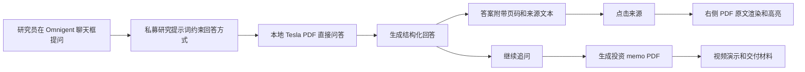
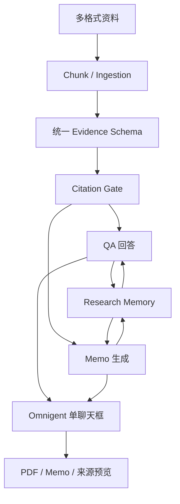

# 当前 PR / 分支与本次私募研究 Demo 工作分析

日期：2026-06-30

## 1. 文档目标

这份文档用于说明当前代码仓库中几个主要 PR、远端分支和本次本地改造之间的关系。

重点只讲流程和职责边界，不展开具体代码实现。

本次工作的主线是：

```text
在 Omnigent 前端中，用一个聊天框跑通本地 PDF 问答、可点击溯源、memo PDF 生成，并制作演示视频。
```

## 2. 当前 PR 与分支概览

| 类型 | 名称 | 状态 | 主要职责 | 与本次 Demo 的关系 |
| --- | --- | --- | --- | --- |
| PR | [#1 evidence schema](https://github.com/simplew4y/pravite_fund_ai_research/pull/1) | Open | 统一 evidence 与 citation 表达 | 是未来可溯源系统的底座 |
| PR | [#2 jcl_memo](https://github.com/simplew4y/pravite_fund_ai_research/pull/2) | Open | memo 生成与进度更新 | 是未来 memo 正式链路的基础 |
| 分支 | `origin/ljl_memo` | 远端分支 | Excel / Markdown / Word 等文件切分与多数据集处理 | 是未来索引问答的资料处理入口 |
| 分支 | `origin/lzx_memo` | 远端分支 | research memory 的存储与召回 | 是未来复用历史 QA / memo 的基础 |
| 分支 | `origin/codex/readme-progress-update` | 远端分支 | README 进度说明 | 用于同步当前阶段说明 |
| 本地改造 | `omnigent/` 工作区 | 本地未提交 | Omnigent 单聊天框、PDF 溯源面板、私募研究提示词 | 是本次实际跑通 demo 的主界面 |
| 本地交付 | `FinSagent/remotion-promo` | 本地生成 | 演示视频 composition 与 MP4 | 是本次对外展示材料 |

## 3. 各板块职责分析

### 3.1 Evidence / Citation 板块

对应：PR #1 `chengjingyi/evidence-schema/20260626-phase1-evidence`

这个板块解决的是“证据如何统一表达”的问题。

它的流程位置是：

```text
原始资料
-> 文档解析结果
-> 标准化 evidence
-> citation 关系
-> 人能看懂的来源展示
```

对本次 Demo 的意义：

- 本次 demo 先绕过完整索引和多格式 evidence 入库，直接对本地 Tesla PDF 做问答。
- 但右侧 PDF 溯源、高亮区域、`p.113` / `10-K p.113, para.1` 这类来源文本，方向上都应该最终对齐 PR #1 的 evidence / citation 设计。
- 后续如果要从 demo 走向正式产品，答案和 memo 不应该只依赖临时页码，而应该沉淀成统一 citation。

### 3.2 Chunk / Ingestion 板块

对应：`origin/ljl_memo`

这个板块解决的是“多类型资料如何进入知识库”的问题。

它的流程位置是：

```text
Excel / Word / Markdown / PDF 等文件
-> 识别文档结构
-> 拆成语义单元
-> 可选补充标签
-> 写入数据集或检索系统
```

对本次 Demo 的意义：

- 本次用户明确要求“现在先做，不用 chunk，直接对原生 PDF 实现 QA 和 memo PDF 链路”。
- 因此第一版 demo 选择直接读 PDF，不走 chunk pipeline。
- 但中长期看，`ljl_memo` 是“多文件、多格式、可扩展问答”的入口。
- 后续可以把它作为一个开关：简单单文件研究走原生 PDF，资料库级研究走 chunk / index。

### 3.3 Research Memory 板块

对应：`origin/lzx_memo`

这个板块解决的是“研究过程如何沉淀和复用”的问题。

它的流程位置是：

```text
QA / note / memo
-> 写入个人研究记忆
-> 按公司、主题、观点版本组织
-> 后续问答或 memo 生成时召回
```

对本次 Demo 的意义：

- 本次 demo 展示的是即时问答和即时 memo 生成，还没有强调长期 memory。
- 但真实私募研究中，历史判断、旧 memo、之前问答非常重要。
- `lzx_memo` 可以支撑后续能力：用户问“之前我们怎么看 Tesla 的 Robotaxi 风险”，系统可以召回历史 QA 和 memo，再结合最新 PDF 重新回答。

### 3.4 Memo 生成板块

对应：PR #2 `jcl_memo`

这个板块解决的是“如何把研究过程变成可交付 memo”的问题。

它的流程位置是：

```text
用户提出 memo 需求
-> 汇总公司资料和研究结论
-> 形成固定结构的 memo
-> 输出 HTML / PDF / Markdown 等交付形态
```

对本次 Demo 的意义：

- 本次 demo 中，memo 生成被放在 Omnigent 单聊天框里触发。
- 展示重点不是 memo 引擎内部如何写作，而是研究员体验：问完问题后，直接要求生成投资 memo PDF。
- 后续正式合并时，PR #2 应该成为 memo 生成服务的主线，本次本地 PDF memo 链路可以作为轻量 demo 或 fallback。

### 3.5 Omnigent 前端与运行入口板块

对应：本地 `omnigent/` 改造

这个板块解决的是“研究员在哪里使用这套能力”的问题。

本次明确选择：

```text
所有操作都在当前 Omnigent 聊天框中完成
不展示单独的 Private Fund PDF 面板
```

用户流程是：

```text
打开 Omnigent
-> 在聊天框提问
-> Claude Code / 本地执行链路处理 PDF
-> 回答带来源
-> 点击来源
-> 右侧打开 PDF 原文和高亮区域
-> 继续追问或生成 memo
```

本次已经验证的体验重点：

- 私募研究专用提示词会引导模型优先使用本地 PDF 证据。
- 回答中的来源可以被点击。
- 右侧面板可以渲染 PDF 页面并显示对应区域。
- `来源：10-K p.113, para.1` 这种自然语言来源也能进入同一溯源流程。
- memo 生成被设计为聊天中的下一步动作，而不是另开一个产品面板。

### 3.6 演示视频板块

对应：`docs/private_fund_demo_video_shot_plan.md` 与 Remotion 成片

这个板块解决的是“如何对外讲清楚产品价值”的问题。

视频叙事流程是：

```text
一个聊天框开始
-> 提出 Tesla PDF 问题
-> 生成结构化 QA
-> 点击来源回到原文
-> 继续追问
-> 生成 memo PDF
-> 总结 QA / 溯源 / Memo 三个价值点
```

视频不讲底层技术，只讲研究员能看到的流程。

## 4. 本次工作如何把各板块串起来

本次没有等待所有 PR 完全合并，而是先用最短路径跑通一个端到端 demo。

实际链路是：



这条链路的价值是：

- 可以先展示“私募研究助手”真实可用的产品体验。
- 不被 chunk、索引、多格式资料库、memory 这些长期模块阻塞。
- 同时保留后续并入 PR #1、PR #2、`ljl_memo`、`lzx_memo` 的空间。

## 5. 与长期架构的关系

长期完整架构更像下面这样：



当前 demo 是长期架构中的一条轻量路径：

```text
单个本地 PDF
-> 直接 QA
-> 页码来源
-> 右侧原文
-> memo PDF
```

未来正式产品路径应升级为：

```text
多格式资料
-> chunk / evidence / citation
-> QA 和 memo 共享同一套证据系统
-> QA 与 memo 反向沉淀到 research memory
-> Omnigent 统一承载交互
```

## 6. 当前状态

### 已经跑通

- Omnigent 可以作为私募研究 demo 的主前端。
- 本地 Tesla PDF 可以用于问答。
- 回答可以带来源页码。
- 来源点击后可以在右侧打开 PDF 页面。
- PDF 页面可以显示对应高亮区域。
- 可以通过同一个聊天框触发 memo 生成。
- 已生成一版产品演示视频。

### 已有 PR / 分支支撑

- PR #1 支撑 future evidence / citation 标准化。
- PR #2 支撑 future memo 生成链路。
- `ljl_memo` 支撑 future 多格式切分和资料库入口。
- `lzx_memo` 支撑 future research memory。

### 仍待合并或产品化

- 本次 Omnigent 私募研究改造还处在本地工作区，需要单独整理成正式分支或 PR。
- 当前 demo 没有使用完整 chunk / index 流程。
- 当前 demo 没有把 QA 和 memo 全量写入 research memory。
- 当前 source highlight 先服务 PDF 页码级复核，后续应与统一 evidence schema 对齐。
- memo 生成体验已经跑通，但正式产品应统一到 memo 引擎和 citation gate。

## 7. 建议合并顺序

建议按“底座先行，体验后接”的顺序推进：

1. 合并 PR #1：先统一 evidence 与 citation 表达。
2. 整理 `ljl_memo`：把多格式 chunk / ingestion 变成稳定资料入口。
3. 整理 `lzx_memo`：把 QA / memo 的研究记忆沉淀下来。
4. 合并或重构 PR #2：让 memo 生成使用统一 evidence 和 citation。
5. 新建 Omnigent 私募研究 PR：把单聊天框、右侧溯源、memo 触发体验接入正式前端。
6. 把演示视频和分镜文档作为产品说明材料归档。

## 8. 对外讲法

如果对业务方介绍，这次工作可以这样讲：

```text
我们先把私募研究最关键的闭环跑通：
研究员在一个聊天框里问本地 PDF，
系统给出结构化回答，
关键判断可以点击回到原文，
然后继续生成可交付 memo。

底层的 evidence、chunk、memory、memo 引擎分别已有 PR 或分支在推进。
本次 Omnigent demo 的价值是把这些能力提前串成一个可感知的产品流程。
```

如果对工程侧介绍，可以这样讲：

```text
现阶段先保留 direct PDF path 作为 demo 和 fallback。
后续把 direct path 逐步替换或补充为 evidence-driven path。
最终 QA、memo、source panel、research memory 都应共享同一套 citation。
```

## 9. 一句话总结

当前多个 PR / 分支分别在做证据、切分、记忆和 memo；本次工作把它们面向用户的最终形态先落到 Omnigent 的一个聊天框里，并用 PDF 溯源和 memo 生成完成了可演示闭环。
