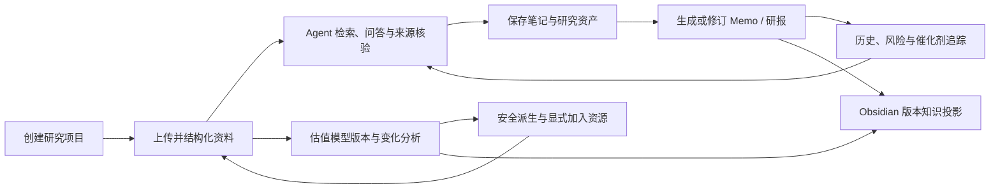

# 📝 私募投研 AI 工作台需求文档 V0.1

> 📝 本文基于 2026-07-17 当前仓库代码、运行文档、测试与 Obsidian 项目记录整理，是用于评审和拆解后续迭代的第一版需求基线，不等同于已全部验收的发布说明。

| 📝 文档属性 | 📝 内容 |
|---|---|
| 版本 | V0.1 |
| 状态 | 待评审 |
| 更新时间 | 2026-07-17 |
| 产品形态 | 本地优先、证据驱动的私募投研 AI 工作台 |
| 当前主实现 | Omnigent Web + FinSagent Pipeline + Claude Native/cc-haha + LiteLLM + SQLite + Obsidian Projection |
| 第一责任用户 | 私募研究员、基金经理、投研负责人 |

## 📝 1. 文档目的

本文件用于统一当前项目的产品目标、用户范围、功能边界、优先级、验收标准和后续决策。后续新增功能应能映射到本文的需求编号；如果产品方向发生变化，应通过新版本记录变更，而不是静默改写本版结论。

## 📝 2. 产品定义

### 📝 2.1 一句话定位

把研究员本地持有的 PDF、Excel、Word、PPT、CSV、Markdown 和文本资料转化为可检索、可引用、可版本化的研究证据，辅助完成问答、研究笔记、Memo、专业研报、风险/催化剂追踪与估值模型变化分析。

### 📝 2.2 核心问题

- 资料分散在不同格式和目录中，查找、核对与复用成本高。
- AI 回答容易脱离原文，事实、数字和估值假设难以追溯。
- 一次性聊天难以沉淀为长期研究资产，旧观点与新资料之间缺乏版本关系。
- Memo、估值模型、风险和催化剂更新后，研究员难以快速判断“发生了什么变化、依据是什么、是否需要行动”。
- 自动化产物与研究员个人笔记之间缺少安全、稳定、可重建的知识层。

### 📝 2.3 产品原则

1. **证据优先**：重大事实、日期、金额、比率、管理层表述和估值输入必须回到可解析证据。
2. **Agent 驱动、轻流程**：系统不强制固定研究模板，由用户问题、所选资料和研究资产驱动分析。
3. **版本不覆盖**：资料、研究节点、Memo 和估值模型采用稳定系列与不可变版本。
4. **人机边界清晰**：系统提供研究辅助与材料组织，不给出自动买卖指令，不替代投资决策。
5. **本地优先**：原始资料、索引、研究产物和知识投影默认在本地保存，密钥不得进入仓库。
6. **安全生成**：HTML/图表禁止联网；Agent 不直接覆盖原始 Excel；缺少证据时明确阻断确定性结论。

## 📝 3. 目标与非目标

### 📝 3.1 V1 产品目标

- 完成“项目创建 → 资料入库 → 带引用研究 → 资产沉淀 → Memo/研报 → 历史与提醒 → 估值跟踪 → Obsidian 阅读”的最小完整闭环。
- 让每个关键研究结论可以追溯到原始文件的页码、Sheet、单元格、范围、幻灯片或标题位置。
- 让同一研究主题和估值模型能够按版本比较，保留变化原因、证据和人工决策痕迹。
- 让后台入库、追踪、估值和知识投影任务在服务重启后可恢复，并向用户展示真实状态。
- 形成可以通过自动化测试和浏览器验收复现的本地演示版本。

### 📝 3.2 V1 非目标

- 不自动执行交易、调仓、下单或输出无条件买卖建议。
- 不把互联网搜索结果作为默认权威事实源；V1 以项目本地资料为准。
- 不承诺完整 OCR、扫描件识别或所有旧式 Office 格式兼容。
- 不执行 Excel 宏、UDF、Power Query、Pivot，也不负责公式重算。
- 不在 V1 开放 Obsidian 任意 Markdown 到 Project DB 的双向回写。
- 不在 V1 承诺成熟的多租户、团队权限、合规归档和云端灾备能力。
- 不以替代研究员复核、投委会审批或正式估值审计为目标。

## 📝 4. 用户与使用场景

### 📝 4.1 用户角色

| 📝 角色 | 📝 主要诉求 | 📝 V1 权限假设 |
|---|---|---|
| 研究员 | 入库资料、提问、核验来源、保存笔记、生成 Memo、分析估值变化 | 本地工作区完整操作权限 |
| 基金经理/投研负责人 | 快速查看结论、变化、风险、催化剂、证据覆盖和待复核项 | 以阅读、比较和审核为主 |
| 系统维护者 | 配置模型与 Vault、启动服务、查看任务/Worker 健康、处理失败 | 本机运维权限 |

> 📝 V1 当前按单机可信用户设计；团队账户、角色隔离和审批授权属于后续生产化范围。

### 📝 4.2 核心用户故事

- 作为研究员，我希望上传一个公司项目的多格式资料并看到明确的解析进度，以便知道哪些内容已可检索。
- 作为研究员，我希望每个事实和数字都能点击回到 PDF 原页或 Excel 单元格，以便快速复核。
- 作为研究员，我希望把回答、选中文字和分析结果保存为长期资产，并在下一轮研究中复用。
- 作为研究员，我希望生成有证据的文本、表格、图表和 Memo，而不是只能保留聊天记录。
- 作为基金经理，我希望比较两个 Memo 或估值模型版本，直接看到重大变化、风险和证据。
- 作为研究员，我希望 Agent 可以提出估值模型修改建议，但不得直接覆盖原文件，发布新版本前必须由我确认。
- 作为投研负责人，我希望在 Obsidian 中阅读当前版本、历史变化和证据卡，同时保留自己的批注不被后台覆盖。
- 作为维护者，我希望后台任务失败、重试、冲突或 Vault 不可用时能被明确发现，而不是被误报为已完成。

## 📝 5. 核心业务闭环

## 📝 6. 功能需求总表

| 📝 编号 | 📝 模块 | 📝 优先级 | 📝 当前状态 |
|---|---|---:|---|
| FR-01 | 研究项目管理 | P0 | 已实现，待完整浏览器验收 |
| FR-02 | 资料上传、目录与任务管理 | P0 | 已实现，部分交互仍在迭代 |
| FR-03 | 多格式解析、分类与证据索引 | P0 | 已实现，OCR/复杂 Excel 有边界 |
| FR-04 | Agent 研究问答 | P0 | 已实现 |
| FR-05 | 引用与原文复核 | P0 | 已实现，待扩大真实浏览器回归 |
| FR-06 | 统一研究资产库 | P0 | 已实现 |
| FR-07 | 研究笔记与结构化节点 | P0 | 已实现 |
| FR-08 | Memo 与专业研报 | P0/P1 | Memo 已实现；专业研报能力已实现但主 UI 入口已弱化 |
| FR-09 | 历史观点、风险与催化剂追踪 | P1 | 已实现，待长期运行验收 |
| FR-10 | 估值模型版本跟踪与自动总览 | P0 | 已实现，最新总览改动待提交与运行态复验 |
| FR-11 | Agent 估值分析与安全派生 | P1 | 已实现；逐项人工批准待补 |
| FR-12 | Obsidian 版本知识投影 | P1 | Memo/估值已实现；其他资产待扩展 |
| FR-13 | 工作台体验与可访问性 | P1 | 基础能力已实现，完整视觉/键盘/窄屏验收待补 |
| FR-14 | 运维、状态与可恢复性 | P0 | 已实现基础服务栈，24 小时稳定性待验收 |
| FR-15 | 安全、审计与删除边界 | P0 | 基础能力已实现，回收站与团队权限待决策 |

## 📝 7. 详细功能需求与验收标准

### 📝 FR-01 研究项目管理

**需求**

- 用户可以创建、查看、切换和激活研究项目；项目至少包含名称，可选公司名称、股票代码和自定义 dataset ID。
- 当前项目必须成为资料检索、资产、Memo、追踪、估值和知识投影的统一作用域。
- 删除项目必须二次确认；当资料 Pipeline 仍在运行时必须拒绝删除。
- 删除项目不得误删关联聊天历史；托管资料、索引和项目产物的删除边界必须清晰展示。

**验收标准**

- 创建项目后可直接进入统一工作台并上传资料。
- 切换项目后，资料、资产、引用和后台状态不串项目。
- 删除运行中项目得到明确错误；删除成功后路由回退到可用项目或空态。

### 📝 FR-02 资料上传、目录与任务管理

**需求**

- 用户可以从左侧“资料来源”选择或拖入多份文件。
- 支持 PDF、XLSX/XLSM、DOCX、PPTX、CSV、Markdown 和 TXT；不支持格式在提交前提示。
- 支持项目内资料目录的新建、重命名、删除与文件移动；目录只改变组织方式，不破坏逻辑文档和版本身份。
- 上传后自动启动增量 Pipeline，并展示 queued、running、completed、failed 和 warning 等真实状态。
- 用户可以删除单份或批量资料；删除当前权威副本不得破坏历史版本证据。

**验收标准**

- 多文件上传后每份资料都有可查询状态，任务完成前不能被误报为可检索。
- 同一逻辑文件更新后进入同一文档版本链，而不是静默覆盖旧版本。
- 目录移动后文件仍可预览、检索和引用，evidence ID 仍可解析。

### 📝 FR-03 多格式解析、分类与证据索引

**需求**

- PDF 至少保留文件、页码、段落/页面文本和版本信息。
- Excel 至少保留工作簿、Sheet、区域、单元格、原值、公式、数字格式和可用期间信息。
- Word、PPT、CSV、Markdown 和 TXT 生成可检索正文及可定位元数据。
- 系统使用受控 taxonomy 区分财报、会议纪要、估值模型等业务类型；规则优先，LLM 只处理模糊分类并接受服务端枚举校验。
- 公司身份冲突或跨公司资料必须进入隔离/待复核状态，不得污染当前项目的确定性结论。
- 入库必须记录 parser 版本、checksum、状态、告警和审计信息，并支持幂等重跑。

**验收标准**

- 任一检索结果均能解析为可定位的 evidence 单元。
- 同 checksum 重试不产生重复当前版本，失败可重跑且原因可见。
- 图片型/扫描型资料没有正文时明确提示 OCR 边界，不生成摘要壳冒充证据。
- Excel 公式不执行，原文件不修改；缓存值缺失时明确标记。

### 📝 FR-04 Agent 研究问答

**需求**

- 用户在“研究”工作区使用单一对话入口提出公司、财务、估值、风险、催化剂和材料核验问题。
- Agent 的第一步应检查数据集状态并检索本地证据；深度研究应扩大召回并交叉核验 PDF 与 Excel。
- 关键事实必须在同一句或同一要点后附可点击引用；证据不足时标记“资料未覆盖/需复核”。
- 用户勾选的资料、笔记、Memo 和节点可以作为上下文，但二级资产不能替代一手证据核验。
- 系统不得在用户可见消息中泄露 dataset ID、内部 MCP 契约、隐藏 Prompt 或完整内部上下文。

**验收标准**

- 对包含金额、比例、日期或管理层表述的问题，回答中的每个关键结论都有有效来源或明确缺口标签。
- 切换数据集后，同一问题不会引用其他项目证据。
- 隐藏上下文不出现在聊天气泡、复制文本和历史消息中。

### 📝 FR-05 引用与原文复核

**需求**

- PDF 引用点击后展示原文件、页码、页面文本/图像和可用高亮。
- Excel 引用点击后展示工作簿、Sheet、请求范围、实际窗口、单元格原值、公式和附近行列上下文。
- 大范围 Excel 请求必须使用有界窗口和分页/游标，不得因范围过大直接失效。
- 空范围、索引缺失、证据过期和跨项目证据必须有可区分的错误信息。
- 用户可从资料库直接预览 PDF、Excel、Office 文本和生成产物。

**验收标准**

- 已存在的 citation/evidence 链接在当前数据集可稳定打开对应位置。
- PDF 页码与 Excel Sheet/Cell 和数据库记录一致。
- 证据不可用时不显示伪原文，必须返回原因和建议动作。

### 📝 FR-06 统一研究资产库

**需求**

- 资产库统一展示原始文档、回答笔记、重要信息、研究节点、表格、图表、Memo 和研报。
- 支持搜索、资产类型/业务文档类型筛选、排序、列表/卡片视图和详情预览。
- 用户可以选择资产用于下一轮分析；选择状态必须是唯一真源并跨视图一致。
- 富内容资产默认使用宽屏详情；PDF、Excel、HTML、Markdown 按格式展示。
- 删除资产必须二次确认，并按真实资产类型清理关联记录；不可变历史的处理规则必须明确。

**验收标准**

- 新保存资产立即出现在列表，接口失败时前端状态可回滚。
- 选择/取消资产后，下一轮 Agent 上下文与 UI 数量一致。
- 筛选后全选不应意外清除筛选范围外已选资产。

### 📝 FR-07 研究笔记与结构化节点

**需求**

- 用户可以保存整条回答或选中文字为笔记。
- 用户可以基于当前会话和已选资产生成文本、表格或图表研究节点。
- 节点包含标题、摘要、类型、正文、标签、置信度、父节点、证据和不可变版本。
- 节点正文至少包含结论、支持信息、不确定性/反证和下一步问题。
- 表格和图表中的每个事实数值必须绑定直接证据；图表只能使用内联数据，不得联网。

**验收标准**

- 没有可靠数值时，Agent 明确说明缺失，不用模拟值补齐图表。
- 节点更新产生新版本，旧版本和父子/证据关系仍可追溯。
- HTML 图文在 sandbox 中运行，无法访问网络、父页面、本地存储、表单或导航。

### 📝 FR-08 Memo 与专业研报

**需求**

- 用户可以从工作台明确选择生成 Memo，并输入主题、关键问题、时间范围、指标和格式要求。
- Memo 使用已核验证据形成研究结论，而不是把检索结果列表直接当成成品。
- Memo 输出 Markdown、HTML 和 PDF；聊天中返回主要产物入口和版本信息。
- 同一主题形成稳定 Memo series；修订必须显式关联 revision_of 并追加版本。
- 专业研报能力复用 FinRobot 模板，输出 Markdown、HTML、PDF、JSON、图表和 evidence index；V1 需确认是否恢复为主 UI 入口。

**验收标准**

- 成品 Memo 的重大事实、数字和章节结论有来源；无证据章节明确标记“不可用于投资判断”。
- 修订不会覆盖旧文件，版本号、前序版本和变更关系可查询。
- 生成失败保留失败 run 和错误，但不升级当前成功版本。

### 📝 FR-09 历史观点、风险与催化剂追踪

**需求**

- 用户可以比较同系列两个 Memo 版本，并查看章节与研究对象的变化。
- 系统持续维护 thesis、assumption、risk、catalyst、metric 和 question 的稳定对象与不可变版本。
- 新资料未提及旧观点只记录 not_mentioned；失效、撤回和回滚必须有显式证据或历史快照。
- 用户可以建立事件/周期追踪规则，查看提醒并执行确认、忽略、稍后提醒和重新打开。
- Pipeline、Memo、手动刷新和计划扫描通过可恢复异步任务处理，不依赖交互会话常驻。

**验收标准**

- 相同事件重复处理不产生重复提醒。
- 服务重启后 queued/running 任务可恢复，超时任务按规则重试。
- 页面不把 queued 误报为 completed，并能查看 job ID、尝试次数和错误。

### 📝 FR-10 估值模型版本跟踪与自动总览

**需求**

- 系统按公司和逻辑文件建立估值模型 series，并保留每个工作簿版本及 checksum。
- Pipeline 完成后自动提取 Sheet、单元格、公式、候选事实和语义节点，生成相邻版本的确定性差异。
- 每个版本生成结构化 JSON 与自包含 HTML 总览，包括三表覆盖、连续期间走势、关键财务/估值指标和可追溯表格。
- 期间识别必须避免把财务小数中的 20xx 片段当成年份；Upload、Bloomberg、缓存等原始 Sheet 不得进入核心结论。
- 低质量、疑似表头、缺单位、跨公司或无法解释的变化进入隔离/审计层。

**验收标准**

- 原始工作簿不被执行或改写；旧版本首次读取可幂等补建总览。
- 总览指标可以回到具体 Sheet/Cell 和原始值/公式。
- 相邻版本可区分真实变化、抽取覆盖变化和历史回滚。

### 📝 FR-11 Agent 估值分析与安全派生

**需求**

- 用户可以对指定估值版本或版本比较发起 Agent 分析，得到总结、发现、证据链和修改建议。
- Agent 引用必须经服务端校验，非法引用、结构化输出错误和缺失证据不得直接落库为有效结论。
- Agent 不直接修改原模型；派生工作簿必须复制原文件，保留 Sheet 与公式，并新增审计分析页。
- 自动写入只允许高置信度、目标明确、非公式、有限范围的数值；年份表头、公式、异常倍数和缺少映射的建议必须跳过。
- “生成派生版”和“加入项目资源”是两个独立动作；只有用户显式确认后，派生版才进入新资料版本链。

**验收标准**

- 原文件 checksum 在分析和派生前后保持不变。
- 派生文件记录建议、证据、实际写入、跳过原因和审计 hash。
- 加入资源时只能选择受管目录中 hash 匹配的派生文件，并产生可查询 Pipeline job。
- V1 正式验收前需补充逐项人工确认或明确接受当前严格安全门的一键模式。

### 📝 FR-12 Obsidian 版本知识投影

**需求**

- Project DB 是权威事实源，Obsidian 是可重建的阅读与个人批注层。
- 独立 Worker 通过 durable outbox、note registry、原子写、重试和 reconcile 投影内容。
- Memo 与估值至少形成系列首页、不可变版本、相邻差异、证据卡和当前版本指针。
- 正文优先展示当前结论、重大变化、证据覆盖、风险、催化剂和待办；内部 ID、hash、parser 元数据进入 Properties 或折叠审计区。
- AUTO 区由系统维护，USER 区由研究员维护；受管区被人工修改时生成冲突笔记，不静默覆盖。
- 系统提供知识状态查询，展示 Vault 配置、Worker 健康、outbox、registry、失败和冲突。

**验收标准**

- 重复事件不会生成重复版本笔记；Worker 重启后可继续处理。
- 新版本只新增版本/差异并移动 current 指针，旧版本内容保持不变。
- USER 区在重投影后原样保留；AUTO 冲突进入隔离目录。
- 无证据 Memo 不发布确定性投资结论，只能显示阻断状态和技术底稿。

### 📝 FR-13 工作台体验与可访问性

**需求**

- 工作台提供研究、资料、笔记、Memo、估值跟踪、历史变化和追踪提醒等入口。
- 支持顶部标签布局与 IDE 侧栏布局；笔记/Memo 可与研究对话并排，估值/历史/追踪使用主区域。
- 支持亮色、暗色和跟随系统主题，使用统一语义色和 Geist 字体。
- 支持常见桌面、平板和窄屏布局；宽表、长 Memo、PDF、Excel 和图表必须可滚动阅读。
- 主要按钮、标签、弹窗和引用提供键盘焦点、aria 标签和明确状态反馈。

**验收标准**

- 1280px 桌面、平板和手机宽度下核心流程无不可达操作。
- 亮暗主题下文字、状态、表格、iframe 和弹窗对比度可读。
- 键盘可完成工作区切换、弹窗确认、引用打开和侧栏宽度调整。

### 📝 FR-14 运维、状态与可恢复性

**需求**

- 统一脚本管理 LiteLLM、Omnigent Server、Host、Research Tracking Worker、Valuation Worker 和 Obsidian Projection Worker。
- 支持 start、stop、restart、status 和分服务 logs；健康检查必须区分进程存在和业务可用。
- 模型 Base URL、API Key、Vault 路径和数据集目录通过环境变量或本地配置提供，不写入 Git。
- 后台任务使用持久化状态、幂等键、lease、超时恢复和有限重试。

**验收标准**

- 新机器按文档安装依赖后可以启动完整本地闭环。
- 服务重启不丢失已入库资料、不可变版本、任务、提醒和投影队列。
- status 能识别关键 Worker 离线、Vault 不可用和积压/失败任务。

### 📝 FR-15 安全、审计与删除边界

**需求**

- 所有生成结论保存使用的资料版本、evidence、模型/Agent、时间和产物路径。
- HTML/图表 iframe 禁止联网、外部资源、表单、导航、对象、worker、父页面和本地存储。
- 文件读取、派生和下载只能作用于受管目录与已登记文件，防止任意路径访问。
- 项目、资料和资产删除必须展示影响范围并二次确认；历史证据和原始文件的删除策略必须可审计。
- API Key、Token、用户原始资料和真实 Vault 不进入版本控制。

**验收标准**

- 越权路径、hash 不匹配派生文件和跨数据集 evidence 被拒绝。
- 生成产物可以回溯到输入版本和证据；失败任务不会冒充成功资产。
- 发布前明确决定永久删除是否继续保留，或引入回收站/软删除。

## 📝 8. 数据与版本模型

| 📝 领域 | 📝 稳定实体 | 📝 不可变/版本实体 | 📝 关键关系 |
|---|---|---|---|
| 项目 | dataset/project | pipeline job | 项目隔离全部资料与产物 |
| 资料 | logical document | document version | checksum、current version、解析审计 |
| 证据 | evidence unit | evidence location/index version | 文件版本 → 页码/Sheet/Cell/范围 |
| 研究资产 | saved asset/research node | node version/content block | 上下文、父节点、evidence IDs |
| Memo/研报 | series/report | memo/report version/run | revision_of、章节证据、产物清单 |
| 持续追踪 | research item/watch rule | item version/change/alert/job | not_mentioned、失效、撤回、回滚 |
| 估值 | valuation model series | model version/diff/analysis/derived model | 相邻比较、证据、派生审计 |
| Obsidian | note registry | projection event/conflict | DB 实体 → Vault 路径与内容 hash |

## 📝 9. 非功能需求

### 📝 9.1 可追溯性

- P0 关键事实与全部数值结论要求 100% 具备可解析证据，或明确标记资料缺口。
- 引用展示不得只暴露 `fact:`、`chunk:`、`cell:` 等内部 ID，必须解析成人类可读来源卡。
- 任何版本比较必须保存参与比较的确切版本，不依赖“当前版本”动态回看。

### 📝 9.2 一致性与可靠性

- 入库、异步追踪、估值处理和 Obsidian 投影必须幂等。
- 不可变版本一旦成功登记不得被后续任务原地改写。
- Worker 中断后允许重试，重复消费不得产生重复提醒、版本或笔记。

### 📝 9.3 性能目标（待用真实数据校准）

- 典型单项目数据集内，普通证据检索 P95 目标不超过 5 秒。
- 已索引 PDF/Excel 来源详情 P95 目标不超过 3 秒。
- 大型 Excel 预览必须分页/窗口化，前端不得一次渲染完整工作簿。
- 长耗时入库、报告、追踪和估值分析必须异步，不阻塞 HTTP 请求至完成。

### 📝 9.4 可维护性

- Skill、MCP tool、API、前端调用和测试中的能力清单必须同步更新。
- schema 升级采用向前兼容迁移，并提供旧数据幂等回填路径。
- 业务文档、README 与 Obsidian 项目记录必须随代码变更同步更新。

## 📝 10. V1 发布验收

### 📝 10.1 必过业务场景

1. 创建一个新项目，上传 PDF 与 Excel，完成 Pipeline 并看到可检索状态。
2. 提问一个同时涉及 PDF 事实和 Excel 数值的问题，逐条打开来源复核。
3. 保存回答片段并生成文本、表格和图表节点，确认资产与证据关系。
4. 生成 Memo，再基于新资料修订，比较两个版本并验证旧版本未被覆盖。
5. 创建风险或催化剂追踪规则，触发异步刷新并处理提醒。
6. 导入两个估值模型版本，查看自动总览、确定性差异和 Agent 分析。
7. 生成安全派生模型，验证原文件不变，并经显式确认加入项目资源。
8. 验证 Memo/估值进入 Obsidian，重投影后 USER 区保留且无重复笔记。
9. 重启完整服务栈，确认项目数据、任务、提醒和知识投影可恢复。

### 📝 10.2 必过质量门

- 相关 Python/TypeScript 测试、类型检查、lint、格式检查和 production build 通过。
- 核心流程完成亮色、暗色、1280px、平板和窄屏浏览器验收。
- 完成至少一次 24 小时 Worker 稳定性运行，检查 lease、重试、小时扫描和健康文件。
- 不提交真实 API Key、用户 PDF/Excel、临时 HTML、截图或真实 Vault 内容。
- 无证据、跨公司、低质量期间或异常估值候选不能进入确定性投资结论。

## 📝 11. 迭代建议

### 📝 M1：需求冻结与当前能力验收

- 评审并确认 V1 范围、用户角色、永久删除策略和专业研报入口。
- 补齐关键浏览器人工验收、完整 Vitest mock 漂移修复和最新估值总览运行态复验。
- 对真实数据抽样评估检索准确率、跨公司污染、风险/催化剂误报和证据覆盖率。

### 📝 M2：研究安全与使用体验

- 增加估值建议逐项人工批准、可编辑语义单元格映射和批准人审计。
- 决定并实现回收站/软删除，或正式确认永久删除的合规边界。
- 扩展 Obsidian 到研究节点、风险、催化剂和会话纪要，并完成应用内渲染验收。
- 增强 OCR、扫描件状态和大型资料的增量索引体验。

### 📝 M3：生产化

- 增加账户、角色、项目权限、操作审计、备份恢复和数据保留策略。
- 建立部署支持矩阵、可观测性、告警、容量基准和发布回滚方案。
- 评估合规可控的外部数据接入，但仍与本地权威证据分层展示。
- 建立跨格式估值本体、情景归因与敏感性矩阵。

## 📝 12. 待评审问题

1. V1 的目标用户是单机研究员，还是必须支持团队协作和角色权限？
2. “专业研报”是否恢复为主工作台显式入口，还是仅保留 Slash Skill/Agent 调用？
3. 项目、资料和资产应继续永久删除，还是在 V1 引入回收站？
4. 估值派生在正式使用前是否必须逐项人工批准，谁是批准人？
5. V1 是否必须支持扫描 PDF/OCR；若支持，接受的语言、准确率和人工校正流程是什么？
6. 外部行情、公告或 Web 资料是否进入 V1；若进入，如何与本地权威证据分层？
7. Obsidian Vault 是否允许云同步；若允许，哪些原文、路径和审计字段禁止投影？
8. 正式发布支持哪些操作系统、模型供应商、部署方式和可用性指标？

## 📝 13. 当前已知风险

- 当前仓库仍包含历史原型与多条实现路径，部署和文档需继续收敛到结构化数据集主链路。
- 真实资料可能出现扫描件、复杂公式、合并单元格、隐藏 Sheet、单位缺失和公司身份冲突，自动抽取不能替代人工复核。
- 风险/催化剂追踪与 Agent 估值分析依赖模型质量，需要真实数据集上的召回率、误报率和稳定性评估。
- 当前主要按本机可信用户设计，尚不足以直接承载多人协作、敏感数据隔离和正式合规审计。
- 浏览器完整回归、24 小时 Worker 稳定性和 Obsidian 应用内渲染仍有待办，不能仅以单元测试通过视为发布完成。

## 📝 14. 需求变更记录

- 📝 2026-07-17：基于当前项目生成 V0.1，首次统一产品定位、十五个功能模块、验收口径、非功能目标、迭代建议与待评审问题。
