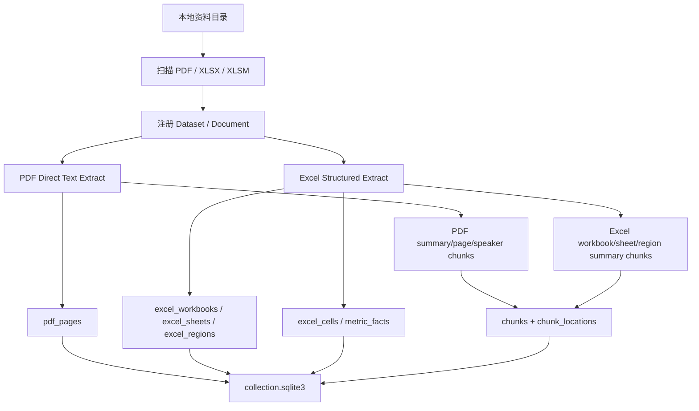

# 私募投研目录级入库 Pipeline

本文档说明新的目录级 pipeline：给定一个本地资料目录，后端一次性扫描其中的 PDF / Excel 文件，将资料写入统一 SQLite 数据库。设计目标是服务私募投研问答和 memo 生成，而不是把所有文件都强行切成同一种文本 chunk。

## 适用资料

以 `test_doc/ygdy` 为例：

| 文件 | 类型 | 处理策略 |
|---|---|---|
| `300274 v44.xlsx` | Excel 估值模型 | 结构化 facts 为主，轻量 summary chunk 为辅 |
| `阳光电源300274近况交流会260701_原文.pdf` | 电话会逐字稿 | 直接抽文本，按页和发言片段存 evidence |
| `阳光电源-20260615.pdf` | 投研 Q&A note | 直接抽文本，按页/段落存 evidence |

这批 PDF 是文字型 PDF，默认不走 MinerU OCR。MinerU/OCR 后续只作为 fallback：扫描版、图片型研报、复杂表格抽取失败时再启用。

## 总体流程



核心原则：

- PDF 是非结构化文本证据，按页码、段落、发言片段做 evidence。
- Excel 是结构化资产，不以完整 markdown chunk 为主，而是抽 `sheet / region / cell / metric fact`。
- `chunks` 只放适合语义召回的轻量摘要。
- 精确取数、公式、单元格证据放在结构化表里。

## 输出目录

默认输出到：

```text
output/private_fund_datasets/
  datasets.sqlite3
  <dataset_id>/
    raw/
      原始 PDF / Excel 副本
    meta/
      collection.sqlite3
```

可通过环境变量覆盖：

```bash
export PRIVATE_FUND_DATASET_WORKSPACE=/path/to/private_fund_datasets
```

也可以在 API 请求里传 `workspace_root`。

## 数据库结构

### 全局库

`datasets.sqlite3`：

| 表 | 作用 |
|---|---|
| `datasets` | 资料包级状态、路径、公司信息 |
| `dataset_state` | 当前 active dataset |

### Dataset 库

`<dataset_id>/meta/collection.sqlite3`：

| 表 | 作用 |
|---|---|
| `documents` | 每个源文件一行 |
| `chunks` | 轻量语义 chunk，供后续向量/BM25 索引 |
| `chunk_locations` | 统一溯源位置，PDF 页码或 Excel range/cell |
| `pdf_pages` | PDF 每页全文 |
| `excel_workbooks` | Excel workbook 摘要 |
| `excel_sheets` | sheet 角色、used range、公式密度 |
| `excel_regions` | sheet 内区域，带 `cell_range` 和 `region_type` |
| `excel_cells` | 每个非空单元格的值、公式、缓存值、行列标签 |
| `metric_facts` | 可用于投研问答的指标事实 |
| `index_registry` | 当前结构化索引状态 |
| `ingest_jobs` | 入库任务状态和完整结果 |

## Excel 存储方式

Excel 不再以“完整表格 chunk”为主。新的存储分三层：

| 层级 | 示例 |
|---|---|
| Summary chunk | `excel_workbook_summary`, `excel_sheet_summary`, `excel_region_summary` |
| Structure | `excel_sheets`, `excel_regions` |
| Facts | `excel_cells`, `metric_facts` |

`metric_facts` 的核心字段：

| 字段 | 说明 |
|---|---|
| `metric_name` | 行标签，例如 `Revenue`、`WACC` |
| `period` | 列标签识别出的年份/季度，例如 `2026E` |
| `value_text` / `value_numeric` | 展示值与数值 |
| `unit` | `%`、`CNYm`、`GWh` 等 |
| `sheet_name` / `cell_ref` | 精确来源 |
| `formula` | 原始公式，如有 |
| `source_range` | 可展示证据位置 |

Agent 检索时应先搜 summary chunk 定位 sheet/region，再查 `metric_facts` 或 `excel_cells` 精确取数，最后返回 `sheet_name!cell_ref` 作为证据。

## 后端接口

新增接口：

```http
POST /private-fund/ingest-directory
```

请求示例：

```json
{
  "directory_path": "/Users/Admin/project/private_fund_ai_research/test_doc/ygdy",
  "workspace_root": "/Users/Admin/project/private_fund_ai_research/output/private_fund_datasets",
  "dataset_id": "ygdy",
  "dataset_name": "阳光电源投研资料包",
  "company_name": "阳光电源",
  "company_ticker": "300274",
  "recursive": true,
  "reset": true,
  "background": true
}
```

默认 `background=true`，接口会立即返回：

```json
{
  "job_id": "...",
  "status": "queued",
  "message": "已排队执行私募投研目录入库..."
}
```

查询状态：

```http
GET /private-fund/ingest-jobs/{job_id}
```

测试或小目录可以同步执行：

```json
{
  "directory_path": "/Users/Admin/project/private_fund_ai_research/test_doc/ygdy",
  "dataset_id": "ygdy",
  "company_name": "阳光电源",
  "company_ticker": "300274",
  "reset": true,
  "background": false
}
```

## CLI 用法

也可以不启动 API，直接跑 pipeline：

```bash
python FinSagent/data_pipeline/private_fund_directory_ingest.py \
  --directory /Users/Admin/project/private_fund_ai_research/test_doc/ygdy \
  --workspace-root /Users/Admin/project/private_fund_ai_research/output/private_fund_datasets \
  --dataset-id ygdy \
  --dataset-name 阳光电源投研资料包 \
  --company-name 阳光电源 \
  --company-ticker 300274 \
  --reset
```

## 后续接 Agent 的方式

后续 agent 检索建议按以下顺序：

1. 通过 `chunks` 做语义召回，定位相关 PDF 页面或 Excel sheet/region。
2. 如果命中 Excel，再查 `metric_facts` 和 `excel_cells` 精确取数。
3. 如果命中 PDF，再查 `pdf_pages` 获取页面上下文。
4. 回答中统一返回 evidence：
   - PDF：`文件名 p.页码`
   - Excel：`文件名 Sheet!Cell` 或 `Sheet!Range`
5. 前端点击 evidence 时，根据 `chunk_locations` 渲染 PDF 页或 Excel 区域。
