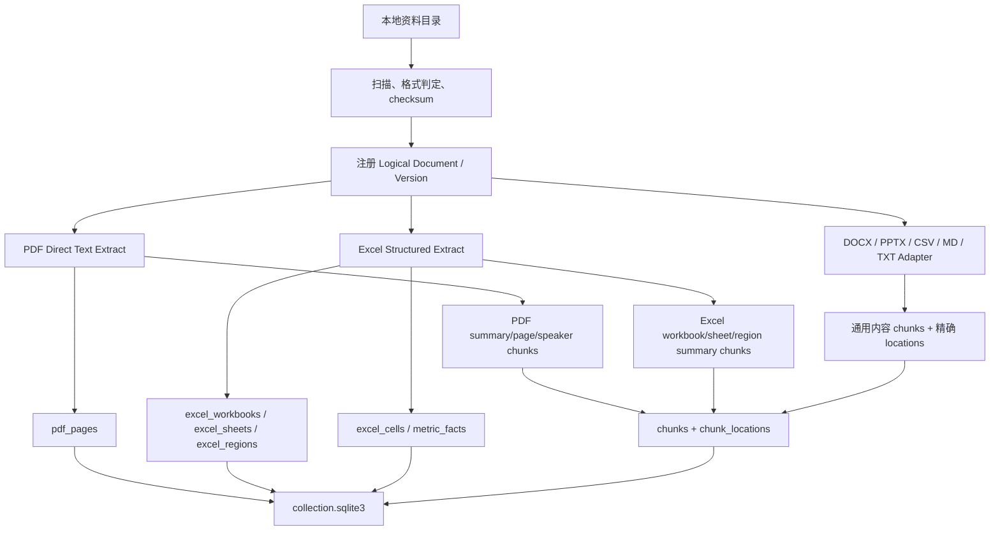

# 私募投研目录级入库 Pipeline

> 📝 2026-07-13：补充多格式解析、版本化证据与 Excel 精确溯源的当前实现。

本文档说明目录级 pipeline：给定一个本地资料目录，后端扫描其中的投研文档，将内容、结构、版本和来源位置写入统一 SQLite 数据库。设计目标是服务私募投研问答和长期 memo 生成，并让每条证据可以回到具体文件版本与原始位置。

## 适用资料

以 `test_doc/ygdy` 为例：

| 文件 | 类型 | 处理策略 |
|---|---|---|
| `300274 v44.xlsx` | Excel 估值模型 | 结构化 facts 为主，轻量 summary chunk 为辅 |
| `阳光电源300274近况交流会260701_原文.pdf` | 电话会逐字稿 | 直接抽文本，按页和发言片段存 evidence |
| `阳光电源-20260615.pdf` | 投研 Q&A note | 直接抽文本，按页/段落存 evidence |

当前格式能力：

| 格式 | 处理方式 | 可回溯位置 |
|---|---|---|
| PDF | PyMuPDF 固定解析器；低文本质量进入 `needs_ocr` | 页码、bbox |
| XLSX / XLSM | workbook、sheet、region、cell、候选 metric facts | Sheet、Range、Cell |
| DOCX | OOXML 正文、Heading、表格 | Heading、段落/表格行 |
| PPTX | OOXML slide 文本与 speaker notes | Slide |
| CSV | 表头和分行表格块 | 原始行、cell range |
| Markdown / TXT | Heading 或稳定行块 | Heading、行范围 |

`.xls`、`.doc`、`.ppt`、RTF 等未实现格式会明确返回 `unsupported`，不会再以“0 documents successfully”结束。

这批 PDF 是文字型 PDF，默认不走 MinerU OCR。MinerU/OCR 后续只作为 fallback：扫描版、图片型研报、复杂表格抽取失败时再启用。

## 总体流程



核心原则：

- PDF 是非结构化文本证据，按页码、段落、发言片段做 evidence。
- Excel 是结构化资产，不以完整 markdown chunk 为主，而是抽 `sheet / region / cell / metric fact`。
- `chunks` 只放适合语义召回的轻量摘要。
- 精确取数、公式、单元格证据放在结构化表里。
- 文档身份由资料包和相对路径确定；内容变化产生新 `version_no`，旧版保留但退出当前检索。
- 单文件解析使用 savepoint；失败不会留下半页、半表或半截 chunk。
- `reset=false` 是默认增量模式；`reset=true` 只强制重解析，不删除数据库、历史 raw 文件或 memo。
- Excel `metric_facts` 是启发式候选事实，必须结合 `fact_status`、`quality_status` 和原始单元格复核。

运行状态约定：

| 状态 | 含义 |
|---|---|
| `completed` | 所有支持文件均已正确索引 |
| `completed_with_warnings` | 存在 `needs_ocr` 或不支持格式；可用文件仍已索引 |
| `failed` | 没有支持文件，或至少一个支持文件解析失败 |
| 文档 `needs_ocr` | 保留页面诊断信息，但写入 0 个可检索 chunk |

## 输出目录

默认输出到：

```text
output/private_fund_datasets/
  datasets.sqlite3
  <dataset_id>/
    raw/
      各版本原始文件副本
    meta/
      collection.sqlite3
    memos/
      长期报告产物（重跑 pipeline 时保留）
```

可通过环境变量覆盖：

```bash
export PRIVATE_FUND_DATASET_WORKSPACE=/path/to/private_fund_datasets
```

也可以在 API 请求里传 `workspace_root`。

## 数据库结构

### 全局库

`datasets.sqlite3`：

| 表 | 作用 |
|---|---|
| `datasets` | 资料包级状态、路径、公司信息 |
| `dataset_state` | 当前 active dataset |

### Dataset 库

`<dataset_id>/meta/collection.sqlite3`：

| 表 | 作用 |
|---|---|
| `documents` | 逻辑文档的每个版本一行，含 checksum、current/supersedes、parser 元数据 |
| `chunks` | 轻量语义 chunk，供后续向量/BM25 索引 |
| `chunk_locations` | 统一溯源位置，PDF 页码或 Excel range/cell |
| `pdf_pages` | PDF 每页全文 |
| `excel_workbooks` | Excel workbook 摘要 |
| `excel_sheets` | sheet 角色、used range、公式密度 |
| `excel_regions` | sheet 内区域，带 `cell_range` 和 `region_type` |
| `excel_cells` | 每个非空单元格的值、公式、缓存值、行列标签 |
| `metric_facts` | 可用于投研问答的指标事实 |
| `index_registry` | 当前结构化索引状态 |
| `ingest_jobs` | 入库任务状态和完整结果 |

`documents.logical_doc_id + version_no` 构成稳定版本链。当前搜索只读取
`is_current=1 AND deleted_at IS NULL`；已经生成的历史报告仍可通过固定的
`chunk:<id>`、`fact:<id>`、`cell:<id>` 找回旧版本证据与 raw 文件。
其中 `status` 保留解析结果（如 `indexed/failed/needs_ocr`），
`lifecycle_state` 单独记录 `active/superseded/removed/failed_attempt`，避免版本切换覆盖原始失败原因。

## Excel 存储方式

Excel 不再以“完整表格 chunk”为主。新的存储分三层：

| 层级 | 示例 |
|---|---|
| Summary chunk | `excel_workbook_summary`, `excel_sheet_summary`, `excel_region_summary` |
| Structure | `excel_sheets`, `excel_regions` |
| Facts | `excel_cells`, `metric_facts` |

`metric_facts` 的核心字段：

| 字段 | 说明 |
|---|---|
| `metric_name` | 行标签，例如 `Revenue`、`WACC` |
| `period` | 列标签识别出的年份/季度，例如 `2026E` |
| `value_text` / `value_numeric` | 展示值与数值 |
| `unit` | `%`、`CNYm`、`GWh` 等 |
| `sheet_name` / `cell_ref` | 精确来源 |
| `formula` | 原始公式，如有 |
| `source_range` | 可展示证据位置 |

Agent 检索时应先搜 summary chunk 定位 sheet/region，再查 `metric_facts` 或 `excel_cells` 精确取数，最后返回 `sheet_name!cell_ref` 作为证据。

### 📝 估值期间与原始数据 Sheet 治理（2026-07-17）

- 📝 期间只接受独立的 `20xx`、`20xxE`、`FY 20xx`、`1Q26` 等年份/季度 token；长小数中的相似数字片段不再被当作期间。
- 📝 每个数值单元格优先继承同列最近的有效期间表头，再回退到通用列标签，减少合并三表和长现金流表的期间漂移。
- 📝 `Upload`、`Download`、`Raw Data`、`Bloomberg`、`__FDSCACHE__` 等 Sheet 优先标记为 `raw_upload`，不会因为内容里出现 DCF/WACC 字样而进入估值主表候选。
- 📝 估值模型总览在入库后消费这些结构化事实，生成与模型版本绑定的三表、趋势、估值指标 JSON 和无脚本 HTML；该阶段不重开工作簿、不执行公式或宏。

### 📝 三类业务资料与季度事实修复（2026-07-21）

- 📝 用户可见 `doc_type` 固定为 `financial_valuation_data`、`meeting_third_party`、`other` 三类，分别展示为“财报与估值数据”“会议与第三方信息”“其他”。
- 📝 财报、估值模型、会议纪要、研报等原有语义作为 `doc_subtype` 保留；旧数据库升级时原位映射，不要求重新复制或解析原文件。
- 📝 Excel 估值模型可由 `doc_subtype` 或 `excel_workbooks.workbook_type=valuation_model` 识别，避免顶层三分类丢失模型路由能力。
- 📝 季度期间支持 `1Q26`、`Q1-23`、`4Q 23` 等表头，并拒绝 1990–2050 以外的伪年份；迁移会依据同列最近季度表头修复既有 `metric_facts.period` 及其单元格位置。
- 📝 五指标提取结合指标别名、单位和排除词判断；百分比形式的 Gross Profit 可作为毛利率，金额形式仍作为毛利额，Difference/Check/Variance 行不参与计算。

## 后端接口

新增接口：

```http
POST /private-fund/ingest-directory
```

请求示例：

```json
{
  "directory_path": "/Users/Admin/project/private_fund_ai_research/test_doc/ygdy",
  "workspace_root": "/Users/Admin/project/private_fund_ai_research/output/private_fund_datasets",
  "dataset_id": "ygdy",
  "dataset_name": "阳光电源投研资料包",
  "company_name": "阳光电源",
  "company_ticker": "300274",
  "recursive": true,
  "reset": false,
  "background": true
}
```

默认 `background=true`，接口会立即返回：

```json
{
  "job_id": "...",
  "status": "queued",
  "message": "已排队执行私募投研目录入库..."
}
```

查询状态：

```http
GET /private-fund/ingest-jobs/{job_id}
```

测试或小目录可以同步执行：

```json
{
  "directory_path": "/Users/Admin/project/private_fund_ai_research/test_doc/ygdy",
  "dataset_id": "ygdy",
  "company_name": "阳光电源",
  "company_ticker": "300274",
  "reset": false,
  "background": false
}
```

## CLI 用法

也可以不启动 API，直接跑 pipeline：

Excel 入库支持 `.xlsx` / `.xlsm`，需要在 Omnigent 的 `uv` 运行环境中安装
`openpyxl`；项目的 `omnigent/pyproject.toml` 已声明该依赖，执行 `uv sync`
即可安装。

```bash
python FinSagent/data_pipeline/private_fund_directory_ingest.py \
  --directory /Users/Admin/project/private_fund_ai_research/test_doc/ygdy \
  --workspace-root /Users/Admin/project/private_fund_ai_research/output/private_fund_datasets \
  --dataset-id ygdy \
  --dataset-name 阳光电源投研资料包 \
  --company-name 阳光电源 \
  --company-ticker 300274
```

默认增量运行会复用 checksum 未变化的当前版本。只有需要用新解析器强制重跑同一份原始文件时才增加 `--reset`；该参数是非破坏性的，历史版本、任务记录和 memo 都会保留。

CLI 退出码：`0` 表示完成，`1` 表示失败，`2` 表示完成但存在 OCR/格式警告。

## 后续接 Agent 的方式

后续 agent 检索建议按以下顺序：

1. 通过 `chunks` 做语义召回，定位相关 PDF 页面或 Excel sheet/region。
2. 如果命中 Excel，再查 `metric_facts` 和 `excel_cells` 精确取数。
3. 如果命中 PDF，再查 `pdf_pages` 获取页面上下文。
4. 回答中统一返回 evidence：
   - PDF：`文件名 p.页码`
   - Excel：`文件名 Sheet!Cell` 或 `Sheet!Range`
5. 前端点击 evidence 时，根据 `chunk_locations` 渲染 PDF 页或 Excel 区域。

## 已知边界

- 扫描 PDF、图片型 DOCX/PPTX 不会自动 OCR；当前会停在告警或失败状态，不能把摘要壳当成正文索引。
- Excel 不执行公式重算、宏、UDF、Power Query、Pivot 或图表语义解析；缓存缺失会记录为 `formula_cache_status=missing/unavailable`。
- `metric_facts` 是候选层，不等于审计后的财务事实；长期报告引用数值时仍应回到 `sheet!cell`。
- 老式二进制 Office 格式需要先转换成 OOXML（`.xlsx/.docx/.pptx`）再入库。
