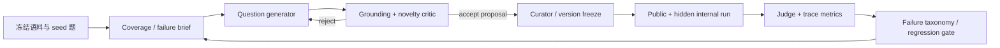

# Private Fund AI Recursive Self-Improvement Benchmark 设计

## 1. 目标

目标不是让 Agent 无限生成“更多题”，而是建立一个可审计的能力进化闭环：Agent 根据语料、能力覆盖缺口和抽象失败信号提出新题；独立 critic 验证题目是否有证据、可回答、非重复且不泄漏；curator 冻结版本；目标 Agent 在 public 与 hidden internal 两个切片上运行；失败再驱动下一轮能力邻域题生成。

最终评估的是框架能力，而不只是单次回答准确率：检索与引用、数值计算、跨期判断、公司/证券实体边界、风险与反证、跨文档综合、工具调用、拒答与置信度，以及新增能力是否造成旧能力回归。

## 2. 为什么不能让同一个 Agent 直接“出题—答题—判题”

完全同源的自评闭环会产生三类假进步：生成自己最擅长的题；judge 偏好与 generator 相同；通过读取 hidden 答案或原题形成 benchmark contamination。因此框架采用角色和信息隔离：

| 角色 | 可以看到 | 不可以看到 |
| --- | --- | --- |
| Question generator | 允许语料、public 题、能力缺口、抽象失败标签 | internal 原题、hidden answer key、目标 Agent 的私有轨迹 |
| Critic / verifier | 候选题、候选答案、证据源、历史题指纹 | 目标 Agent 对该候选题的答案 |
| Target agent | public/internal 的问题文本和正常工具 | answer key、rubric、critic 结论 |
| Judge | 目标答案、answer key、key points、证据 | generator 的偏好分数 |
| Curator | 全部审计材料 | 无；但所有 promotion 决策必须留痕 |

public 表示可发布的开发/对比集，答案仍只保存在 curator 的 canonical 副本；internal 是从未向目标 Agent 暴露的最终门禁集。

## 3. 一轮 RSI 生命周期

每个 round 只允许新增候选题，不修改已冻结题的答案来配合当前系统。确需修订的错误 GT 必须产生新版本和 review 记录，旧版本仍可追溯。

## 4. 题目类型与能力矩阵

首版建议按公司和能力做二维配额，而不是按文档平均抽题：

- Evidence retrieval：单文档精确事实、表格定位、跨文档证据拼接、冲突来源消解。
- Financial reasoning：同比/环比、margin/现金流/营运资本、派生指标、单位与币种。
- Temporal reasoning：财年与自然年、as-of cutoff、后续事件隔离、latest 与指定期区别。
- Company research：业务结构、产品与客户、股权/控股/VIE、交易时间线。
- Risk analysis：监管、出口管制、客户集中、产品组合风险，要求事实与推断分离。
- Agent behavior：选对工具、引用可解析、证据不足时拒答、置信度校准、延迟与成本。
- Adversarial robustness：跨公司同名指标、错误文件夹噪声、近似数字、冲突披露、不可回答题。

难度不由问题长度决定，而由所需证据跳数、计算步数、冲突程度和时间边界共同决定。

## 5. Candidate promotion gates

Agent 生成的题只有同时满足以下条件才能进入下一版：

1. Schema gate：字段、语言、时间范围、company、capability 均合法。
2. Grounding gate：每个 key point 至少对应一个可解析 evidence ref；数字和日期逐项核对。
3. Answerability gate：在冻结语料与允许工具范围内可以回答；live fact 必须有 as-of 时间。
4. Novelty gate：与 public、internal、历史弃题做语义去重；失败邻域题不能只是改写原题。
5. Leakage gate：题干不得包含答案；generator 不得读取 internal item 或 answer key。
6. Quality gate：问题自然、单义、对投资研究有意义，并有清晰评分 rubric。
7. Balance gate：补足公司/能力/难度缺口，不让单一公司或数值题占据全部增量。
8. Review gate：internal 候选必须经独立模型复核，关键财务数字建议再做人审抽样。

“能把当前 Agent 难倒”不是 promotion 条件；不可回答、来源错误或故意含糊的题应被拒绝。

## 6. 评分和是否真的进步

每轮至少报告以下指标，并同时给出 company/capability 切片：

- Answer correctness：key-point coverage 与严重错误惩罚。
- Evidence faithfulness：引用可解析率、引用支持率、关键数字支持率。
- Retrieval quality：evidence recall@k、跨公司污染率、时间越界率。
- Agent behavior：工具选择正确率、拒答 precision/recall、步骤成功率。
- Efficiency：成功题延迟、token/tool cost、超时率。
- Generalization：public、frozen internal、fresh holdout 分开报告。
- RSI gain：相对上一冻结版本的 hidden-set 增益。
- Regression：旧 protected set 的能力/公司切片下降；超过阈值则不 promotion。
- Generator yield：候选题中通过 grounding/novelty/review 的比例，防止靠海量垃圾题碰运气。

推荐 promotion 规则：fresh internal 明显提升；protected set 不发生统计或业务上显著回退；证据支持率不下降；增益不能只来自一个已知失败题的近邻。

## 7. 当前 report benchmark v0

当前已接入五套数据，共 555 个 claim rubrics：Lotus 108、FinanceBench 145、FinDER 71、SEC-QA 100、Zeekr 131。它们被聚合成 77 个完整研报任务，而不是 555 道独立 benchmark 题：

- Public development tasks：57 个，来自 FinanceBench、FinDER、SEC-QA。
- Internal hidden tasks：20 个，来自 Lotus 与 Zeekr。
- 每个研报任务最多配置 15 个隐藏 claim 验收点，要求 Agent 产出连贯研报而不是逐题作答。
- 36 个过于孤立、无法组成合格研报任务的 claim 暂留在 rubric pool，未强行 promotion。
- 259 个 source document records 中有 223 个带明确服务器 PDF 路径，另有 36 个仅保留解析产物 `source_file` 标识。2026-08-10 已通过 `rag_autodl_PRO_6000` 对 223 个明确 PDF 路径逐一核验，全部存在。

目标 Agent 只接收 task brief、研究要求和 document IDs。expected answers、claim IDs、页码、服务器绝对路径和 judge rubric 保存在 evaluator-side hidden bundle，不能挂载到目标 Agent 运行环境。

下一步是把 ResearchTask 接入真实研报生成入口，并让独立 judge 消费 report + hidden ClaimRubric + evidence。v1 的 Agent generator 应生成新的研报 brief、语料组合和 rubric，而不只是改写已有问题；同时加入 10%–15% 的不可回答、冲突披露、跨期污染和跨公司噪声任务。

代码入口与运行示例见 `FinSagent/evaluation/rsi_benchmark/README.md`。
