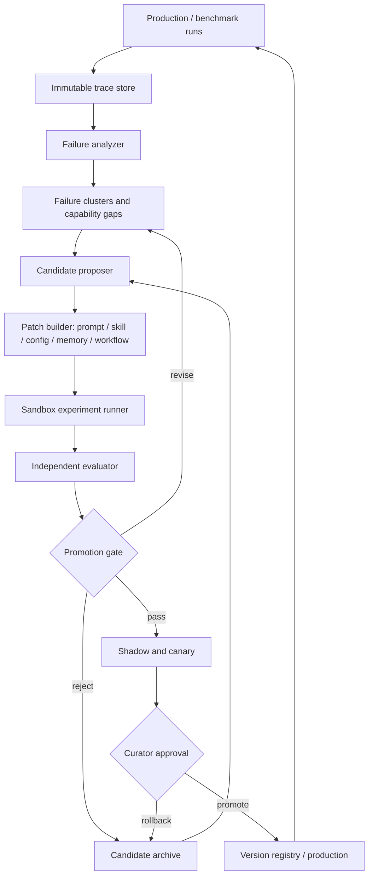

# Private Fund AI RSI 实现指导

> 版本：v1.0  
> 日期：2026-08-17  
> 适用系统：`private_fund_ai` / FinSagent  
> 目标：构建可审计、可归因、可回滚的受限递归自改进系统，而不是追求不可验证的“无限自我进化”。

## 1. 执行结论

Private Fund AI 最适合采用“快慢双环 + 候选档案 + 独立评测器”的 RSI 架构：

- 快环在每次任务后沉淀运行轨迹、失败标签、可复用经验和局部策略。
- 慢环周期性聚类失败，提出对 Skill、Prompt、Router、Retriever、Memory Policy 的版本化修改。
- 每个修改都在隔离沙箱中运行，并与当前生产版本、随机搜索和等预算简单基线做配对比较。
- 独立 evaluator 使用 public、frozen internal、fresh holdout、protected regression 四层数据判定效果。
- 通过门禁的候选先进入 shadow/canary，再由 curator 晋级；失败候选保留在档案中，但不得污染生产。
- v1 不允许 Agent 修改 evaluator、隐藏答案、权限策略、生产数据和核心发布控制器。

这不是严格意义上的无边界 RSI，而是最适合金融投研场景的 bounded RSI。它的价值是让系统稳定地把真实失败转成可复用能力，并能回答三个关键问题：改了什么、为什么改、是否真的更好。

## 2. 为什么选择这个参考实现

前沿工作提供了五个可以组合的设计原则：

1. MetaSkill-Evolve：使用快环优化任务 Skill、慢环优化“如何分析和修改 Skill”的 meta-skill，但外层治理保持固定。
2. Darwin Gödel Machine：保留多个候选分支和完整谱系，不只维护一个贪心的“当前最好版本”。
3. ALMA：记忆不是简单保存文本，而是可版本化的 schema、write、retrieve、update policy。
4. PAST-Bench：必须通过 persistence on/off 和机制轨迹证明收益来自经验保存、检索和更新，而不是偶然波动。
5. Simple Baselines：复杂进化算法必须与随机候选、顺序候选和人工基线在同等预算下比较，否则不能声称 RSI 有效。

对 Private Fund AI 来说，这些原则应被落成一个“外部脚手架演化系统”。当前平台的核心模型可以保持冻结，先优化模型周围的可解释组件。相较直接做权重训练，这条路线成本更低、回滚更容易，也更符合投研系统的证据和审计要求。

## 3. RSI 的能力边界

### 3.1 v1 允许自动修改

| 变更层 | 允许对象 | 典型例子 | 风险级别 |
| --- | --- | --- | --- |
| L0 参数 | 检索 top-k、阈值、超时、重试、路由权重 | 降低跨公司污染 | 低 |
| L1 Prompt | agent prompt、synthesis prompt、judge 之外的工作提示 | 加入期间对齐检查 | 中 |
| L2 Skill | SkillCard、触发条件、处理步骤、输出 contract | table evidence verifier | 中 |
| L3 Memory policy | 写入、检索、合并、过期、替换策略 | 新披露替换旧状态 | 中 |
| L4 Workflow | LangGraph 节点、局部路由、工具组合 | 先做 evidence check 再 synthesis | 高 |

### 3.2 v1 禁止自动修改

- hidden/internal benchmark、answer key、claim rubric 和 evaluator prompt。
- 权限、密钥、网络白名单、审计日志、发布门禁和回滚逻辑。
- 原始 PDF/Excel、权威 evidence、用户研究资产和生产数据库。
- 生产分支、部署脚本和交易相关动作。
- 基座模型权重、训练数据和训练算法。

L4 Workflow 的修改只能由 Agent 生成 patch，由测试系统运行并由人工批准。后续只有在 v1 证明评测器稳定、回滚可靠后，才考虑参数微调或更高层 meta-improvement。

## 4. 目标架构



架构分为五个互相隔离的平面：

1. Target plane：被改进的 FinSagent，只能看到任务和允许的资料。
2. Learning plane：读取脱敏 trace 和抽象失败信号，生成改进假设与候选 patch。
3. Experiment plane：在临时工作树、固定依赖、固定预算中运行候选。
4. Evaluation plane：持有 hidden set 和 rubric，不向 Target/Learning 暴露。
5. Governance plane：持有晋级、回滚、权限和审计控制权，默认人工最终批准。

## 5. 与当前仓库的映射

现有代码已经覆盖了闭环的一半，不应另起炉灶。

| 现有资产 | 当前能力 | RSI 中的目标位置 | 需要补齐 |
| --- | --- | --- | --- |
| `src/diagnosis/failure_explainer.py` | 规则化失败归因 | Failure analyzer | 置信度校准、跨任务聚类、unknown 类 |
| `src/diagnosis/skill_candidate_generator.py` | 从失败生成 Skill proposal | Candidate proposer | 通用 proposal schema、多候选、多样性 |
| `src/skillops/skill_card.py` | Skill 元数据和风险 | Mutable artifact | 生命周期、父版本、内容哈希、owner approval |
| `src/skillops/gate.py` | 简单回归门禁 | Promotion gate | 数值阈值、置信区间、成本和安全门禁 |
| `src/skillops/vertical_slice_runner.py` | 单 case 纵向链路 | Experiment runner 雏形 | 真正运行 baseline/candidate、多 seed、隔离环境 |
| `evaluation/rsi_benchmark/` | 版本化 QA/研报 benchmark | Evaluation plane | target adapter、judge runner、统计比较 |
| `private_fund_report_v0` | 77 个研报任务、555 个隐藏 claim | report-level hidden eval | fresh holdout 和 adversarial slice |
| `configs/eval_suites/` | protected/targeted/failure suites | Regression matrix | 扩容、冻结策略和切片阈值 |
| `src/core/ResearchMemory.py` | 项目/用户记忆 | Experience store | policy version、因果 telemetry、staleness |
| `src/core/AgenticRAG.py` | 多 Agent 工作流 | Target runtime | artifact version 注入、统一 trace ID |

现有 `evaluation/rsi_benchmark` 的 6 个单元测试已经通过，说明数据脱敏、去重、报告 rubric 选择和结构 gate 可以作为可靠起点。但目前尚未证明候选变更被真实执行，也没有完成 baseline-vs-candidate 的统计验收。

## 6. 建议的代码目录

```text
FinSagent/
  src/rsi/
    models.py              # 核心不可变数据模型
    trace_collector.py     # 统一运行轨迹
    failure_clusterer.py   # 跨任务失败聚类
    proposer.py            # 生成 N 个候选，不直接写生产
    patch_policy.py        # 可改文件/字段白名单
    archive.py             # 候选谱系和 Pareto archive
    sandbox.py             # 临时工作树和资源限制
    experiment.py          # 配对、多 seed 运行
    metrics.py             # 指标和置信区间
    promotion.py           # 门禁状态机
    registry.py            # 已晋级 artifact registry
    rollback.py            # 生产回滚
  evaluation/rsi_benchmark/
    target_adapter.py      # ResearchTask -> FinSagent 调用
    judge_runner.py        # 独立 judge + deterministic checks
    paired_compare.py      # baseline/candidate 配对统计
    holdout_builder.py     # fresh holdout 生成和冻结
  configs/rsi/
    mutation_policy.yaml
    promotion_policy.yaml
    resource_budget.yaml
  evaluation/rsi_runs/     # gitignore，保存运行产物和审计记录
```

不建议把 RSI 逻辑直接塞进 `ChatService` 或 `AgenticRAG`。生产运行时只需要接受一个只读 `artifact_bundle_id` 并输出 trace；学习、实验和晋级应在独立进程中进行。

## 7. 核心数据模型

### 7.1 ArtifactBundle

一个可复现系统版本，不只记录 Git commit：

```json
{
  "bundle_id": "pfai-2026-08-17-candidate-014",
  "parent_id": "pfai-prod-023",
  "git_commit": "...",
  "model_id": "qwen3-max",
  "prompt_hashes": {},
  "skill_versions": {},
  "retrieval_config_hash": "...",
  "memory_policy_version": "...",
  "dataset_manifest_hash": "...",
  "created_by": "rsi-proposer-v1",
  "mutation_scope": ["skill:period_alignment"],
  "status": "proposed"
}
```

### 7.2 RunTrace

每次任务至少记录：

- `run_id / task_id / bundle_id / parent_bundle_id / seed`。
- model、prompt、skill、retriever、dataset 的精确版本。
- 路由选择、query rewrite、检索候选、rerank、工具调用、memory read/write。
- 每个关键结论的 evidence ID、source、locator 和验证结果。
- token、工具次数、wall time、错误、重试和最终状态。
- judge 结果必须后写入 evaluator-side 表，不能回流到 target trace 文件。

### 7.3 ImprovementCandidate

```json
{
  "candidate_id": "cand-014",
  "parent_bundle_id": "pfai-prod-023",
  "hypothesis": "期间冲突来自 later filing 在 rerank 中压过目标财年",
  "failure_cluster_ids": ["fc-period-07"],
  "mutation_type": "skill_and_config",
  "changed_artifacts": [],
  "expected_mechanism": "period-compatible evidence is checked before synthesis",
  "expected_metric_changes": {"temporal_accuracy": "+", "latency_p95": "<=10%"},
  "risk_cases": [],
  "rollback_bundle_id": "pfai-prod-023"
}
```

“expected mechanism” 是必填项。没有可验证机制、只写“提升效果”的候选不得实验。

### 7.4 ExperimentResult

必须同时保存总体分数、逐题配对结果、切片结果、机制轨迹、成本和运行环境。不得只保存一个平均分。

## 8. 一轮完整 RSI 生命周期

### Step 0：冻结运行条件

- 冻结语料 manifest、benchmark 版本、模型版本、工具版本和资源预算。
- 生成 baseline ArtifactBundle。
- 确保 target 运行环境无法挂载 hidden answer/rubric。

### Step 1：收集失败，不立即改系统

- 从离线 benchmark、生产 shadow 和人工反馈收集 trace。
- deterministic checks 优先：引用是否可解析、数字是否有支持、期间是否越界、是否跨公司污染。
- LLM judge 只负责难以规则化的完整性、论证和平衡性。
- 将失败标成 `confirmed / suspected / unknown / evaluator_disagreement`。

### Step 2：形成失败簇和能力缺口

聚类键建议为：

```text
capability + failure_type + stage + entity_scope + temporal_scope + evidence_shape
```

只有满足以下任一条件的失败簇才进入 proposal：

- 至少 3 个独立任务重复出现；
- 单次出现但属于 critical error；
- 在 fresh holdout 上造成显著切片回退；
- 用户明确标记为高价值问题，并有可复现 trace。

### Step 3：生成多个候选

对每个失败簇至少生成：

- C0：不修改系统的生产 baseline。
- C1：最小修改候选。
- C2：结构性修改候选。
- B-random：相同 mutation scope 下的随机/独立采样候选。
- B-human：可用时加入人工设计基线。

候选生成器只能读取抽象失败簇、public 开发样例和允许语料，不能读取 hidden 原题、答案和 judge 推理。

### Step 4：静态检查和沙箱执行

静态门禁：

- 修改路径属于白名单；patch 大小和复杂度在上限内。
- 不引入外部网络、shell 任意执行、密钥读取或 evaluator import。
- schema、lint、unit tests、type/compile tests 通过。
- Prompt/Skill 变更不能包含 benchmark 答案、公司专属答案模板或内部 task ID。

沙箱门禁：

- 候选在临时工作树、只读语料副本和固定 CPU/GPU/API 预算中运行。
- 默认禁网；工具权限沿用 target 的 allowlist。
- 每个任务独立 session，避免非预期状态泄漏。

### Step 5：分层评测

按成本从低到高运行：

1. Unit/deterministic：schema、evidence locator、公式、权限、memory update。
2. Targeted short：候选目标失败簇的正例、负例和 no-op controls。
3. Public development：确认候选不是明显无效。
4. Frozen internal：主要晋级证据，开发者和 proposer 不可见。
5. Fresh holdout：本轮新公司、新披露风格或新任务，防止 benchmark 过拟合。
6. Robustness：跨公司噪声、近似数字、冲突披露、不可回答和时间污染。
7. Shadow/canary：真实请求的只读影子运行，不改变用户产物。

前一层不通过，停止后续昂贵评测。

### Step 6：独立晋级和回滚

候选状态机：

```text
proposed -> statically_valid -> evaluated -> approved_for_shadow
         -> canary -> promoted
         -> rejected / quarantined / rolled_back
```

只有 governance plane 可以改变 `promoted` 状态。生产读取 registry 中已签名 bundle，不能直接读取 proposer 的工作目录。

## 9. 效果测试方案

### 9.1 首要指标：投研任务质量

建议把单一总分拆成五类，并保留切片结果：

| 维度 | 指标 | 说明 |
| --- | --- | --- |
| 正确性 | claim supported rate、critical error rate、key-point coverage | 完整研报按 hidden claim 计分 |
| 证据性 | citation resolvability、support precision、numeric support | 正确但无证据不能满分 |
| 检索 | evidence recall@k、cross-company contamination、temporal leakage | 直接定位能力瓶颈 |
| 行为 | tool choice、refusal P/R、memory pathway success | 证明过程正确 |
| 效率 | latency p50/p95、token、tool calls、cost per passed task | 防止用无限预算换分 |

总分只用于排序，不用于掩盖 critical slice。建议采用有硬门禁的 Pareto 选择，而不是把所有指标线性加权成一个数。

### 9.2 RSI 特有指标

- `RSI gain`：candidate 在 fresh internal 相对 parent 的配对增益。
- `retention`：历史 protected 能力中未回退的比例。
- `transfer ratio`：非目标公司/非目标能力增益 ÷ 目标切片增益。
- `proposal yield`：通过最终门禁的候选数 ÷ 总候选数。
- `mechanism attribution`：成功任务中，预期 Skill/Memory/Retrieval 路径实际触发的比例。
- `learning efficiency`：每 1 万 token、每 100 次任务或每 100 元实验成本带来的 hidden 增益。
- `diversity`：候选谱系、mutation type 和行为输出的多样性，防止搜索坍缩。
- `acceleration`：达到同一增益所需的实验预算是否随 round 下降。
- `evaluator disagreement`：规则、模型 judge 和人审之间的分歧率。

RSI 是否成立至少要求同时出现：fresh holdout 提升、protected retention、机制轨迹成立。只有 public 分数提升不算。

### 9.3 因果对照

每个重要候选至少做四个对照：

1. Persistence off：关闭跨任务记忆和 Skill 更新。
2. Mechanism off：保留其他改动，只关闭候选声称的关键机制。
3. Wrong/stale mechanism：注入过期记忆或错误路由，验证系统能拒绝而不是盲用。
4. Equal-budget simple baseline：相同调用数和任务数下做随机候选或顺序候选搜索。

如果完整候选提升，但 mechanism off 不下降，则不能把收益归因于该机制；候选应回到诊断阶段。

### 9.4 统计设计

- 所有版本对同一批任务做 paired evaluation。
- 对存在采样随机性的任务使用固定 seed 集，初期建议 3 个 seed；晋级关键版本使用 5 个。
- 二元成功指标报告配对 bootstrap 95% CI，并可用 McNemar 检验辅助判断。
- 连续指标报告逐题差值的 bootstrap CI，不只比较两个总体平均数。
- 预先登记 primary metric、关键切片和停止规则，避免看到结果后换指标。
- 同一 candidate 多次试验的最优值不能单独报告；必须报告均值、中位数、方差和最差 seed。

### 9.5 v1 建议晋级门槛

以下是启动阈值，应在首轮数据后校准：

| 门禁 | 建议条件 |
| --- | --- |
| Critical safety | 0 个权限、数据泄漏、跨项目污染或伪造引用错误 |
| Targeted suite | 所有正例通过；所有 scope-negative/no-op control 不误触发 |
| Fresh internal | primary metric 配对提升至少 3 个百分点，且 95% CI 下界不低于 0 |
| Protected set | 总体下降不超过 1 个百分点；任何关键公司/能力切片下降不超过 2 个百分点 |
| Evidence | 引用支持率和关键数字支持率不得下降 |
| Refusal | 不可回答集的 precision/recall 均不得下降超过 2 个百分点 |
| Efficiency | p95 延迟增幅不超过 15%，单任务成本增幅不超过 20%，除非质量收益经人工批准 |
| Mechanism | 目标切片中至少 80% 的新增成功有预期机制轨迹 |
| Human review | 高风险 L3/L4 变更必须通过抽样复核 |

当前 `core_protected_v1` 只有 40 题，适合做“不得出现确定性回归”的 smoke gate，不足以单独支持统计显著结论。v1 应扩展到至少 150-300 个彼此独立的 protected task，并以公司、能力、证据形态分层。

## 10. Benchmark 建设方案

### 10.1 保留现有两级单元

- Claim/QA：便宜、定位快，用于 targeted regression 和组件诊断。
- Complete research report：贴近真实产品，用于最终质量和投资决策可用性评测。

77 个研报任务和 555 个 hidden claims 可以作为 v0 主干，但要补三类内容：

1. 10%-15% 不可回答任务，要求正确拒答并指出缺失证据。
2. 10%-15% 冲突/污染任务，包括跨期、跨公司、单位和同名指标。
3. Fresh holdout，每轮从新公司、新文件结构或新披露中冻结一批，只使用一次进行晋级。

### 10.2 数据隔离

- public：允许开发和 proposer 查看问题，但不提供 canonical answer/evidence rubric。
- internal：只在 evaluator 服务挂载。
- fresh holdout：在 candidate 冻结后才构建或揭示给 evaluator。
- protected：版本冻结，变更必须创建 v2，不能静默追加或改答案。
- failure bank：允许追加，但每条必须有人审确认和 evidence pointer。

### 10.3 Judge 设计

按优先级组合：

1. 确定性 verifier：数字、日期、公式、citation、source/company/time boundary。
2. Evidence entailment judge：判断证据是否支持 claim。
3. Report judge：论点一致性、风险平衡、完整性和决策价值。
4. Human calibration：定期抽样，评估自动 judge 的误判。

Judge 不能看 generator 的自评分，也不能和 target 共用运行记忆。高价值指标应使用两个独立 judge 或规则+模型的组合，并记录分歧。

## 11. Candidate Archive 与搜索策略

不要每轮只保留一个“最好候选”。维护一个有限 Pareto archive：

- 质量更高但成本略高。
- 质量接近但延迟更低。
- 对数值题强。
- 对长研报和跨文档综合强。
- 对不可回答和风险控制强。

父候选选择可综合：质量排名、候选被探索次数的反比、与现有 archive 的行为差异。每轮设置严格预算，例如每个失败簇最多 8 个候选、前两层最多保留 3 个、hidden 评测最多 2 个。

只有在 archive 明显优于 IID/顺序候选基线时，才增加更复杂的进化策略。否则继续使用简单搜索，把工程投入放在 search space、trace 和 evaluator 上。

## 12. Memory RSI 的专门设计

Private Fund AI 的记忆至少分四类，不能混在一个向量库：

| 类型 | 内容 | 更新规则 |
| --- | --- | --- |
| Evidence memory | 原始文档事实和位置 | 只随文档版本变化，不由 Agent 改写 |
| Research state | 当前观点、假设、风险、催化剂 | 新版本追加，保留历史 |
| Procedural memory | 如何完成某类任务 | 可由 RSI 候选更新 |
| User preference | 格式、语言、研究风格 | 用户可见、可修改、可删除 |

每次 memory 使用都记录 `write -> retrieve -> apply -> outcome`。测试必须使用 matched persistence-on/off episode，并加入 stale-state replacement：新财报出现后，系统应更新旧状态，而不是只累计更多文本。

Memory policy 可作为 ArtifactBundle 的一部分演化，但 Evidence memory 的内容和 canonical locator 不属于可变对象。

## 13. 安全、审计和运营要求

- 所有变更 append-only，保留 parent、patch、实验、judge、reviewer 和 promotion 决策。
- 生产 bundle 必须可一键回滚，且回滚不依赖 proposer 服务可用。
- shadow 只读，不创建用户研究资产；canary 只进入低风险内部项目。
- 自动回滚触发器至少包括：critical error、跨项目证据、引用伪造、p95 超限、连续窗口质量下降。
- 每日设置 API/token/CPU/GPU 上限；超过预算停止当前 round，不降低门禁。
- 对 L3/L4 patch 做 secret scan、依赖变更审查、网络和文件访问审查。
- evaluator 和 registry 使用独立凭据，target/proposer 无写权限。

## 14. 分阶段交付路线

### Phase 0：可观测、可复现

交付：

- `ArtifactBundle` 和统一 `RunTrace`。
- target adapter 跑通 77 个研报任务。
- deterministic metrics + 独立 judge runner。
- baseline 结果按 company/capability 切片。

退出条件：同一 bundle、seed、数据版本可复现；hidden 信息不出 evaluator。

### Phase 1：Skill/Prompt 的受控自改进

交付：

- 从 failure cluster 生成多个 candidate。
- 白名单 patch、sandbox、多 seed paired experiment。
- promotion policy 和 artifact registry。
- 第一条真实闭环：失败 -> Skill proposal -> 测试 -> shadow -> 晋级/拒绝。

退出条件：至少 3 个独立失败簇完成闭环；至少 1 个候选在 fresh holdout 提升且 protected 无回退。

### Phase 2：检索和记忆策略演化

交付：

- Retriever 参数/路由候选。
- Procedural memory 的 schema/write/retrieve/update policy 版本化。
- persistence on/off、stale update 和 mechanism attribution 测试。

退出条件：收益能被机制对照解释，而不是只有 headline score 上升。

### Phase 3：Workflow 与 meta-skill

交付：

- 有限 L4 patch。
- 候选 archive 和父节点选择。
- 慢环允许优化 Analyzer、Retriever、Allocator、Proposer、Evolver 的说明文件。

退出条件：meta-loop 相对固定 proposer 在相同预算下有 fresh holdout 增益；无搜索多样性坍缩。

### Phase 4：参数训练（可选）

只有在前述外部脚手架闭环稳定后，再考虑把高置信成功轨迹整理为训练数据。权重更新必须经过独立的数据审计、训练前后 benchmark 和安全评审，不属于 v1 的自动晋级范围。

## 15. 第一批工程任务

按优先级建议拆成以下 12 个任务：

1. 新建 `src/rsi/models.py`，定义 Bundle、Trace、Candidate、Experiment、Decision。
2. 在 `ChatService`/AgenticRAG 出口统一写 RunTrace，不改变现有回答行为。
3. 实现 `target_adapter.py`，让 `ResearchTask` 调用真实研报入口。
4. 实现 deterministic evidence metrics 和 judge result schema。
5. 把 77 个任务跑出 baseline scorecard，冻结 manifest/hash。
6. 扩充 failure taxonomy，加入 `unknown`、`judge_disagreement`、`memory_staleness`、`tool_misuse`。
7. 把单 case proposal 改为 cluster-level、多候选 proposal。
8. 实现 mutation whitelist 和临时工作树 sandbox。
9. 实现 baseline/candidate paired runner 和 bootstrap CI。
10. 将现有 gate 改为 policy-driven 数值门禁，所有决定写审计记录。
11. 接入 shadow/canary registry 和自动回滚。
12. 完成一次 period/source-conflict 端到端试点，作为 RSI v1 验收样板。

## 16. 首个试点建议：期间/来源冲突 Skill

选择 `period_alignment + source_conflict` 作为第一个 RSI 闭环，因为：

- 仓库已有失败类型、Skill trace、targeted suite 和跨公司 protected cases。
- 能用确定性日期和来源规则验证，judge 不确定性较小。
- 很容易设计 scope-negative：问 latest 时不能错误过滤新披露。

试点实验：

```text
Parent: 当前 production bundle
C1: 只改 period_alignment Skill
C2: Skill + rerank period compatibility feature
C3: 在 synthesis 前增加 evidence-time verifier
B1: 等预算随机 Skill 改写
B2: 人工最小规则基线
```

主要指标：期间正确率、source support、latest scope-negative accuracy、跨公司污染、延迟。通过后进入 shadow，对真实任务只生成旁路结果和差异报告，不直接替换用户答案。

## 17. RSI v1 的验收定义

系统满足以下条件，才能称为 Private Fund AI RSI v1，而不是普通自动调参：

1. 能从真实运行 trace 自动形成抽象失败簇。
2. 能生成至少两类可执行候选，并记录清晰的机制假设和谱系。
3. 候选在隔离环境中以相同预算对比 parent 和简单基线。
4. hidden/fresh holdout 对 proposer 和 target 不可见。
5. 晋级同时满足质量、证据、回归、成本和安全门禁。
6. 至少一次收益通过 mechanism-off 对照得到归因。
7. 生产版本可审计、可灰度、可自动回滚。
8. 连续三个 round 报告学习曲线、保留率、成本和候选 yield，而非只展示单次最好结果。

做到这里，平台就拥有了一个可信的“递归结构”：它不仅能改进任务 Skill，还能在严格边界内改进产生 Skill 的过程；同时外部 evaluator、权限和治理保持固定。这是当前技术成熟度下最值得建设、也最容易被业务验证的 RSI 形态。

## 18. 参考研究

- MetaSkill-Evolve: Recursive Self-Improvement of LLM Agents via Two-Timescale Meta-Skill Evolution, 2026.
- Darwin Gödel Machine: Open-Ended Evolution of Self-Improving Agents, ICLR 2026.
- Learning to Continually Learn via Meta-learning Agentic Memory Designs (ALMA), 2026.
- PAST-Bench: Benchmarking the Foundations of Recursive Self-Improvement in Personal Agents, 2026.
- Simple Baselines are Competitive with Code Evolution, ICLR 2026.
- Self-Improvements in Modern Agentic Systems: A Survey, 2026.

