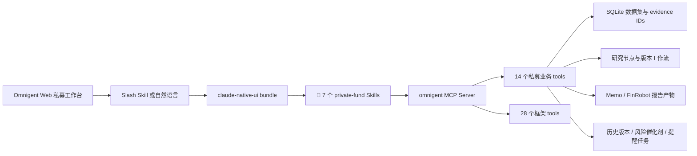

# 📝 当前 Skills 与 MCP Tools 清单

更新时间：📝 2026-07-21

## 📝 结论

当前私募研究主 Agent 是 `claude-native-ui`。服务启动时会把以下能力打入同一个内置 Agent bundle：

- 📝 7 个私募研究 Skills。
- 14 个私募业务 MCP tools。
- 28 个 Omnigent 框架 MCP tools。
- 合计 42 个通过 `omnigent` MCP Server 暴露的工具。

用户在 Claude Code 中看到的完整名称通常是 `mcp__omnigent__<tool_name>`；代码、Agent spec 和本文表格使用不带前缀的规范名称 `<tool_name>`。

> [!NOTE]
> Claude Code 自身的原生文件、编辑和命令工具不属于本文统计。本文只统计当前项目通过 Omnigent Agent bundle 和 `omnigent` MCP bridge 注册的能力。

## 📝 当前运行链路

MCP Server 使用本地 stdio 启动，Server 名称固定为 `omnigent`。本地 bridge 直接提供 OS 和私募数据集工具；活动回合内的其余工具通过 Omnigent tool relay 注入。重名工具由 relay 版本覆盖，因此调用仍进入统一事件流、权限和审计链路。

## 📝 当前 7 个私募 Skills

| Skill | 主要触发场景 | 页面入口 | 最终产物 |
|---|---|---|---|
| `private-fund-memo` | 围绕公司、主题、风险、催化剂或问题生成聚焦 Memo，或修订已有 Memo | “生成结果 → 研究 Memo”；也可输入 `/private-fund-memo <要求>` | Markdown、HTML、PDF |
| `private-fund-node` | 把选中回答、证据、假设、风险、比较或结论保存为可复用研究节点 | 普通研究资产生成流程；也可自然语言或 Slash Skill 调用 | 不可变节点版本、证据关系、父节点关系、可选富内容块 |
| `private-fund-report` | 把勾选节点综合为 FinRobot 对齐的长期专业研报 | “生成结果 → 专业研报”；也可输入 `/private-fund-report <要求>` | Markdown、HTML、PDF、JSON、图表、evidence index |
| `private-fund-report-update` | 基于新节点和新证据滚动更新旧报告，并保留历史 | 当前没有单独页面按钮，通过对话明确要求更新或调用 Skill | 新版本 Markdown、HTML、PDF、`revision_of`、变更日志 |
| `private-fund-knowledge-base` | 维护 Memo/估值版本语义、质量门、可读证据卡和 Obsidian 投影状态 | 版本创建、修订、比较、溯源或知识状态查询时自动使用 | 版本交接、证据覆盖、投影/冲突状态 |
| 📝 `private-fund-valuation-impacts` | 从当前项目的财报、研究报告和会议纪要中识别估值上行、下行与双向影响 | 估值 Worker 自动调用并展示在“其他资料对估值的综合影响” | 固定结构 JSON、估值影响卡片、`chunk:` 证据、来源页码、资料指纹与运行状态 |
| 📝 `private-fund-valuation-metrics` | 从不同模板的估值模型中识别五项固定指标和估值日，并严格校验证据 | 估值 Worker 自动调用；也可通过自然语言或 Slash Skill 调用 | 固定结构 JSON、五指标、估值日、证据 ID、置信度和警告 |

Skills 的共同约束：

- 重大事实、日期、金额、比率、估值输入和管理层表述必须绑定真实 evidence ID。
- 关键证据必须先通过 `private_fund_source_detail` 查看原文或单元格上下文。
- 无法定位到文件页码、Sheet/单元格、幻灯片或标题的内容标记为 `资料未覆盖/待复核`。
- 用户勾选的研究节点只是优先上下文，不自动等于已核验的一手证据。
- 修订使用追加版本，不覆盖或删除旧产物。

## 📝 Skills 与业务 Tools 调用关系

| Skill | 正常工作流调用的 MCP tools |
|---|---|
| `private-fund-memo` | `private_fund_dataset_status`、`private_fund_dataset_search`、`private_fund_source_detail`、可选 `private_fund_research_context`、`private_fund_dataset_memo`、修订时 `private_fund_history_compare` |
| `private-fund-node` | `private_fund_research_context`、`private_fund_dataset_search`、`private_fund_source_detail`、`private_fund_research_node_save` |
| `private-fund-report` | `private_fund_research_context`、`private_fund_dataset_search`、`private_fund_source_detail`、`private_fund_equity_report_generate`、`private_fund_equity_report_status`、`private_fund_equity_report_get` |
| `private-fund-report-update` | `sys_os_read`、`private_fund_research_context`、`private_fund_dataset_search`、`private_fund_source_detail`、`private_fund_dataset_memo` |
| `private-fund-knowledge-base` | `private_fund_dataset_memo`、`private_fund_history_compare`、`private_fund_knowledge_status`；估值版本由 Valuation Worker/API 持久化 |
| 📝 `private-fund-valuation-impacts` | 后台模式由 Valuation Worker 注入当前非模型文档的高相关 chunks 与模型上下文；交互模式可使用 `private_fund_dataset_search`、`private_fund_source_detail` 复核卡片证据 |
| 📝 `private-fund-valuation-metrics` | 交互模式使用 `private_fund_dataset_search`、`private_fund_source_detail`；后台模式由 Valuation Worker 注入已入库 `metric_facts` 和 Excel 单元格证据 |

## 📝 当前 14 个私募业务 MCP Tools

| Tool | 用途 | 必填参数 | 重要可选参数/输出 |
|---|---|---|---|
| `private_fund_dataset_status` | 检查当前或指定数据集是否就绪，以及文档、chunk、Excel、facts 等覆盖数量 | 无 | `dataset_id`；返回 pipeline/索引状态和 schema 统计 |
| `private_fund_knowledge_status` | 检查 Obsidian 投影队列、note registry、冲突、Worker health 和 Vault 可用性 | 无 | `dataset_id`；只读返回投影与配置状态 |
| `private_fund_dataset_search` | 在 PDF chunks、Excel Sheet/区域摘要、metric facts 和可选原始 cells 中统一检索证据 | `query` | `dataset_id`、`top_k`、`include_metric_facts`、`include_cells`；返回 `chunk:`、`fact:`、`cell:` evidence IDs 和可点击引用 |
| `private_fund_source_detail` | 根据 evidence ID 获取页级正文、Excel 单元格、公式和完整来源元数据 | `evidence_id` | `dataset_id`、`context_radius`；用于重大事实最终核验 |
| `private_fund_dataset_memo` | 📝 从结构化数据集生成或渲染证据支持的 Memo，并在落盘前执行 Citation Gate | 无 | 📝 `topic`、`sections`、`instructions`、`conversation_context`、`revision_of`、优先使用 `memo_claims`、兼容 `memo_markdown`、`key_questions`；输出 Markdown/HTML/PDF、`citation_gate` 与审计路径 |
| `private_fund_equity_report_generate` | 使用 FinRobot 模板和 Omnigent 证据生成版本化专业研报包 | `title`、`sections`、`section_evidence` | `market_snapshot`、`financial_metrics`、行业、评级、日期；输出 Markdown/HTML/PDF/JSON/图表 |
| `private_fund_equity_report_status` | 查询报告 run 状态和产物链接 | 无 | `dataset_id`、`run_id`；默认查最新 run，不返回完整 request/package |
| `private_fund_equity_report_get` | 获取已完成报告 run 的完整 provenance package | 无 | `dataset_id`、`run_id`；返回请求快照、证据索引和完整报告包 |
| `private_fund_research_context` | 读取用户当前勾选的研究节点和研究 lineage | 无 | `dataset_id`；同时返回未绑定 evidence source 的节点列表和 citation contract |
| `private_fund_research_node_save` | 保存一个结构化研究节点及证据、父节点和富内容块 | `title`、`summary`、`content_markdown` | `node_type`、`parent_node_ids`、`evidence_ids`、`tags`、`confidence`、`content_blocks` |
| `private_fund_history_compare` | 比较同系列两个 Memo 版本，或读取单个研究对象的完整版本时间线 | `dataset_id`、`mode` | Memo 模式传 `from_version_id/to_version_id`；item 模式传 `item_id` |
| `private_fund_tracking_list` | 读取观点、假设、风险、催化剂、提醒、规则和异步任务 | `dataset_id` | 可用 `view`、`item_type`、`status` 过滤，返回持久化 tracking 状态 |
| `private_fund_watch_upsert` | 新建或更新持续追踪规则 | `dataset_id`、`name`、`target_type` | `rule_id`、目标 item、优先级、频率、active 与 query 条件 |
| `private_fund_alert_acknowledge` | 更新提醒生命周期 | `dataset_id`、`alert_id`、`status` | 支持 `new/acknowledged/dismissed/snoozed` 与 `snoozed_until` |

### 📝 `private_fund_research_node_save` 支持的富内容块

- `markdown`：叙述、推理、引用和列表。
- `metrics`：2–8 个可比较的核心指标。
- `table`：跨期、跨公司或跨情景的精确比较。
- `chart`：结构化折线或柱状图数据，只允许已核验数字。
- `html`：无脚本、无表单、无远程资源的静态组合展示。

每个包含事实或数字的 block 都应携带直接支持它的 `evidence_ids`。

## 📝 当前完整 42 个 MCP Tools

除上述 14 个私募业务 tools 外，`claude-native-ui` 根据当前 spec 自动注册以下 28 个框架 tools：

| 分组 | 数量 | 当前注册的 tools | 作用 |
|---|---:|---|---|
| Skill 加载 | 1 | `load_skill` | 按名称加载 bundled/host Skill 指令 |
| 会话与子 Agent | 7 | `sys_session_list`、`sys_session_get_history`、`sys_session_get_info`、`sys_session_send`、`sys_session_close`、`sys_list_models`、`sys_session_create` | 查询会话树，创建、驱动和关闭子会话；当前 bundle 设置 `spawn: true` |
| Agent 管理读取 | 3 | `sys_agent_get`、`sys_agent_download`、`sys_agent_list` | 查询可访问 Agent、读取配置摘要、下载 Agent bundle |
| 工作区 OS | 4 | `sys_os_read`、`sys_os_write`、`sys_os_edit`、`sys_os_shell` | 在当前 workspace 读取、写入、精确编辑文件和执行一次性命令 |
| 持久终端 | 5 | `sys_terminal_launch`、`sys_terminal_send`、`sys_terminal_read`、`sys_terminal_list`、`sys_terminal_close` | 管理当前 spec 声明的 `shell` 持久终端 |
| 异步与任务 | 4 | `sys_call_async`、`sys_read_inbox`、`sys_cancel_async`、`sys_cancel_task` | 异步派发、读取完成结果和取消后台任务；当前 `async` 使用默认开启值 |
| 评论 | 2 | `list_comments`、`update_comment` | 读取和更新当前会话的 review comments |
| Policy | 2 | `sys_add_policy`、`sys_policy_registry` | 浏览可用策略并给当前会话增加策略；新增策略仍受 ASK 审批保护 |

合计：`14 + 1 + 7 + 3 + 4 + 5 + 4 + 2 + 2 = 42`。

## 📝 当前未注册或未启用的工具面

| 能力 | 当前状态 | 原因 |
|---|---|---|
| `read_skill_file` | 按资源条件注册 | 当前 7 个 bundled Skills 的核心说明都在各自 `SKILL.md`；仅在 bundle 存在可读取资源时提供 |
| `sys_timer_set`、`sys_timer_cancel` | 未注册 | 当前 Agent spec 的 `timers` 为默认 `false` |
| `sys_session_share` | 未注册 | 当前未启用 `agent_session_sharing` |
| `web_search`、`web_fetch` | 未声明 | 私募事实要求以本地数据集为权威来源；专业报告 Skill 明确不调用 FinRobot Web research subprocess |
| `upload_file`、`list_files`、`download_file` | 未作为 Agent builtins 声明 | 资料上传和资产下载主要由 Web/API 链路处理；OS 工具仍可访问 workspace |
| 外部第三方 MCP Server | 未绑定到当前内置 Agent spec | 当前只有本地 `omnigent` stdio MCP Server；第三方自定义 Agent 可以另行声明 `mcp_servers` |

## 📝 页面与对话中的触发方式

1. 页面右上角“生成结果 → 研究 Memo”会构造 `/private-fund-memo <用户要求>`。
2. 页面右上角“生成结果 → 专业研报”会构造 `/private-fund-report <用户要求>`。
3. `dataset_id`、勾选节点和资产全文通过隐藏上下文传输，不应出现在用户聊天气泡。
4. 普通指标、表格、图表和综合图文仍走研究节点生成链路，由 Agent 调用 `private_fund_research_node_save`。
5. 用户也可以在对话框直接输入 Slash Skill，或用自然语言要求创建节点、生成 Memo、生成报告或滚动更新旧报告。

## 📝 证据和产物边界

- `private_fund_dataset_search` 负责发现候选证据，不能代替最终原文核验。
- `private_fund_knowledge_status` 只报告 Project DB → Obsidian 投影状态，不把 Vault 当作版本真值源。
- `private_fund_source_detail` 是 PDF 页、Excel 单元格/公式和文档元数据的核验入口。
- `private_fund_research_context` 返回的是二级研究资产；节点没有 `evidence_sources` 时必须重新搜索和核验。
- `private_fund_dataset_memo` 是聚焦 Memo 产物工具。
- `private_fund_equity_report_generate` 是 FinRobot 对齐专业研报产物工具。
- `private_fund_equity_report_status/get` 是报告 run 状态与 provenance 读取工具，不生成新报告。
- `private_fund_history_compare` 只读取不可变版本和差异，不通过“新版未提及”推断旧观点失效。
- `private_fund_tracking_list/watch_upsert/alert_acknowledge` 读写持久化 tracking 台账，不依赖交互 Agent 会话常驻。

## 📝 代码事实来源

- Skills：`omnigent/omnigent/resources/private_fund_skills/*/SKILL.md`
- 内置 Agent bundle：`omnigent/omnigent/server/app.py::_build_claude_native_bundle`
- 私募 tool schemas 与实现：`omnigent/omnigent/tools/builtins/private_fund_dataset.py`
- builtin 注册表：`omnigent/omnigent/tools/builtins/__init__.py`
- 自动工具注册条件：`omnigent/omnigent/tools/manager.py`
- Claude Native MCP bridge：`omnigent/omnigent/claude_native_bridge.py`
- 页面生成路由：`omnigent/web/src/components/private-fund/PrivateFundResearchWorkbench.tsx`
- Native/in-process Skill 发送适配：`omnigent/web/src/pages/ChatPage.tsx`

## 📝 维护规则

修改 Skill 或 MCP tool 后，至少同步检查：

1. `private_fund_skills/*/SKILL.md` 中的工具名是否真实注册。
2. `_build_claude_native_bundle()` 的 `tools.builtins` 是否包含新工具。
3. `build_private_fund_dataset_tools()`、builtin registry 和 runner local dispatch 三处是否一致。
4. 页面入口是否调用正确 Skill，隐藏上下文是否仍不会打印到聊天气泡。
5. `test_builtin_bundles.py`、`test_private_fund_local_dispatch.py` 和对应业务工具测试是否覆盖新增能力。
6. 更新本文的 Skill 数、业务工具数和完整 MCP 工具数。

## 📝 Citation Gate 接口约定（2026-07-21）

- 📝 `memo_claims[]` 每项包含 `section`、`text`、`status=supported|not_covered|needs_review`、`evidence_ids[]`；`text` 内不写 Markdown 引用。
- 📝 服务端按证据白名单验证并渲染来源。`status=passed` 为首轮正确，`repaired` 为一次定向修复成功，`needs_review` 为仍有未解决事实句，`not_covered` 为资料明确未覆盖。
- 📝 管理脚本默认设置 `PRIVATE_FUND_CITATION_GATE_RETRY=1`，最多执行一次引用映射修复；关闭该变量时仍保留确定性校验与安全降级。
