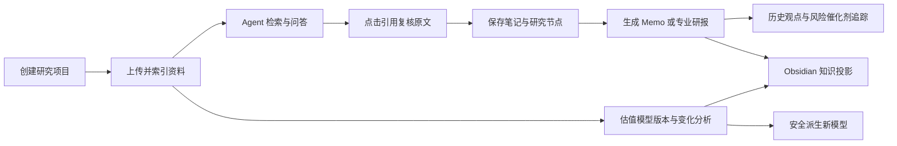
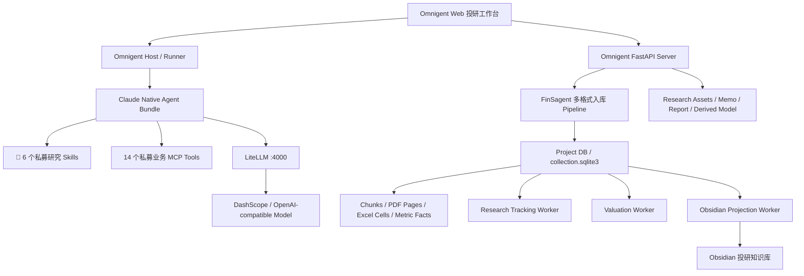
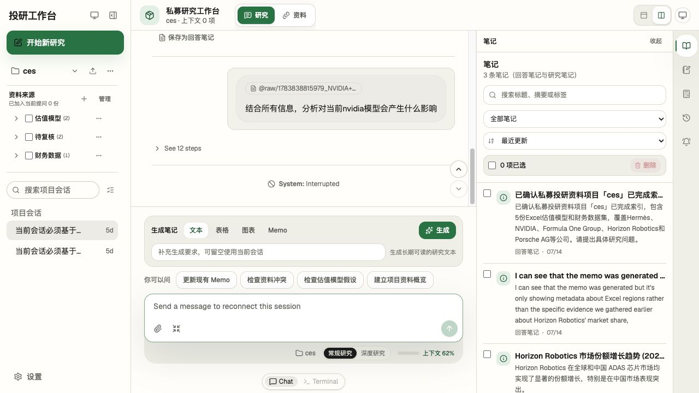
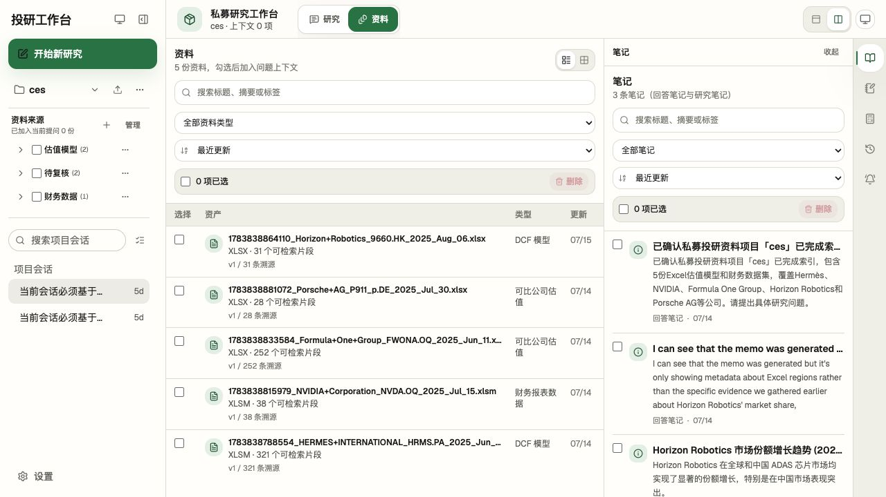
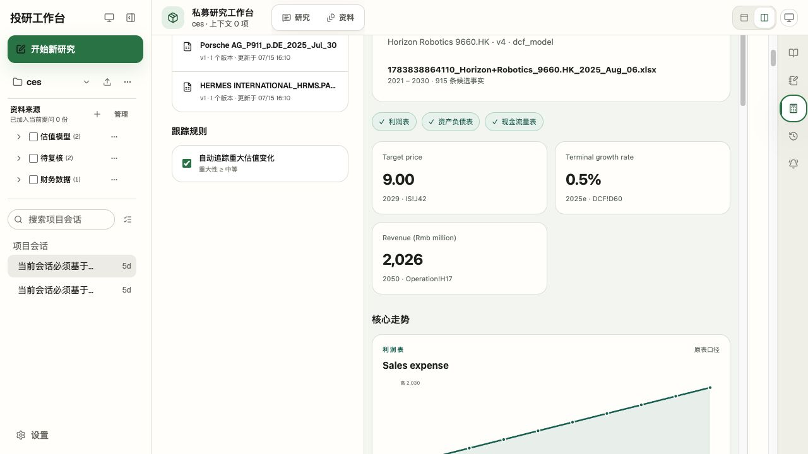
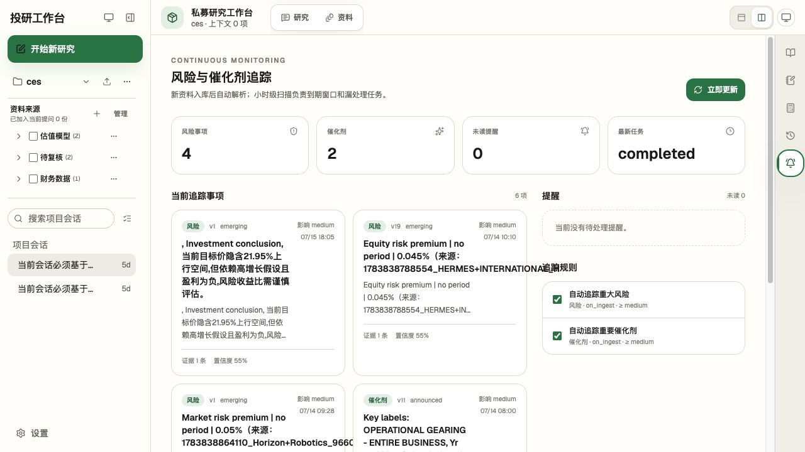

# 📝 私募投研 AI 工作台：系统模块机制与新手手册

> 📝 版本：2026-07-20  
> 📝 适用代码：`main@06a600b` 加当前工作区中的 Obsidian 知识投影改动  
> 📝 适用对象：第一次使用系统的研究员、基金经理和本机维护者

这是一份面向实际使用的总手册。它回答三个问题：系统里有哪些模块、每个模块内部如何工作、第一次使用时应该按什么顺序操作。

> **重要边界**：本系统是研究证据组织与分析辅助工具，不是自动投资决策或交易系统。任何进入投资判断的事实、数字、估值假设和变化结论，都必须回到原始文件位置复核。

## 📝 1. 一分钟理解系统

系统把研究员本地保存的 PDF、Excel、Word、PPT、CSV、Markdown 和文本资料，转换为可以检索、引用、版本化和持续跟踪的研究证据。

完整业务闭环如下：



系统遵守六条基本原则：

1. **证据优先**：搜索结果只是候选，关键结论必须再次打开来源详情。
2. **版本不覆盖**：资料、研究节点、Memo 和估值模型都保留历史版本。
3. **本地优先**：原始资料、SQLite、研究产物和知识投影默认保存在本机。
4. **人机边界清晰**：Agent 负责整理、比较和提出建议，研究员负责复核与决策。
5. **后台任务可恢复**：入库、追踪、估值和 Obsidian 投影由持久化任务或独立 Worker 执行。
6. **低质量内容不冒充结论**：跨公司、无证据、疑似期间、单位不明等内容应进入待复核或隔离层。

## 📝 2. 系统总体架构



### 📝 2.1 权威数据在哪里

| 数据 | 权威位置 | 说明 |
|---|---|---|
| 项目注册与当前项目 | `output/private_fund_datasets/datasets.sqlite3` | 保存 dataset 及 active dataset |
| 项目资料、证据、版本、任务 | `output/private_fund_datasets/<dataset_id>/meta/collection.sqlite3` | 每个项目一套 Project DB |
| 原始文件版本 | `output/private_fund_datasets/<dataset_id>/raw/` | 作为不可变证据保留 |
| Memo 与报告产物 | 项目目录下的 `memos/`、报告目录 | Markdown、HTML、PDF、JSON 等 |
| 派生估值模型 | `<dataset_id>/derived_models/` | 原模型副本和审计页，不覆盖原文件 |
| Obsidian 知识库 | 配置的 Vault 中 `投研知识库/` | 是可重建阅读层，不是业务真值源 |

### 📝 2.2 当前长期服务

统一脚本使用 `omnigent-stack` tmux session 管理以下窗口：

| 窗口 | 模块 | 机制 | 健康信号 |
|---|---|---|---|
| `litellm` | 模型代理 | 把 Claude/OpenAI-compatible 请求映射到配置模型 | `:4000/health/liveliness` |
| `server` | API 与 Web UI | 提供页面、项目 API、文件预览和业务路由 | `:6767/health` |
| `host` | 本机执行入口 | 接收 Server 任务并启动 Runner/Agent | `omnigent host status` |
| `tracking` | 观点与风险催化剂追踪 | 消费持久化任务、定时扫描、恢复 stale job | Worker health JSON |
| `valuation` | 估值模型跟踪 | 发现模型版本、生成差异/总览、处理 Agent 分析 | Worker health JSON |
| `obsidian` | 知识投影 | 消费 outbox，原子更新 Vault 并维护 registry | Worker health JSON |
| `control` | tmux 生命周期 | 维持统一 session，不承载业务请求 | tmux 窗口存在 |

## 📝 3. 页面模块地图

系统的主工作台分为七个用户可见模块：

| 页面模块 | 用途 | 典型入口 |
|---|---|---|
| 研究 | 与 Agent 对话、选择研究深度、生成文本/表格/图表/Memo | 顶部“研究” |
| 资料 | 查看已索引资料、分类、版本和溯源数量 | 顶部“资料” |
| 笔记 | 管理回答笔记与研究笔记，并加入后续分析上下文 | 右侧活动栏“笔记” |
| Memo | 查看生成的 Memo 系列和版本产物 | 右侧活动栏“Memo” |
| 估值跟踪 | 查看模型系列、三表总览、差异、Agent 分析和派生模型 | 右侧活动栏“估值跟踪” |
| 历史变化 | 比较 Memo 版本，查看观点/假设时间线 | 右侧活动栏“历史变化” |
| 追踪提醒 | 查看风险、催化剂、规则、提醒和任务状态 | 右侧活动栏“追踪提醒” |

### 📝 3.1 研究工作台



页面由四个区域组成：

- 左侧：项目、资料文件夹、会话和上传入口。
- 中间：对话记录、生成笔记控制、问题建议和输入框。
- 右侧：笔记或 Memo 面板；也可切换为估值、历史、追踪等全屏模块。
- 最右活动栏：在笔记、Memo、估值、历史和追踪之间切换。

“上下文 0 项”表示当前没有额外勾选资料或研究资产；它不代表项目没有资料。Agent 仍会接收到当前项目 `dataset_id`，但明确勾选资料能缩小研究范围并减少跨公司污染。

### 📝 3.2 资料工作区



资料页展示物理格式、业务分类、版本号、可检索片段数和溯源数。勾选资料的含义是“加入当前提问上下文”；删除是永久业务操作，当前版本没有回收站。

### 📝 3.3 估值跟踪



估值页把 Excel 模型拆为系列和不可变版本，并展示利润表、资产负债表、现金流量表覆盖、关键指标、趋势和单元格位置。页面中的自动抽取仍属于候选层，应根据 Sheet/Cell 和质量状态复核。

### 📝 3.4 风险与催化剂追踪



追踪页区分“当前事项”“提醒”和“追踪规则”。事项是长期对象，提醒是某次变化产生的待处理事件，规则决定何时扫描。低置信度或明显像索引元数据的条目不能直接用于投资判断。

## 📝 4. 各模块功能与内部机制

### 📝 4.1 项目管理模块

**功能**

- 创建、切换和删除研究项目。
- 为每个项目绑定公司、ticker、本地工作目录和独立数据库。
- 让对话、资料、资产、Memo、估值和提醒按 `dataset_id` 隔离。

**机制**

创建项目后，系统在 `output/private_fund_datasets/<dataset_id>/` 建立受管目录。当前项目写入全局状态库；Web 页面和隐藏 Agent 上下文都会携带 `dataset_id`。所有私募业务工具可以显式接收该 ID，避免只依赖“最近打开项目”。

**新手注意**

- 一个项目最好对应一个公司或一个清晰研究主题。
- 不要把多个无关公司的估值模型混在同一项目中。
- 项目删除当前是永久删除；执行前应先备份原始资料和产物。

### 📝 4.2 资料上传与目录管理模块

**功能**

- 支持按钮选择或拖入多份资料。
- 支持受控文件夹、移动、重命名、筛选和批量管理。
- 上传后自动提交增量 Pipeline，并显示 queued/running/completed/failed 状态。

**机制**

浏览器上传先进入 `_uploads/<dataset_id>/`，随后创建持久化 Pipeline job。任务默认按 checksum 增量处理；同一逻辑文件内容变化时生成新的 `document version`，旧版保留。删除当前资料后，历史产物仍可通过固定 evidence ID 访问旧版本证据。

**支持格式**

| 格式 | 解析方式 | 可回溯位置 |
|---|---|---|
| PDF | PyMuPDF 文本提取 | 页码、段落、bbox |
| XLSX/XLSM | workbook/sheet/region/cell/fact 结构化抽取 | Sheet、Range、Cell、Formula |
| DOCX | OOXML 正文、Heading 和表格 | Heading、段落、表格行 |
| PPTX | Slide 文本和 speaker notes | Slide |
| CSV | 表头和稳定行块 | 行号、Cell Range |
| Markdown/TXT | Heading 或稳定行块 | Heading、行范围 |

老式 `.xls/.doc/.ppt` 和 RTF 不直接支持；扫描 PDF 或图片型 Office 文件会进入 `needs_ocr`，不会伪装成已完成索引。

### 📝 4.3 文档分类与公司边界模块

**功能**

- 区分财报、会议纪要、DCF 模型、可比公司估值、财务数据等业务类型。
- 识别文档公司并检查是否与项目公司冲突。
- 将高风险资料放入“待复核”而不是直接建立检索索引。

**机制**

分类器先读取有界预览并运行确定性规则；规则不明确时可以调用结构化 LLM 复核。模型输出必须落在服务端枚举中。分类方法、置信度、证据和分类器版本会写入数据库。`company_conflict` 或 `classification_review_required` 文档保留原件，但默认不生成可检索 chunks。

### 📝 4.4 Evidence 与引用溯源模块

**功能**

- 统一检索 PDF 文本、Excel summary、metric facts 和 cells。
- 把回答引用定位到原始 PDF 页或 Excel 单元格。
- 在右侧来源面板展示上下文、公式和附近单元格。

**机制**

检索分两步：

1. `private_fund_dataset_search` 从轻量 chunks、结构化 facts 和 cells 中找候选证据。
2. `private_fund_source_detail` 按 evidence ID 读取原文或单元格上下文，完成最终核验。

常见 evidence ID：

| 前缀 | 含义 | 最终展示 |
|---|---|---|
| `chunk:` | PDF 页面、文档段落或 Excel summary | 文件名 + 页码/标题/区域 |
| `fact:` | Excel 候选指标事实 | 文件名 + Sheet + Cell + 原值/公式 |
| `cell:` | Excel 原始非空单元格 | 文件名 + Sheet!Cell |

**判断规则**

- 搜索命中不等于证据已核验。
- 数值必须回到原始单元格，不能只引用 workbook/sheet summary。
- 页面不应把裸 `fact:`、`chunk:`、`cell:` 当成人类可读来源。
- 缺证据时必须写“资料未覆盖/待复核”。

### 📝 4.5 Agent、Skills 与业务工具模块

**功能**

- 用自然语言或 Slash Skill 完成检索、节点保存、Memo、研报、历史比较和知识状态检查。
- 在常规研究与深度研究之间切换。
- 把当前项目、勾选资料和研究资产作为隐藏上下文传给 Agent。

**机制**

📝 主 Agent 是 `claude-native-ui`。Server 启动时把 6 个私募 Skills 和 14 个私募业务 MCP Tools 打入 Agent bundle；Agent 经 Host/Runner 执行，模型请求统一通过 LiteLLM。

当前 Skills：

| Skill | 职责 |
|---|---|
| `private-fund-node` | 保存证据化研究节点和富内容块 |
| `private-fund-memo` | 生成或修订聚焦 Memo |
| `private-fund-report` | 生成 FinRobot 对齐专业研报 |
| `private-fund-report-update` | 用新节点和新证据追加报告版本 |
| `private-fund-knowledge-base` | 维护版本语义、知识投影、质量门和可读交接 |
| 📝 `private-fund-valuation-metrics` | 从模型证据识别五指标和估值日，输出服务端可校验的固定 JSON |

14 个业务工具覆盖：数据集状态、知识投影状态、证据搜索、来源详情、Memo、研报生成/状态/读取、研究上下文、节点保存、历史比较、追踪查询、规则维护和提醒处理。

### 📝 4.6 研究笔记与资产库模块

**功能**

- 把回答片段保存为“回答笔记”。
- 让 Agent 生成文本、表格、图表或结构化研究节点。
- 勾选已有笔记加入下一轮上下文。
- 支持 Markdown、metrics、table、chart 和受控 HTML 内容块。

**机制**

回答笔记是轻量保存资产；研究节点是带 `node_type`、证据、父节点、标签、置信度和不可变版本的长期对象。上下文选择只影响当前分析范围，不会自动证明节点中的事实正确。每次复用二级资产时，关键结论仍应重新搜索并核验原始证据。

HTML/图表运行在 sandbox iframe 中，禁止远程资源、网络请求、表单、父页面访问和导航；图表数字仍需绑定 evidence IDs。

### 📝 4.7 Memo 与专业研报模块

**功能**

- 生成 Markdown、HTML 和 PDF Memo。
- 生成包含 JSON、图表和 evidence index 的 FinRobot 对齐专业研报。
- 对同一主题建立 series，并通过 `revision_of` 追加版本。
- 比较两个 Memo 版本的章节变化。

**机制**

Agent 先检索和核验证据，再形成 `memo_markdown` 或章节结构，最后由服务端生成文件产物并登记版本。Memo 版本不会覆盖旧文件；失败 run 保留错误但不升级 current version。专业研报复用同一证据边界，只是模板、图表和产物包更完整。

无证据章节必须明确显示“不适用于投资判断”。只包含 workbook/sheet/region 索引摘要的内容属于技术底稿，不是投资逻辑。

### 📝 4.8 历史观点与风险催化剂追踪模块

**功能**

- 把 thesis、assumption、risk、catalyst、metric 和 question 建为稳定对象。
- 为对象记录不可变版本、来源和变化状态。
- 建立 on-ingest 或周期规则，生成提醒并支持确认、忽略、稍后提醒和重新打开。

**机制**

Research Tracking Worker 周期扫描每个 dataset：恢复 stale job、发现新资料、提交计划扫描并消费任务。对象使用 canonical key 归并；只有内容、状态、数值或时间窗口变化才新增版本。新版未提及旧观点时记录 `not_mentioned`，不能自动推断旧观点失效、撤回或错误。

提醒与对象分离：对象表示长期事实/观点，提醒表示一次需要处理的变化。重复事件通过幂等键去重。

### 📝 4.9 估值模型版本、总览与 Agent 分析模块

**功能**

- 自动发现 `valuation_model` 文档并建立模型 series。
- 保存每个工作簿版本、checksum、结构化节点和相邻版本差异。
- 生成同源 JSON 与无脚本 HTML 总览。
- 运行 Agent 分析，形成发现、证据链、风险、问题和修改建议。
- 复制原模型生成安全派生版，并由用户显式加入项目资源。

**确定性机制**

Valuation Worker 读取 Pipeline 已存储的 Sheet、Cell、Region 和 `metric_facts`，不执行宏、不重算公式、不改写原文件。它识别三表、期间、关键指标和趋势，生成版本总览；旧版本第一次读取时可以幂等补建。

版本差异区分：

- 数值或公式真实变化。
- 节点新增/删除。
- 抽取覆盖变化或低质量期间变化。
- 与历史 checksum/快照一致的回滚。

**Agent 机制**

Agent 先选择证据，再生成分析和建议。服务端校验引用是否属于当前模型。建议默认不直接修改原工作簿；派生器仅向副本写入高置信度、唯一定位、非公式、非期间表头且通过数值边界的输入。其他建议只写入 `Agent_Analysis` 审计页并记录跳过原因。

“生成派生版”和“加入项目资源”是两个独立动作。只有用户显式点击加入资源后，文件才进入新的资料版本和 Pipeline。

### 📝 4.10 Obsidian 知识投影模块

**功能**

- 把 Memo 和估值系列投影为可读的系列首页、不可变版本、相邻差异和证据卡。
- 生成 Bases、Wikilinks、项目首页和同步状态。
- 保留研究员的 `USER` 手写区。

**机制**

Project DB 通过 `obsidian_sync_outbox` 记录待投影事件。独立 Worker 领取事件、生成 Markdown、使用临时文件加原子替换写入 Vault，并在 `obsidian_note_registry` 保存路径和 hash。Worker 会重试失败事件并周期 reconcile，修复漏事件。

每份受管笔记分为：

```markdown
<!-- AUTO:BEGIN -->
后台维护的可重建内容
<!-- AUTO:END -->

<!-- USER:BEGIN -->
研究员手写内容，后台保留
<!-- USER:END -->
```

人工修改 AUTO 区时，Worker 生成冲突笔记，不静默覆盖。原始 PDF/Excel 默认不复制进 Vault，只通过可读证据卡和受控本地链接访问。

## 📝 5. 新手首次使用手册

### 📝 5.1 启动前准备

需要安装：

```text
git
Python 3.12+
uv
bun
tmux
curl
Poppler（pdftotext / pdftoppm）
```

首次部署：

```bash
scripts/setup_full_system.sh
```

在本机环境变量或受控配置文件中设置模型地址和密钥。不要把真实 API Key 写入 Git、Markdown、截图或 Vault。

如需启用 Obsidian 投影：

```bash
export PRIVATE_FUND_OBSIDIAN_VAULT_PATH="/absolute/path/to/obsidian-vault"
```

### 📝 5.2 启动与检查服务

```bash
scripts/manage_omnigent_services.sh start
scripts/manage_omnigent_services.sh status
```

正常状态应看到 LiteLLM、Server、Host、Tracking、Valuation 和 Obsidian 全部 online。打开：

```text
http://127.0.0.1:6767/
```

如果启动失败，先执行：

```bash
scripts/manage_omnigent_services.sh logs
```

首次运行时 LiteLLM/uvx 可能下载或构建依赖，超过 180 秒会使统一脚本报告超时；依赖完成后再次执行 `restart` 即可重新走完整健康检查。不要因为 tmux 窗口存在就认定服务已经可用。

### 📝 5.3 创建研究项目

1. 点击左侧“开始新研究”。
2. 创建项目，填写稳定项目名称；建议一个项目只研究一家公司。
3. 如有 ticker，一并填写，便于公司边界和估值系列识别。
4. 创建完成后确认页面顶部和左侧都显示正确项目名。

推荐命名：

```text
阳光电源
Horizon Robotics
某公司-年度深度研究
```

不推荐命名：

```text
新项目
所有公司
临时测试
```

### 📝 5.4 上传并等待资料索引

1. 在左侧“资料来源”点击上传，或拖入资料。
2. 优先上传年报/公告、会议纪要和估值模型等一手或受控资料。
3. 等待进度弹窗进入终态，不要在 queued/running 时开始精确取数。
4. 在资料页检查业务分类、版本、片段数和溯源数。
5. 打开“待复核”文件夹，处理公司冲突、格式不支持或 OCR 问题。

状态解释：

| 状态 | 含义 | 是否可研究 |
|---|---|---|
| `queued` | 已排队 | 否 |
| `running` | 正在解析 | 暂不建议 |
| `completed` | 支持文件全部索引完成 | 是 |
| `completed_with_warnings` | 可用资料已完成，但有 OCR/格式告警 | 仅使用已完成部分 |
| `needs_ocr` | 页面文本质量不足 | 否，需 OCR |
| `classification_review_required` | 公司或类型存在冲突 | 复核前不用于结论 |
| `failed` | 支持文件解析失败或没有支持文件 | 否 |

### 📝 5.5 发起第一轮研究

1. 在左侧勾选与问题直接相关的资料。
2. 选择“常规研究”或“深度研究”。
3. 提出包含公司、时间、指标和输出要求的问题。
4. 回答生成后逐条点击引用，检查 PDF 页码或 Excel 单元格。
5. 对重要回答点击“保存为回答笔记”，或生成长期研究节点。

一个好的第一轮问题：

```text
请只使用当前项目已索引资料，比较 2023A、2024A 与 2025E 的收入、毛利率和经营现金流变化。
所有数字必须给出可点击的 PDF 页码或 Excel Sheet!Cell；资料不足时明确列出缺口。
```

不要直接问：

```text
这家公司能买吗？
```

更安全的写法：

```text
请梳理当前资料支持的投资逻辑、反证、风险、催化剂和待验证问题，不给出自动买卖建议。
```

### 📝 5.6 保存和生成研究资产

在研究页“生成笔记”中选择：

| 类型 | 适合场景 |
|---|---|
| 文本 | 投资逻辑、风险、会议纪要总结 |
| 表格 | 跨期、跨公司、情景或假设比较 |
| 图表 | 连续时间序列或结构占比 |
| Memo | 形成可交付的聚焦报告 |

生成前至少满足以下一种上下文：

- 已有完整会话；
- 勾选资料；
- 勾选回答笔记或研究节点；
- 保存了当前回答片段。

生成后检查：标题、结论、来源、数字、资料缺口和置信度。把有价值的资产勾选加入下一轮上下文，不要一次勾选所有资产。

### 📝 5.7 生成或修订 Memo

首次生成示例：

```text
生成一份“阳光电源 2026 年中投资 Memo”，重点覆盖：
1. 当前投资逻辑；
2. 财务与估值；
3. 风险与催化剂；
4. 资料缺口和待验证问题。
所有重大事实与数字必须绑定直接证据。
```

修订示例：

```text
基于新上传的 2026Q2 电话会资料修订现有 Memo。
保留旧版本，明确列出新增、变化、未提及和需要人工确认的内容。
```

验收 Memo 时确认：

- 同一主题形成稳定 series，而不是每次生成无关文档。
- 新版具有 predecessor/revision_of。
- Markdown、HTML、PDF 可以打开。
- 无证据章节显示阻断或待复核，不把索引元数据写成投资结论。

### 📝 5.8 使用估值模型跟踪

1. 上传或更新被分类为 DCF/估值模型的 Excel。
2. 等待资料 Pipeline 完成，再打开“估值跟踪”。
3. 点击“扫描模型”，确认新版本进入正确 series。
4. 查看三表覆盖、关键指标、趋势和单元格位置。
5. 选择两个版本比较，区分真实变化、抽取变化和回滚。
6. 需要解释时运行 Agent 分析，并检查证据链。
7. 需要新模型时生成派生版；先下载审查，再决定是否“加入资源”。

特别注意：

- 系统不执行 Excel 宏、UDF、Power Query、Pivot 或公式重算。
- 缓存值缺失、期间识别、单位和合并单元格可能影响自动抽取。
- 派生模型不是已批准模型；当前还没有逐项人工批准界面。

### 📝 5.9 使用历史与追踪

在“历史变化”中选择 Memo series、基准版本和对比版本。章节未变化不代表结论仍有效；需要结合新资料是否明确确认或否定。

在“追踪提醒”中：

1. 检查当前风险/催化剂是否是真实业务事件，而不是财务标签或索引文本。
2. 为重要对象启用规则。
3. 新提醒出现后执行确认、忽略或稍后提醒。
4. 定期检查 Worker 最新任务是否 completed，不能只看页面是否有卡片。

### 📝 5.10 使用 Obsidian 阅读层

启动 Obsidian Worker 后，在 Vault 中打开：

```text
投研知识库/
```

推荐阅读顺序：

```text
项目首页
→ 当前 Memo/估值系列
→ 相邻版本变化
→ 可读证据卡
→ 折叠审计区
```

可以在 `USER` 区写个人判断，但不要手改 `AUTO` 区或依赖手工创建的文件名作为业务版本。需要确认投影状态时，使用知识状态工具或检查 Worker health、outbox、registry 和冲突目录。

## 📝 6. 推荐问题模板

### 📝 6.1 财务趋势

```text
请比较 2022A–2025E 的收入、毛利率、经营利润和自由现金流。
先列出数据口径和单位，再解释变化驱动；每个数字都要回到原始单元格。
```

### 📝 6.2 会议纪要与模型交叉核对

```text
请把管理层在最新会议纪要中的收入、毛利率和资本开支表述，与当前估值模型假设逐项对照。
输出“管理层表述 / 模型输入 / 差异 / 证据 / 待确认”的表格。
```

### 📝 6.3 风险与反证

```text
请只基于当前项目资料，列出最可能推翻现有投资逻辑的五条反证。
区分已发生风险、潜在风险和资料缺口，不要把风险溢价等财务字段当成业务风险。
```

### 📝 6.4 估值版本变化

```text
请比较模型 v3 与 v4：区分方法变化、经营假设变化、公式结构变化、目标价变化和抽取覆盖变化。
无法从工作簿确定的原因必须标记为推断。
```

### 📝 6.5 Memo 质量复核

```text
请审查当前 Memo 的证据覆盖：逐章列出直接证据、二级研究资产、无证据结论和跨公司来源。
对不适用于投资判断的章节明确给出阻断原因。
```

## 📝 7. 常见故障排查

| 现象 | 常见原因 | 处理方法 |
|---|---|---|
| `host is offline` | Server 尚未健康或 Host 未连接 | `status` → `logs` → 完整 `restart` |
| LiteLLM 180 秒超时 | 首次 uvx 下载/构建依赖 | 等依赖完成，确认 `:4000/health/liveliness`，再 `restart` |
| 页面能打开但 Agent 不能回答 | Server 在线、LiteLLM/Host 离线 | 检查三者状态和模型配置 |
| 上传后 0 个可检索片段 | needs_ocr、不支持格式、公司冲突或解析失败 | 查 Pipeline job 和文档 classification/status |
| Excel 数字明显不对 | 命中 summary、期间/单位识别错误或缓存缺失 | 打开 Sheet!Cell、公式、行列标签和质量状态 |
| 引用只显示内部 ID | 来源详情解析或前端映射失败 | 用 `private_fund_source_detail` 验证 ID，再检查数据版本 |
| Memo 只有 workbook/region 摘要 | 没有提供核验后的 `memo_markdown` 或证据包质量不足 | 重新检索 source detail 后生成可读正文 |
| Memo 混入其他公司 | 项目混放资料、分类冲突或上下文过宽 | 缩小勾选范围，检查公司分类并停止生成 |
| 追踪页出现财务标签型“风险” | LLM/规则把财务字段误分类 | 不确认；回到来源，调整规则/分类并重跑 |
| 估值页大量新增/删除节点 | 模型模板变化或抽取覆盖漂移 | 先看质量门和回滚判断，不直接解释成经济变化 |
| Obsidian 没有更新 | Vault 未配置、Worker 离线、outbox 失败或冲突 | 查知识状态、Worker health、outbox 和 `99-系统/冲突/` |

常用命令：

```bash
scripts/manage_omnigent_services.sh status
scripts/manage_omnigent_services.sh logs
scripts/manage_omnigent_services.sh restart
scripts/manage_omnigent_services.sh stop
```

只验证 Web Server：

```bash
curl -fsS http://127.0.0.1:6767/health
```

只验证模型代理：

```bash
curl -fsS http://127.0.0.1:4000/health/liveliness
```

## 📝 8. 安全、隐私与投资判断边界

### 📝 8.1 可以信任什么

- 原始文件版本和 checksum。
- 可解析到文件版本、页码、Sheet/Cell 的直接证据。
- 明确记录参与比较版本的确定性差异。
- 持久化任务、版本和 Worker 状态。

### 📝 8.2 需要人工复核什么

- `metric_facts` 和自动识别的财务/估值指标。
- 模型生成的投资逻辑、原因解释、风险和催化剂。
- 低置信度分类、公司身份、期间、单位和跨公司比较。
- Agent 提出的估值修改建议和派生模型。

### 📝 8.3 当前不能承诺什么

- 自动交易、买卖建议或投委会审批替代。
- 完整 OCR 和所有旧式 Office 格式。
- Excel 宏、公式重算和正式估值审计。
- 成熟的团队权限、多租户、合规归档和云灾备。
- 任意 Obsidian Markdown 双向回写 Project DB。
- 项目/资料/资产回收站；当前部分删除为永久删除。

## 📝 9. 新手验收清单

完成以下清单后，才算跑通第一轮完整闭环：

- [ ] 创建了公司边界清晰的研究项目。
- [ ] 上传至少一份 PDF 和一份 Excel。
- [ ] Pipeline 进入 completed 或可解释的 completed_with_warnings。
- [ ] 提问同时涉及 PDF 事实和 Excel 数值的问题。
- [ ] 至少打开一条 PDF 引用和一条 Excel 单元格引用。
- [ ] 保存一条回答笔记，并生成一个研究节点。
- [ ] 生成一份有证据的 Memo，确认 Markdown/HTML/PDF 可打开。
- [ ] 导入两个估值模型版本并查看总览或差异。
- [ ] 查看历史变化和追踪提醒，理解对象与提醒的区别。
- [ ] 检查 Obsidian 投影状态并确认 USER 区可保留。
- [ ] 重启服务后确认项目、任务、版本和知识投影仍可恢复。

## 📝 10. 维护者检查清单

发布或演示前：

- [ ] `scripts/manage_omnigent_services.sh status` 全部 online。
- [ ] Python、TypeScript、格式、lint 和 production build 门禁通过。
- [ ] 当前真实项目的资料、Memo、估值和追踪页面已人工复验。
- [ ] 无 API Key、用户 PDF/Excel、临时 HTML、截图或真实 Vault 内容误入 Git。
- [ ] 新增 Skill 时同步 Agent bundle、工具注册、测试和能力文档。
- [ ] 新增 Worker 时同步 start/status/logs/health 和故障恢复说明。
- [ ] 新增 Markdown 标题或变更记录带 `📝`，并同步 Obsidian 项目记录。

## 📝 11. 当前已知质量风险

1. 历史 `ces` 数据集混有多家公司资料，已有 Memo/追踪对象存在跨公司污染示例；它们只能作为功能演示，不应直接作为投资判断。
2. 风险/催化剂抽取仍可能把财务标签、Excel 区域摘要或 Agent 分析元数据误当成业务事项。
3. 估值模型的自动期间和指标抽取虽有质量门，复杂模板、合并单元格、单位缺失和公式缓存仍可能产生误识别。
4. 当前 Obsidian CLI 不可用，Bases/Wikilinks/嵌入内容的应用内 DOM 级验收尚未完成。
5. 完整浏览器回归、24 小时 Worker 稳定性、团队权限和回收站仍未达到生产发布门槛。

## 📝 12. 延伸阅读

- [📝 私募投研 AI 工作台需求文档 V0.1](private_fund_ai_research_prd_v0.1.md)
- [📝 Agent 驱动的私募研究资产工作台](private_fund_research_workflow.md)
- [📝 私募投研目录级入库 Pipeline](private_fund_directory_ingest_pipeline.md)
- [📝 当前 Skills 与 MCP Tools 清单](private_fund_skills_and_mcp_tools.md)
- [📝 Omnigent 本地服务运行手册](omnigent_runtime_services.md)
- [📝 Evidence Schema 与溯源设计](evidence_schema_design.md)
- [📝 Memo 生成模块设计](memo_generation_design.md)
- [📝 Obsidian 投研知识库架构](../knowledge_base/obsidian/README.md)

## 📝 13. 本文验证记录

- 📝 2026-07-20：直接核对当前 Web 组件、API 路由、Agent bundle、14 个私募业务工具和当时的 5 个私募 Skills。
- 📝 2026-07-21：新增估值指标识别 Skill，当前 Agent bundle 为 6 个私募 Skills；后台 Worker 复用同一契约输出固定 JSON。
- 📝 2026-07-20：启动本地 Server/Host/Tracking/Valuation/Obsidian，使用真实 `ces` 数据集检查研究、资料、估值和追踪页面。
- 📝 2026-07-20：采集四张当前运行态截图；未发起模型请求或修改用户研究数据。
- 📝 2026-07-20：发现 LiteLLM 首次重建依赖超过统一启动脚本 180 秒，已作为新手故障排查案例记录。
