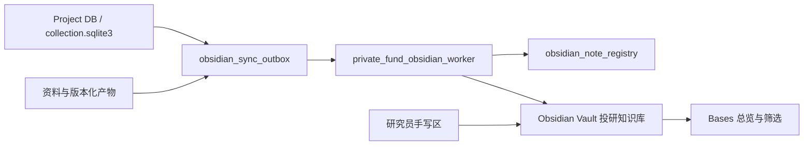

# 📝 Obsidian 投研知识库架构

状态：架构草案  
日期：2026-07-16  
适用范围：Omnigent 私募投研工作台、cc-haha Agent、Project DB、Research Tracking、Valuation Tracking 与个人 Obsidian 工作区

## 📝 1. 定位与核心决策

这套知识库不是另一套业务数据库，也不直接替代 Omnigent 工作台。它是现有投研系统面向研究员的“可读知识投影”：让项目、资料、结论、风险、催化剂、估值版本、Memo、研报和历史变化在 Obsidian 中可浏览、可链接、可复盘。

> [!important] 📝 单一事实源
> 每个 dataset 的 `meta/collection.sqlite3`、受控资料目录和版本化产物仍是权威事实源；Obsidian 是可重建的阅读与个人研究层，不承担交易状态、证据身份或版本真值。

第一版采用单向投影：

```text
Project DB / 文档版本 / Research Nodes / Tracking / Valuation
-> durable outbox
-> Obsidian Projection Worker
-> Markdown + Bases + Wikilinks
-> 投研人员阅读、筛选、批注和复盘
```

暂不把研究员在 Obsidian 中的任意编辑直接写回 Project DB。后续如需要双向同步，只允许白名单字段和显式命令进入系统，并保留审计记录。

## 📝 2. 分层架构



各层职责：

| 层 | 负责 | 不负责 |
|---|---|---|
| Project DB | 资料、证据、节点、版本、任务、提醒和审计真值 | 人工知识导航和自由笔记 |
| Outbox | 可靠记录待投影事件、去重键和重试状态 | 生成 Markdown 内容 |
| Projection Worker | 幂等生成笔记、链接、Bases 数据和同步状态 | 直接修改原始资料或投资结论 |
| Obsidian Vault | 阅读、筛选、关联、复盘和个人批注 | 成为证据或版本的唯一来源 |
| Omnigent UI | 证据核验、Agent 对话、资产生成和业务操作 | 依赖 Obsidian 才能完成核心流程 |

## 📝 3. 运行时 Vault 目录

真实 Vault 不放进代码仓库。通过 `PRIVATE_FUND_OBSIDIAN_VAULT_PATH` 指向用户选择的 Obsidian Vault，默认在 Vault 内生成 `投研知识库/`：

```text
投研知识库/
├── 00-总览/
│   ├── 投研首页.md
│   ├── 最近更新.base
│   ├── 待复核.base
│   └── 风险与催化剂.base
├── 10-项目/
│   └── {dataset_id}-{company_slug}/
│       ├── 项目首页.md
│       ├── 公司画像.md
│       ├── 01-资料/
│       ├── 02-证据包/
│       ├── 03-研究节点/
│       │   ├── 结论/
│       │   ├── 假设/
│       │   ├── 风险/
│       │   ├── 催化剂/
│       │   ├── 问题/
│       │   └── 决策/
│       ├── 04-估值/
│       ├── 05-Memo/
│       ├── 06-研报/
│       ├── 07-追踪/
│       ├── 08-会话纪要/
│       ├── 09-个人笔记/
│       ├── _views/
│       └── _sync/
├── 20-跨项目/
│   ├── 公司与项目.base
│   ├── 风险对照.base
│   ├── 催化剂日历.base
│   └── 估值变化.base
├── 90-模板/
└── 99-系统/
    ├── 同步状态.md
    ├── 冲突/
    └── 审计/
```

目录设计遵循三个原则：

1. 项目内按研究对象分区，研究员可以从“项目首页”进入全部上下文。
2. 跨项目目录只放 Bases/MOC，不复制项目笔记。
3. `09-个人笔记/` 由研究员拥有，后台绝不覆盖。

## 📝 4. 知识对象与映射

| 系统对象 | Obsidian 形态 | 关键链接 |
|---|---|---|
| Dataset / Project | 项目首页、公司画像 | 资料、节点、估值、Memo、提醒 |
| Logical Document | 一份资料笔记，内部列版本时间线 | 原始文件、文档版本、被引用节点 |
| Evidence | 默认作为资料笔记中的引用块；仅把精选集合做成证据包 | `evidence_id`、来源位置、Omnigent source detail |
| Saved Asset | 信息笔记或研究节点入口 | 来源回答、会话、后续资产 |
| Research Node | 一节点一笔记，保留不可变版本号 | 父节点、证据、支持/反证关系 |
| Risk / Catalyst | 研究节点笔记 + 跟踪属性 | watch rule、change event、alert |
| Memo / Report | 一系列一目录，一版本一笔记 | `revision_of`、节点快照、证据索引、PDF/HTML |
| Valuation Series | 模型系列首页 + 版本笔记 | 原模型、diff、Agent 分析、派生版本 |
| Conversation | 会话纪要，不默认复制完整逐条消息 | 产生的资产、引用资料、待办 |
| Alert | 跟踪提醒笔记或日报条目 | 风险/催化剂、状态、触发证据 |

不建议为每个 chunk/cell 自动创建独立笔记。证据粒度可能很高，全部展开会淹没 Vault；默认只物化被引用、被保存或进入报告的证据，并在资料笔记中使用稳定 block ID。

## 📝 5. 通用属性契约

所有后台维护的笔记使用统一 frontmatter：

```yaml
---
title: "示例标题"
aliases: []
tags:
  - private-fund
  - managed
entity_type: research-node
entity_id: node_example
dataset_id: example
company: "示例公司"
status: active
review_state: needs-review
evidence_state: partial
source_system: omnigent
source_version: "3"
sync_key: "dataset:example:research-node:node_example"
sync_hash: "sha256:..."
managed_by: omnigent
sensitivity: internal
created_at: 2026-07-16T00:00:00+08:00
updated_at: 2026-07-16T00:00:00+08:00
---
```

对象专用字段：

| 对象 | 专用字段 |
|---|---|
| Document | `doc_id`、`logical_doc_id`、`document_type`、`current_version_id`、`source_date`、`ingest_status` |
| Research Node | `node_id`、`node_type`、`version_no`、`confidence`、`parent_node_ids`、`evidence_ids` |
| Risk/Catalyst | `canonical_key`、`severity`、`probability`、`time_horizon`、`watch_status` |
| Memo/Report | `report_id`、`series_id`、`version_no`、`revision_of`、`artifact_paths` |
| Valuation | `valuation_series_id`、`model_version_id`、`valuation_date`、`diff_status`、`derived_model_id` |
| Conversation | `session_id`、`agent_id`、`started_at`、`ended_at`、`produced_asset_ids` |

稳定身份使用系统 ID，不使用文件名作为主键。文件名采用“可读标题 + 短 ID”，标题变化时可安全重命名，双链仍由 Obsidian 维护。

## 📝 6. 笔记所有权与冲突规则

每份受管笔记分成两个区域：

```markdown
<!-- AUTO:BEGIN -->
后台生成内容；可重建。
<!-- AUTO:END -->

<!-- USER:BEGIN -->
研究员批注；后台必须原样保留。
<!-- USER:END -->
```

同步规则：

- 后台只更新 frontmatter 中的受管字段和 `AUTO` 区域。
- `USER` 区域、`09-个人笔记/` 和未标记文件永不覆盖。
- 写文件使用临时文件 + `fsync` + 原子替换，避免生成半份笔记。
- 每次投影记录 `sync_hash`；如果受管区被人工修改，先写入 `99-系统/冲突/`，不静默覆盖。
- 删除业务对象时，第一版移动到项目 `_sync/archive/` 并标记 `status: archived`，不直接删除研究员可见历史。

## 📝 7. 自动维护触发与一致性

建议新增独立 `private_fund_obsidian_worker`，不让 cc-haha 会话承担后台同步。它与现有 Tracking/Valuation Worker 同级，消费以下事件：

| 事件 | 投影动作 |
|---|---|
| `project_updated` | 更新项目首页和公司画像 |
| `document_ingested` | 更新资料笔记、版本、分类和来源状态 |
| `research_node_version_created` | 创建/更新研究节点笔记和双链 |
| `memo_version_created` | 写 Memo 版本、修订关系和产物链接 |
| `report_version_created` | 写研报版本、证据索引和图表链接 |
| `tracking_item_changed` | 更新风险/催化剂台账和时间线 |
| `alert_created_or_updated` | 更新提醒视图和状态 |
| `valuation_version_created` | 更新模型系列、版本 diff 和分析结果 |
| `session_completed` | 生成会话纪要并链接本轮资产 |

建议增加两张持久化表：

```text
obsidian_sync_outbox
  event_id, dataset_id, entity_type, entity_id, source_version,
  event_type, payload_json, status, attempt_count, available_at,
  lease_until, last_error, created_at, updated_at

obsidian_note_registry
  dataset_id, entity_type, entity_id, note_path, source_version,
  content_hash, sync_status, last_synced_at, last_error
```

幂等键使用 `dataset_id + entity_type + entity_id + source_version`。Worker 除事件驱动外，每小时执行一次 reconcile，比较 DB 当前版本与 registry，修复漏事件、被移动文件和中断写入。

## 📝 8. 研究员视图

第一版优先提供以下 Bases：

| 视图 | 研究问题 |
|---|---|
| 最近更新 | 最近哪些项目、结论、模型或报告发生变化？ |
| 待复核 | 哪些内容缺证据、低置信度或尚未人工确认？ |
| 风险台账 | 当前风险、影响、概率、窗口和最新变化是什么？ |
| 催化剂日历 | 哪些催化剂临近，预期时间与状态如何？ |
| 研究节点 | 可以按类型、公司、状态和置信度筛选哪些结论？ |
| 资料版本 | 哪些资料刚入库、分类待复核或出现新版本？ |
| 估值变化 | 哪些模型假设、公式、目标价或预测值发生重大变化？ |
| Memo/研报版本 | 最新版本、修订关系和待更新报告是什么？ |
| 跨项目对照 | 不同公司的风险、催化剂、估值和研究进度如何比较？ |

本目录提供一个可验证的原型：[research-dashboard.base](bases/research-dashboard.base)。

## 📝 9. 安全与隐私边界

- 默认不复制原始 PDF、Excel、完整聊天记录、API Key、Token 或本地配置到 Vault。
- 笔记只保存可读摘要、稳定 ID、受控本地文件链接和 Omnigent 内部来源链接。
- Vault 若启用第三方云同步，必须按 `sensitivity` 过滤；`restricted` 内容默认不投影。
- 文件写入只能落在配置的 Vault 根目录之下，解析后路径必须防止 `..`、符号链接逃逸和任意绝对路径。
- Agent 不能自由决定写入路径；只能提交领域对象，最终路径由服务端映射器生成。
- 每次写入、冲突、归档和失败均写审计记录。

## 📝 10. 代码与运行边界

```text
knowledge_base/obsidian/
  版本化保存架构、属性契约、模板和 Bases 原型。

omnigent/omnigent/server/private_fund_obsidian.py
  📝 已实现映射、渲染、冲突检测、registry/outbox repository。

omnigent/omnigent/server/private_fund_obsidian_worker.py
  📝 已实现可恢复的后台消费、reconcile 循环和健康状态。

真实 Obsidian Vault
  由 PRIVATE_FUND_OBSIDIAN_VAULT_PATH 配置，不提交到 Git。
```

cc-haha/Agent 的职责仅是产生受控领域对象和显式用户命令；持续维护由 Worker 完成，因此即使没有活跃聊天会话，知识库仍会跟随资料、提醒和估值版本更新。

## 📝 11. 分阶段落地

### 📝 Phase 1：单向最小投影

- 项目首页、资料、研究节点、Memo/研报、风险/催化剂、估值版本。
- 通用 frontmatter、AUTO/USER 分区、原子写和 registry。
- 项目级 Bases 与同步状态页。

### 📝 Phase 2：可靠增量同步

- durable outbox、Worker lease/retry、小时 reconcile。
- 文件移动识别、冲突笔记、归档和完整审计。
- 服务管理脚本增加 `obsidian` Worker 窗口与健康状态。

### 📝 Phase 3：研究员工作流

- 会话纪要、每日/每周研究简报、待复核 Inbox。
- 允许研究员在 `USER` 区域批注并生成显式回写建议。
- Obsidian CLI 用于打开目标笔记、刷新视图和人工验收，不作为数据真值通道。

### 📝 Phase 4：受控双向与语义记忆

- 仅白名单字段、显式确认、乐观锁和审计后回写。
- Personal Memory 与 Obsidian 笔记建立稳定映射。
- 跨项目主题、公司、风险和观点变化的语义检索。

## 📝 12. 第一版验收标准

1. 新资料、节点、Memo、提醒和估值版本在 30 秒内出现在对应项目知识库。
2. 重复事件不会生成重复笔记；服务重启后可继续处理。
3. 任意结论都能通过可读证据卡回到文件版本、页码或 Sheet/单元格；裸 `evidence_id` 只留在折叠审计信息中。
4. 研究员手写区在多次同步、重命名和版本更新后保持不变。
5. 人工修改受管区不会被静默覆盖，冲突可在系统视图中发现。
6. 删除项目或对象不会立即抹掉研究员历史，归档可追溯。
7. Vault 不出现密钥、Token、任意系统路径逃逸或未经允许的原始资料副本。

## 📝 13. 已实现的 Memo / 估值版本维护（2026-07-16）

当前实现已经覆盖：

- 📝 Memo 系列首页、不可变版本、相邻版本差异和 `not_mentioned` 语义保护。
- 📝 估值系列首页、模型版本、公式/单元格/证据索引、重大变化、回滚识别、确定性分析、Agent 分析和派生模型。
- 📝 durable outbox、幂等 registry、Worker lease/retry、原子写入、路径逃逸保护、`USER` 区保留和 `AUTO` 区冲突记录。
- 📝 全局与项目级 Memo/估值 Bases，以及服务管理脚本中的独立 `obsidian` Worker 窗口。

运行前设置：

```bash
export PRIVATE_FUND_OBSIDIAN_VAULT_PATH="/absolute/path/to/obsidian-vault"
scripts/manage_omnigent_services.sh restart
```

单次回填或诊断：

```bash
cd omnigent
PRIVATE_FUND_OBSIDIAN_VAULT_PATH="/absolute/path/to/obsidian-vault" \
  uv run --offline python -m omnigent.server.private_fund_obsidian_worker --once
```

Worker 健康状态写入 dataset workspace 的 `.obsidian-projection-worker.json`。发生受管区冲突时，原笔记不会被覆盖，诊断笔记写入 `投研知识库/99-系统/冲突/`。

## 📝 14. Projector v3 阅读层（2026-07-16）

- 📝 首页、系列页和版本页优先展示当前结论、版本变化、证据覆盖、阅读状态和待验证问题，不再用内部 ID 作为链接标题。
- 📝 `fact:`、`chunk:`、`cell:` 被解析为可点击证据卡；证据卡展示原始文件版本、位置、行列标签、原值、公式、数字格式、置信度和质量问题。
- 📝 疑似期间表头、无单位的邻近标签猜测、未解析来源和待复核差异经过质量门禁；隔离项不能进入重大变化或投资结论。
- 📝 没有证据绑定的 Memo 明确显示“不可用于投资判断”，章节只显示覆盖状态，检索/索引底稿默认折叠。
- 📝 Bases 以可点击人类标题、当前结论、证据覆盖、隔离数量和变化摘要为主，不再以文件名、哈希和同步字段为主要列。
